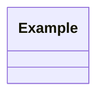
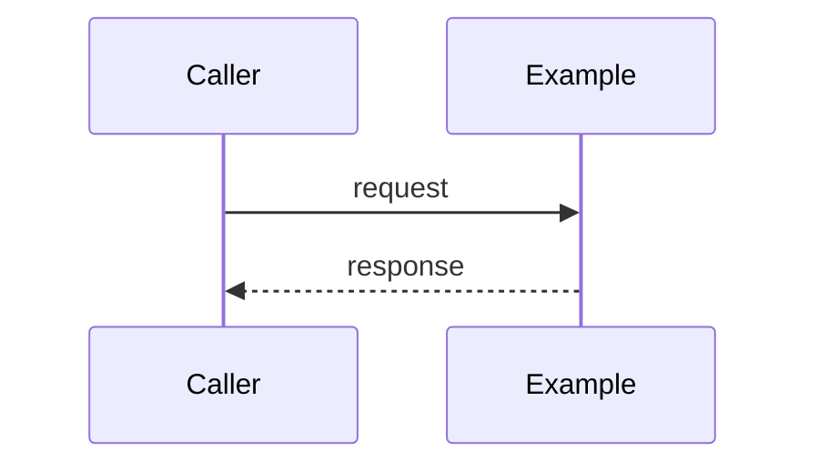

# Design: {{FEATURE}}

<!--
FluencyLoop Stage 2 — one design.md per feature, committed alongside it.
Defaults: a class diagram and a sequence diagram (the two first-class Mermaid types that
pay their way most often). Add an interaction/flow view only when it earns its place.
Keep the Mermaid blocks TOP-LEVEL (not nested in another code fence) so GitHub renders them.
Delete this comment once the diagrams are real.
-->

started: {{DATE}}

## Class diagram

## Sequence: <the main flow>

