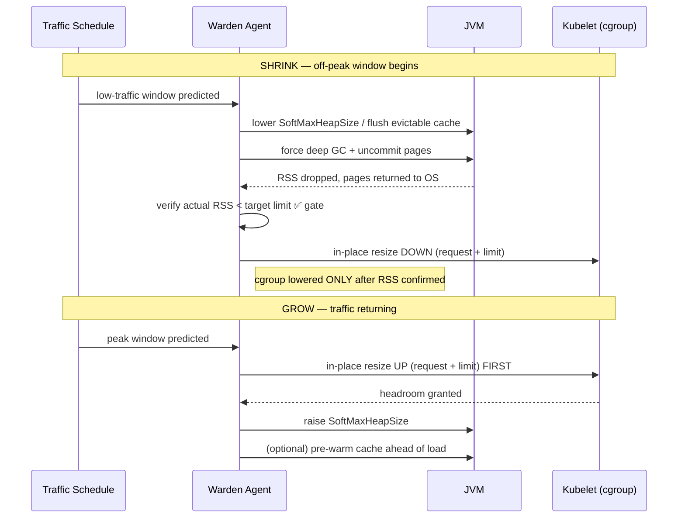

# mnemo-jvm-warden

**JVM-aware vertical right-sizing for Kubernetes.** Warden makes a running JVM
give memory back to the OS during predictable low-traffic windows, then safely
lowers the Pod's resource footprint — reclaiming idle infrastructure without
killing the pod, dropping its warm state, or risking your high-availability
posture.

> Use **HPA** to scale your stateless web traffic.
> Use **Warden** for your minimum-replica baselines, your heavy stateful nodes,
> and your slow-booting monoliths — the places where horizontal scaling is too
> slow, too dangerous, or simply not allowed.

---

## The gap Warden fills

In ~95% of production environments, [Horizontal Pod Autoscaling
(HPA)](https://kubernetes.io/docs/tasks/run-application/horizontal-pod-autoscale/)
is the right answer: scale from 10 replicas to 2 when traffic drops, and you
save money. Warden does **not** compete with that.

But there are three well-known scenarios where *removing replicas* fails, and
where shrinking the pods you keep is the only lever left:

### 1. Minimum-replica HA baselines

High-availability architectures often can't scale below a floor — e.g. 3
sub-services × 3 replicas across 3 Availability Zones. If each JVM needs 4 GB at
peak, that's **36 GB reserved overnight to serve zero requests**. HPA can't
touch it; the floor is there for failover, not for load.

Warden keeps all 9 replicas alive for availability but shrinks each one's
footprint during the off-peak window — turning a 36 GB idle reservation into
~9 GB, **without reducing replica count**.

### 2. Slow-booting monoliths

Many enterprise Java apps (older Spring Boot, WebSphere, large multi-module
builds) take 2–5 minutes to boot and pass readiness. If HPA scales you down to 2
pods overnight and a sharp spike hits at 06:00, the new pods sit in
`ContainerCreating`/unready for minutes while the surviving 2 get slammed, spike
CPU, and cascade into an outage.

Warden keeps the pods **warm** — JVM up, classes loaded, connection pools
primed. Raising the footprint back to peak is a sub-second resize, not a cold
start.

### 3. Stateful nodes & distributed caches

For an in-memory data grid, a stateful worker queue, or a distributed cache
(this is [mnemo-cache](https://github.com/baokhang83/mnemo-cache)'s home turf),
you *can't* just kill a replica to save money — termination forces data
rebalancing, purges local cache, and thrashes surviving nodes with replication
overhead.

Warden instead **shrinks in place**: it flushes expired/evictable entries and
idle pages, runs a deep GC, uncommits the freed pages back to the OS, and keeps
the node running at a lower price point — with its hot working set intact.

---

## How it actually works (and where the money comes from)

A few load-bearing truths that shape the entire design:

**Cost lives in `requests`, not `limits`.** Lowering a Pod's memory *limit*
saves nothing — you still pay for the node. Kubernetes cost is driven by
*requests*, because that's what the scheduler bin-packs against and what
[Cluster
Autoscaler](https://github.com/kubernetes/autoscaler/tree/master/cluster-autoscaler)
uses to decide it can drain and delete a node. Warden's savings chain is:

```
Warden shrinks JVM RSS
  →  lowers the Pod's memory *request* (in-place, no restart)
  →  scheduler sees reclaimable capacity
  →  Cluster Autoscaler consolidates nodes
  →  actual $ saved
```

**You can't change `-Xmx` on a running JVM.** Max heap is fixed at launch. What
*is* movable at runtime is the soft ceiling and committed memory:

- **ZGC** — `SoftMaxHeapSize`, settable live via `jcmd VM.set_flag`, plus
  automatic uncommit of unused heap.
- **Shenandoah** — aggressive uncommit via `-XX:ShenandoahUncommitDelay`
  (the gold standard for returning memory to the OS).
- **G1** — `-XX:G1PeriodicGCInterval` / `-XX:G1PeriodicGCSystemLoadThreshold`
  already trigger idle GC + uncommit.

The JVM already does half of this. **Warden's job is the orchestration** — it
drives these knobs from a traffic schedule *and* coordinates them with a
Kubernetes [in-place Pod
resize](https://kubernetes.io/docs/tasks/configure-pod-container/resize-container-resources/),
which the JVM has no way to do on its own.

---

## The safety handshake

The shrink and grow sequences are **not symmetric**. Get the order wrong and you
`OOMKilled` the pod. This ordering is the core correctness guarantee of the
tool:



- **Shrinking:** shrink the JVM first, *verify RSS actually fell*, **then** lower
  the cgroup. Lowering the cgroup before the JVM has released memory = instant
  OOMKill.
- **Growing:** raise the cgroup **first**, then raise the JVM's soft max. Give
  the headroom before the JVM tries to use it.
- **Cache re-warming** happens *ahead* of the predicted traffic return — a
  flushed cache is itself a cold start, so Warden shrinks early and re-warms
  early rather than reactively.

---

## Warden vs. VPA

Warden's real neighbor isn't HPA — it's the [Vertical Pod
Autoscaler](https://github.com/kubernetes/autoscaler/tree/master/vertical-pod-autoscaler),
which now also supports in-place updates. The difference is that VPA is
**JVM-blind**:

| | VPA | mnemo-jvm-warden |
|---|---|---|
| Resizes the Pod in place | ✅ | ✅ |
| Can *cause* the JVM to release memory | ❌ observes RSS, can't move it | ✅ drives soft-max, GC, uncommit |
| Coordinates GC/uncommit with the resize | ❌ | ✅ ordered handshake |
| Understands cache / working-set state | ❌ | ✅ flushes evictable, keeps hot set |
| Driven by predicted traffic curves | ❌ reactive to observed usage | ✅ proactive, schedule-aware |

> **VPA resizes the box and hopes the JVM cooperates.
> Warden makes the JVM cooperate first, then resizes.**

---

## Status

🚧 **Early design / pre-alpha.** This repository currently defines the concept
and architecture. APIs, agent packaging, and supported GC matrix are still in
flux — issues and design discussion welcome.

## Requirements (target)

- Kubernetes **1.33+** (in-place Pod resize is beta / on by default)
- A JVM with runtime-tunable heap commit: **ZGC**, **Shenandoah**, or **G1**
  with periodic GC enabled
- Cluster Autoscaler (or equivalent node consolidation) to realize cost savings
  from reduced requests

## License

[Apache License 2.0](./LICENSE)
