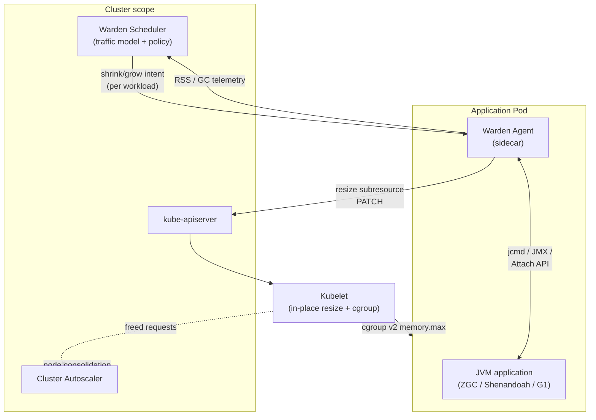
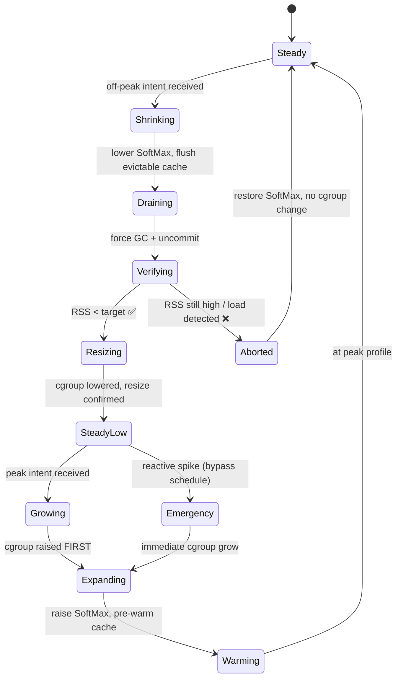

# Architecture

This document describes the internal design of **mnemo-jvm-warden**: its
components, how they interact with the JVM and the Kubernetes control plane, and
the state machine that guarantees a resize never OOMKills a pod.

> For the *why* — the market gap, the requests-vs-limits argument, and the vs-VPA
> positioning — see the [README](../README.md). This document assumes that
> context and focuses on *how*.

---

## Component overview

Warden runs as a **per-pod sidecar agent** plus an optional **cluster-scoped
scheduler**. The sidecar is deliberately dumb about policy and smart about
safety; the scheduler owns the traffic model.

### Warden Agent (sidecar)

The safety-critical component. One per JVM pod. Responsibilities:

- **JVM control** — drives the runtime heap knobs via `jcmd`, JMX, or the Attach
  API: `SoftMaxHeapSize`, forced GC, uncommit. Never touches `-Xmx` (immutable at
  runtime).
- **RSS verification** — reads actual resident set from cgroup
  `memory.current` and JVM `NMT`/`GC` telemetry. This is the gate that makes a
  shrink safe.
- **Resize execution** — issues the in-place `resize` subresource PATCH to the
  API server and confirms the kubelet applied it.
- **Cache hooks** — optional. If the app exposes a Warden-compatible cache
  interface (e.g. mnemo-cache), the agent asks it to flush *evictable* entries
  before a shrink and pre-warm before a grow. Never flushes the hot working set.

### Warden Scheduler (cluster-scoped, optional)

- Owns the **traffic model**: predicted low/peak windows per workload, from
  cron-style schedules or a metrics source (Prometheus queue length, RPS).
- Emits **intent** ("workload X should be at its off-peak profile") to agents.
  It does *not* execute resizes — it declares desired state; the agent decides
  whether it's currently safe.
- Consumes agent telemetry (RSS, GC pause, cache hit-rate) to close the loop and
  detect when a shrink was rejected.

Running without the scheduler is valid: an agent can be driven by a static
annotation-based schedule for simple minimum-replica baselines.

---

## The resize state machine

Every transition is a state machine in the agent, not a linear script — because
a shrink can legitimately **abort** if the JVM won't give memory back (a genuine
load spike arriving mid-shrink). Aborting safely is a first-class outcome.

### Shrink path (SteadyLow is the goal)

1. **Shrinking** — agent lowers `SoftMaxHeapSize` and signals the cache to flush
   evictable entries. No cgroup change yet.
2. **Draining** — force a deep GC and uncommit; pages return to the OS.
3. **Verifying** — the **gate**. Read actual RSS. Only if RSS has dropped below
   the intended new limit (with a safety margin) does the agent proceed.
4. **Resizing** — issue the in-place PATCH lowering *both* request and limit.
   Lowering the **request** is what frees capacity for Cluster Autoscaler; the
   limit is lowered in lockstep to keep the pod honest.
5. **Aborted** — if RSS won't drop or the scheduler/agent detects returning
   load, restore the soft max and leave the cgroup untouched. **Never lower the
   cgroup on an unverified shrink.**

### Grow path (asymmetric on purpose)

1. **Expanding** — raise the cgroup (request + limit) **first** via in-place
   PATCH. Headroom must exist before the JVM reaches for it.
2. **Warming** — raise `SoftMaxHeapSize`, then optionally pre-warm the cache
   *ahead* of the predicted traffic return.

### Emergency path

A reactive spike detected while in `SteadyLow` bypasses the schedule and jumps
straight to `Expanding`. This is Scenario 2 insurance: the pod is already warm
(JVM up, classes loaded), so recovery is a sub-second grow, not a cold start.

---

## Failure modes & invariants

The design holds these invariants regardless of scheduler state:

| Invariant | Why | Enforced by |
|---|---|---|
| cgroup is never lowered before RSS is verified below target | prevents OOMKill | `Verifying` gate |
| cgroup is always raised before JVM soft-max is raised | prevents allocation into non-existent headroom | grow ordering |
| a workload never drops below its HA replica floor | Warden is vertical-only; it must not fight PodDisruptionBudgets | agent refuses replica changes |
| hot working set is never flushed | avoids self-inflicted cold cache | cache hook flushes evictable-only |
| a rejected shrink is a no-op, not a degraded state | safety over savings | `Aborted` restores soft-max |

### What can still go wrong

- **Uncommit lag.** Some GCs uncommit asynchronously; the `Verifying` gate must
  wait for pages to actually return, not just for GC to complete. Timeout →
  abort.
- **cgroup v1 clusters.** In-place resize + reliable `memory.current` accounting
  assume cgroup v2. v1 is out of scope.
- **Request-only savings.** If the cluster has no node consolidation (no Cluster
  Autoscaler, fixed node pool), lowering requests reclaims *schedulable*
  capacity but not *billed* capacity. Warden surfaces this so the value isn't
  over-claimed.

---

## Open design questions

Tracked for discussion — none are settled:

1. **Agent placement** — true sidecar container vs. a node-level DaemonSet
   agent addressing pods over the CRI. Sidecar is simpler and per-JVM; DaemonSet
   is lighter on pod overhead.
2. **GC abstraction** — a per-collector driver (ZGC / Shenandoah / G1) behind a
   common `HeapController` interface, so the safety machine stays
   collector-agnostic.
3. **Scheduler source of truth** — CRD-based policy vs. pod annotations vs. a
   Prometheus-driven predictor. Likely all three as pluggable inputs.
4. **VPA coexistence** — should Warden emit its recommendations *to* VPA (as a
   JVM-aware recommender) rather than resizing directly? This could make Warden a
   drop-in enhancement to existing VPA deployments.
