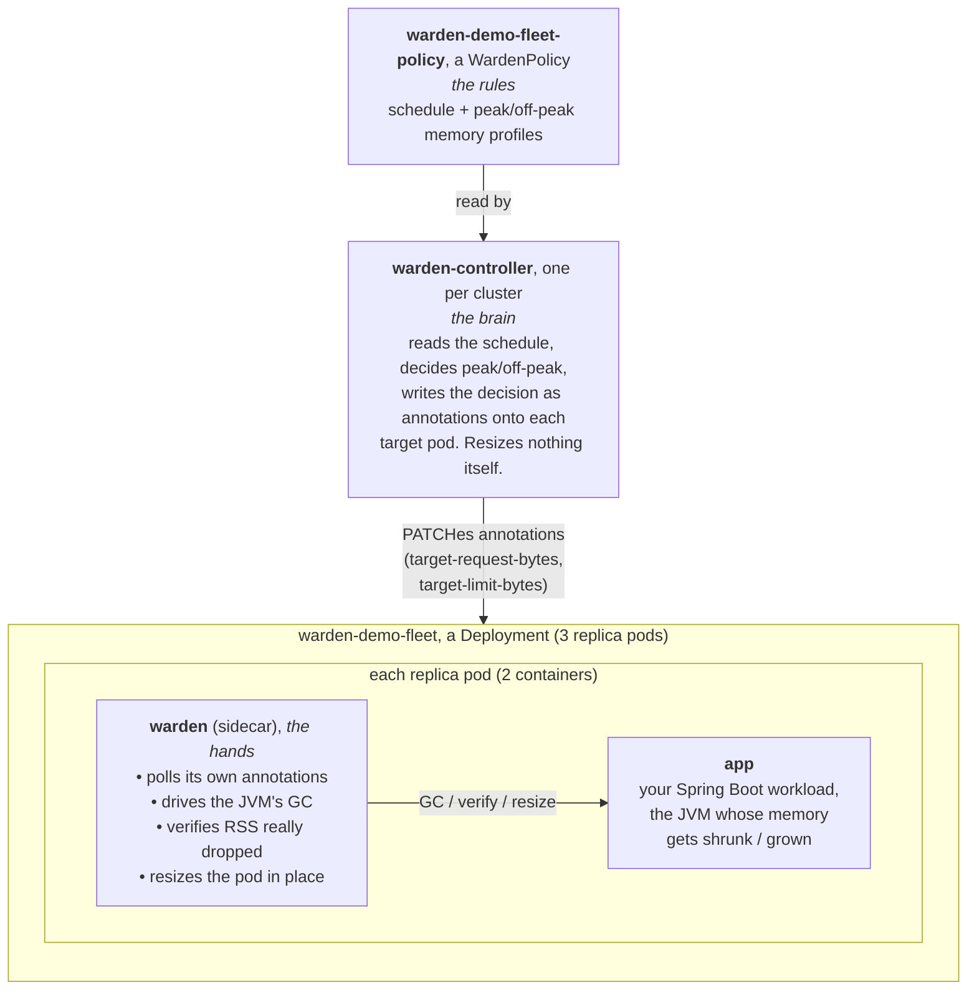

# Right-Sizing a Fleet of JVMs on a Schedule with mnemo-jvm-warden

*A hands-on walkthrough: running three replicas of a Spring Boot service and watching Warden
safely shrink and grow their memory on a schedule, the way you'd actually do it in production.*

---

## What this article shows, and why it matters

Java services are often memory-hungry, and when no action is taken, most of that memory will sit idle outside peak hours. A service sized for its 9am rush holds that same footprint at 3am, when it's serving almost nothing. In Kubernetes you pay for that idle headroom because the cluster reserves it whether
you use it or not.

The obvious fix, "give it less memory", is harder than it sounds for a JVM. You can't
change `-Xmx` on a running JVM, and even if you lower the container's memory limit, the JVM
won't hand memory back to the operating system on its own. Lower the limit without making the
JVM cooperate and you get an OOMKill.

[**mnemo-jvm-warden**](https://github.com/baokhang83/mnemo-jvm-warden) solves this. It's a
Kubernetes controller plus a per-pod agent that, on a schedule, makes the JVM *actually
release* memory (lower its soft heap ceiling, run GC, uncommit pages), *verifies* the memory
was really freed, and only then shrinks the pod's resource request and limit in place. No
restart, no OOMKill, no cold start. When peak returns, it grows everything back before traffic
arrives.

This walkthrough runs a realistic version of that: **three replicas of one service**, resized
together by a single controller reading a single policy. By the end you'll have watched the
memory oscillate on a two-minute cycle across all three pods, and you'll understand each moving
part well enough to adapt it to your own services.

---

## The mental model: three pieces, one flow

Before any commands, it helps to hold the whole picture in your head. Warden is not "a
sidecar." It's three distinct things with a deliberate division of labor:



**Why split "the brain" from "the hands"?** Two reasons that matter in production:

1. **Safety and blast radius.** The agent that lives *inside* your application pod is
   deliberately dumb: it knows *how* to resize safely but has no scheduling logic, no policy
   parsing, no cluster-wide awareness. It only ever touches its own pod. The controller, which
   holds the cluster-wide policy, never needs privileged access into your app's pod, it just
   writes an annotation.
2. **Scale.** One controller drives an entire fleet. Add a new service, or scale an existing
   one from 3 replicas to 30, and the controller picks up the new pods automatically. You
   never configure Warden per-pod.

The **flow** ties them together: the controller reads the policy, decides the current profile,
and PATCHes two annotations (`warden.mnemo.io/target-request-bytes` and `-limit-bytes`) onto
every pod that matches the policy's target. Each pod's sidecar independently polls those
annotations, and when it sees a new target, it runs the shrink or grow sequence on its own
JVM.

---

## Prerequisites and environment

This walkthrough assumes a Kubernetes cluster of **version 1.35 or newer**, because in-place
pod resizing (the `pods/resize` subresource that lets you change a running pod's memory without
restarting it) only became generally available then. On earlier versions you'd need the
`InPlacePodVerticalScaling` feature gate.

The environment used here is a [kind](https://kind.sigs.k8s.io/) cluster (Kubernetes-in-Docker)
running inside a **WSL** Ubuntu distro on Windows. This is a common setup on locked-down
corporate laptops, where Docker Desktop and Rancher Desktop may be blocked or admin-gated, but
a WSL distro with its own native Docker is available. If you're on Linux or macOS, ignore the
WSL-specific notes, the Kubernetes steps are identical.

**Open your WSL shell as root:**

```bash
wsl -d abs-on-azt-ubuntu-24.04 -u root
```

Running as root avoids the Linux `docker` group permission dance, otherwise you'd need your
user added to the `docker` group and a fresh login for it to take effect. Every command below
runs inside this shell.

**Start Docker.** The WSL distro has no systemd, so the Docker daemon doesn't start
automatically and doesn't survive a restart. Start it manually at the beginning of each
session:

```bash
service docker start
docker ps        # should print an empty table, NOT a connection/permission error
```

If `docker ps` errors with "Cannot connect to the Docker daemon," the daemon didn't start; if
it errors with "permission denied," you're not root. Fix that before continuing, nothing else
will work.

**Install the CLI tools** (one-time). You need `kubectl` (talk to Kubernetes), `kind` (create
a local cluster), and `helm` (install the Warden controller):

```bash
# kubectl, the Kubernetes command-line client
curl -LO "https://dl.k8s.io/release/$(curl -Ls https://dl.k8s.io/release/stable.txt)/bin/linux/amd64/kubectl"
chmod +x kubectl && mv kubectl /usr/local/bin/

# kind, runs a throwaway Kubernetes cluster inside Docker
curl -Lo ./kind https://kind.sigs.k8s.io/dl/latest/kind-linux-amd64
chmod +x ./kind && mv ./kind /usr/local/bin/kind

# helm, the Kubernetes package manager, used to install the Warden controller chart
curl -fsSL https://raw.githubusercontent.com/helm/helm/main/scripts/get-helm-3 | bash

# confirm all three respond
kubectl version --client && kind version && helm version
```

**Create the cluster:**

```bash
kind create cluster --name warden-demo
kubectl wait --for=condition=Ready node --all --timeout=90s
```

`kind create cluster` spins up a single-node Kubernetes cluster as a Docker container and points
your `kubectl` at it automatically (the context becomes `kind-warden-demo`). The `wait` command
blocks until the node reports Ready, so you don't race ahead before the cluster is usable.

---

## Step 1, Install the Warden controller (once per cluster)

The controller is distributed as a Helm chart, published to a chart repository. Installing it
is three commands:

```bash
helm repo add warden https://baokhang83.github.io/mnemo-jvm-warden/
helm repo update
helm install warden warden/warden
```

- `helm repo add` registers the Warden chart repository under the local alias `warden`.
- `helm repo update` fetches the current index of available charts from that repo.
- `helm install warden warden/warden` installs the chart named `warden` from that repo, naming
  this installation (the "release") `warden`.

What this actually creates in the cluster: a **Deployment** running the controller, the
**CustomResourceDefinition** for `WardenPolicy` (so Kubernetes learns about the new
`WardenPolicy` object type), and the **RBAC** (a ServiceAccount, ClusterRole, and
ClusterRoleBinding) that lets the controller watch policies and patch pod annotations
cluster-wide.

Wait for it to be ready:

```bash
kubectl wait --for=condition=Available deployment/warden-controller --timeout=90s
```

**You install the controller once.** It will drive every Warden-managed workload in the
cluster, you never install a second one for a second app.

---

## Step 2, Understand and save the fleet manifest

This is the heart of the walkthrough. We deploy the application as a **Deployment with three
replicas**, not as three individually-named pods. That distinction is the whole point of doing
this "the production way":

- A **bare Pod** must have a unique name you choose by hand. Running three means writing three
  manifests with three different names, tedious and unlike anything you'd do in production.
- A **Deployment** is a controller that says "keep N copies of this pod template running."
  Kubernetes generates the individual pods' names for you (`warden-demo-fleet-5c6c98c9dc-74gqv`
  and so on). You name the Deployment once; the replicas' names are Kubernetes' problem, not
  yours.

Save the following as `fleet.yaml`. It contains five Kubernetes objects, explained
section-by-section after the manifest.

```yaml
apiVersion: v1
kind: ServiceAccount
metadata:
  name: warden-demo-fleet
---
apiVersion: rbac.authorization.k8s.io/v1
kind: Role
metadata:
  name: warden-demo-fleet-resize
rules:
  - apiGroups: [""]
    resources: ["pods/resize"]
    verbs: ["patch"]
  - apiGroups: [""]
    resources: ["pods"]
    verbs: ["get"]
---
apiVersion: rbac.authorization.k8s.io/v1
kind: RoleBinding
metadata:
  name: warden-demo-fleet-resize
subjects:
  - kind: ServiceAccount
    name: warden-demo-fleet
roleRef:
  kind: Role
  name: warden-demo-fleet-resize
  apiGroup: rbac.authorization.k8s.io
---
apiVersion: apps/v1
kind: Deployment
metadata:
  name: warden-demo-fleet
  labels:
    app.kubernetes.io/name: warden-demo-fleet
spec:
  replicas: 3
  selector:
    matchLabels:
      app.kubernetes.io/name: warden-demo-fleet
  template:
    metadata:
      labels:
        app.kubernetes.io/name: warden-demo-fleet
    spec:
      serviceAccountName: warden-demo-fleet
      shareProcessNamespace: true
      volumes:
        - name: host-cgroup
          hostPath:
            path: /sys/fs/cgroup
            type: Directory
      initContainers:
        - name: warden
          image: ghcr.io/baokhang83/mnemo-jvm-warden:latest
          imagePullPolicy: IfNotPresent
          restartPolicy: Always
          ports:
            - name: health
              containerPort: 8080
          env:
            - name: WARDEN_POD_NAME
              valueFrom:
                fieldRef:
                  fieldPath: metadata.name
            - name: WARDEN_TARGET_CONTAINER_NAME
              value: app
            - name: WARDEN_INTENT_POLL_INTERVAL_SECONDS
              value: "2"
          volumeMounts:
            - name: host-cgroup
              mountPath: /host-cgroup
              readOnly: true
          livenessProbe:
            httpGet: { path: /healthz, port: health }
            periodSeconds: 10
          readinessProbe:
            httpGet: { path: /readyz, port: health }
            periodSeconds: 5
          resources:
            requests: { cpu: 25m, memory: 64Mi }
            limits: { memory: 256Mi }
      containers:
        - name: app
          image: ghcr.io/baokhang83/warden-spring-demo:latest
          imagePullPolicy: IfNotPresent
          command:
            - java
            - -XX:+UseG1GC
            - -Xmx400m
            - -Dcom.sun.management.jmxremote.port=9999
            - -Dcom.sun.management.jmxremote.rmi.port=9999
            - -Dcom.sun.management.jmxremote.host=127.0.0.1
            - -Dcom.sun.management.jmxremote.authenticate=false
            - -Dcom.sun.management.jmxremote.ssl=false
            - -Djava.rmi.server.hostname=127.0.0.1
            - -jar
            - /app/app.jar
          ports:
            - name: http
              containerPort: 8081
          readinessProbe:
            httpGet: { path: /actuator/health, port: http }
            periodSeconds: 5
          resources:
            requests: { cpu: 100m, memory: 300Mi }
            limits: { memory: 450Mi }
          resizePolicy:
            - resourceName: memory
              restartPolicy: NotRequired
---
apiVersion: warden.mnemo.io/v1alpha1
kind: WardenPolicy
metadata:
  name: warden-demo-fleet-policy
spec:
  targetRef:
    apiVersion: apps/v1
    kind: Deployment
    name: warden-demo-fleet
  timezone: UTC
  profiles:
    off-peak: { request: 300Mi, limit: 350Mi }
    peak:     { request: 350Mi, limit: 450Mi }
  schedule:
    - cron: "*/2 * * * *"
      profile: off-peak
    - cron: "1-59/2 * * * *"
      profile: peak
```

### The ServiceAccount, Role, and RoleBinding, permissions

First, what a **ServiceAccount** actually is, since the rest of this section builds on it.
Kubernetes distinguishes two kinds of "who": *users* are humans (you, running `kubectl`), while
a *ServiceAccount* is the identity a **program running inside the cluster**, a pod, uses when
it calls the Kubernetes API. When a pod is assigned a ServiceAccount, Kubernetes automatically
injects a token (a credential) into the pod's containers; any API call the pod makes carries that
token, and the API server recognizes the caller as that ServiceAccount. It's a service's login
account, as opposed to a person's. Every pod runs as *some* ServiceAccount, if you don't specify
one, it uses the namespace's near-powerless `default`, which is exactly why we create a dedicated
one here and grant it only what it needs.

Three objects work together to authorize the sidecar, and it's worth seeing how they connect:

- The **ServiceAccount** (`warden-demo-fleet`) is the *identity*, the "who."
- The **Role** (`warden-demo-fleet-resize`) is the *permissions*, the "what's allowed." It's
  where we grant exactly two things the sidecar needs on its own pod: read it (`get` on `pods`)
  and resize it (`patch` on the `pods/resize` subresource). Kubernetes denies everything by
  default, so without this the sidecar's resize call is rejected with "Forbidden."
- The **RoleBinding** connects the two, it says "this ServiceAccount gets these permissions."

So at runtime: the pod runs *as* `warden-demo-fleet`; the sidecar calls `pods/resize`; the API
server checks whether that ServiceAccount is allowed; the RoleBinding says yes; the resize
proceeds. (Analogy: the ServiceAccount is a badge, the Role is a list of doors it may open, and
the RoleBinding is programming *this* badge to open *those* doors.)

There's a subtlety here worth calling out for anyone adapting this. In the single-pod demo, you
can scope the Role tightly to one named pod (`resourceNames: ["warden-spring-demo"]`). With a
Deployment you *can't*, the replica names are generated at runtime, so you can't pre-name them
in a Role. This manifest therefore grants `get`/`patch` on pods across the whole namespace.
That's broader than ideal: any pod using this ServiceAccount could, in principle, patch any
other pod in the namespace. In real production you pair this with a **ValidatingAdmissionPolicy**
(the project's issue #71) that uses each pod's own service-account token identity to ensure a
replica can only resize *itself*. It's omitted here to keep the manifest readable, but flag it
in your notes if you take this to production.

### The Deployment, `replicas: 3` and the two containers

`replicas: 3` is the entire difference from a single-pod demo. The `selector` and the pod
template's `labels` must match (`app.kubernetes.io/name: warden-demo-fleet`), that label is how
the Deployment finds its own pods, and, crucially, **also how the Warden controller finds them**
to write intent annotations.

Each pod runs two containers:

- **`warden`** is declared as an **initContainer** with `restartPolicy: Always`. That specific
  combination is Kubernetes' "native sidecar" pattern (stable since 1.29): the container starts
  *before* the main app, runs for the pod's entire life, and shuts down *after* it. That
  ordering matters, the agent must be attached and ready before the JVM it manages starts, and
  must outlive it to handle shutdown cleanly.
- **`app`** is the actual workload, a small Spring Boot service that can be told to grow its
  heap on demand, standing in for a real application.

A few fields on these containers are load-bearing and worth understanding rather than
copy-pasting blindly:

- **`shareProcessNamespace: true`** lets the sidecar see the app JVM's process ID through
  `/proc`. The agent needs the PID to locate the JVM; the actual communication then happens over
  a local JMX port (the `-Dcom.sun.management.jmxremote.*` flags on the app).
- **The `host-cgroup` hostPath volume** mounts the node's `/sys/fs/cgroup` into the sidecar
  read-only. This is how the agent reads the app container's *actual* resident memory (RSS) from
  cgroup accounting, the number it checks to confirm memory was genuinely freed before
  resizing. This mount is a real privilege cost (the sidecar can see every cgroup on the node),
  and it's required: there's no narrower Kubernetes-native way to expose just one pod's cgroup.
  If your platform enforces restrictive PodSecurity standards, this needs an exemption.
- **The JMX flags on the app**, especially `-Dcom.sun.management.jmxremote.host=127.0.0.1`,
  bind the management port to loopback only. Because the two containers share a network
  namespace, the sidecar can reach it over localhost, but nothing outside the pod can, which is
  why `authenticate=false` is acceptable here.
- **`-XX:+UseG1GC`** is set explicitly. At small container memory sizes the JVM's own ergonomics
  would pick the Serial collector, which Warden refuses to manage (it can only safely drive G1,
  Shenandoah, and ZGC). Setting it explicitly guarantees the demo uses a collector Warden can
  actually work with.
- **`resizePolicy: [{ resourceName: memory, restartPolicy: NotRequired }]`** tells Kubernetes
  that changing this container's memory does *not* require a restart. This is what makes the
  resize happen in place, the whole point.

Note the two containers have very different resource profiles: the app requests 300Mi (and is
what Warden resizes), while the sidecar is a lightweight 64Mi helper that stays fixed.

### The WardenPolicy, the rules

This is the object the controller reads. Three things define the behavior:

- **`targetRef`** points at the **Deployment** (`kind: Deployment`), not a pod. This is what
  makes the controller fan out to all replicas: it reads the Deployment's label selector, finds
  every matching pod, and writes intent to each. Point it at a Deployment and scaling "just
  works."
- **`profiles`** define two named memory configurations. `off-peak` is the lean profile
  (request 300Mi / limit 350Mi); `peak` is the roomy one (350Mi / 450Mi). *Note which number
  matters:* the **request** is what Kubernetes bills and bin-packs against. Lowering the limit
  alone saves nothing; lowering the request is what frees capacity a cluster autoscaler can
  reclaim.
- **`schedule`** maps cron expressions to profiles. Here it alternates every minute
  (`*/2` = even minutes → off-peak, `1-59/2` = odd minutes → peak) so you don't have to wait for
  a real overnight window to see it work. In production these would be real times, e.g. `0 20 * * *`
  → off-peak at 8pm, `0 6 * * *` → peak at 6am, interpreted in the `timezone` you specify.

---

## Step 3, Apply the manifest and watch the rollout

```bash
kubectl apply -f fleet.yaml
kubectl rollout status deployment/warden-demo-fleet --timeout=150s
```

`kubectl apply` creates all five objects. `kubectl rollout status` then blocks, printing
progress, until all three replicas are up and passing their readiness probes:

```
Waiting for deployment "warden-demo-fleet" rollout to finish: 0 of 3 updated replicas are available...
Waiting for deployment "warden-demo-fleet" rollout to finish: 2 of 3 updated replicas are available...
deployment "warden-demo-fleet" successfully rolled out
```

Look at the pods Kubernetes created for you:

```bash
kubectl get pods -l app.kubernetes.io/name=warden-demo-fleet
```

```
NAME                                 READY   STATUS    RESTARTS   AGE
warden-demo-fleet-5c6c98c9dc-74gqv   2/2     Running   0          60s
warden-demo-fleet-5c6c98c9dc-kdnb9   2/2     Running   0          60s
warden-demo-fleet-5c6c98c9dc-tpbr2   2/2     Running   0          60s
```

Two things to read here. **`2/2`** means both containers (app + sidecar) are running and ready
in each pod. And the **generated names**, you never typed `74gqv`; Kubernetes assigned them.
That's the production model: you manage the Deployment, Kubernetes manages the pods.

---

## Step 4, Confirm the controller reached every replica

This is the step that proves the "one brain, many hands" model. Ask each pod whether the
controller has written intent annotations onto it:

```bash
for p in $(kubectl get pods -l app.kubernetes.io/name=warden-demo-fleet -o jsonpath='{.items[*].metadata.name}'); do
  echo "$p -> $(kubectl get pod $p -o json | grep -o 'target-limit-bytes[^,}]*' | head -1)"
done
```

```
warden-demo-fleet-5c6c98c9dc-74gqv -> target-limit-bytes": "367001600"
warden-demo-fleet-5c6c98c9dc-kdnb9 -> target-limit-bytes": "367001600"
warden-demo-fleet-5c6c98c9dc-tpbr2 -> target-limit-bytes": "367001600"
```

All three carry the annotation `warden.mnemo.io/target-limit-bytes: 367001600`, which is 350Mi
in bytes, the off-peak limit. You never touched the individual pods; the single controller
discovered all three by the Deployment's label selector and wrote to each. If you scaled to
thirty replicas, all thirty would get the annotation the same way.

You can also confirm what the policy currently thinks the profile should be:

```bash
kubectl get wardenpolicy warden-demo-fleet-policy -o jsonpath='{.status.currentProfile}'
```

This prints `off-peak` or `peak` depending on the current minute, the controller writes its
decision into the policy's status so you can observe it.

---

## Step 5, Watch all three replicas resize in real time

The resize itself is what we came to see. Save this monitoring loop as `watch-fleet.sh`:

```bash
cat > watch-fleet.sh <<'EOF'
#!/usr/bin/env bash
while true; do
  clear
  echo "policy target: $(kubectl get wardenpolicy warden-demo-fleet-policy -o jsonpath='{.status.currentProfile}')"
  printf "%-40s %-9s %-9s %-8s %-6s\n" POD REQUEST LIMIT SHRINKS GROWS
  for p in $(kubectl get pods -l app.kubernetes.io/name=warden-demo-fleet -o jsonpath='{.items[*].metadata.name}'); do
    req=$(kubectl get pod "$p" -o jsonpath='{.status.containerStatuses[?(@.name=="app")].resources.requests.memory}')
    lim=$(kubectl get pod "$p" -o jsonpath='{.status.containerStatuses[?(@.name=="app")].resources.limits.memory}')
    m=$(kubectl exec "$p" -c warden -- wget -qO- http://localhost:8080/metrics 2>/dev/null)
    s=$(echo "$m" | grep 'resizes_total{direction="shrink"}' | grep -vE 'HELP|TYPE' | awk '{print $2}')
    g=$(echo "$m" | grep 'resizes_total{direction="grow"}'   | grep -vE 'HELP|TYPE' | awk '{print $2}')
    printf "%-40s %-9s %-9s %-8s %-6s\n" "$p" "$req" "$lim" "$s" "$g"
  done
  sleep 5
done
EOF
chmod +x watch-fleet.sh
./watch-fleet.sh
```

What this script reads, and why each part:

- **`req` and `lim`** come from `.status.containerStatuses[...]`, not `.spec`. That's
  deliberate: `.spec` is what was *requested*, while `.status` is what the kubelet has
  *actually applied* to the running container. When watching a live resize, you want the truth
  of what's applied. The `[?(@.name=="app")]` filter picks the app container specifically,
  since each pod has two.
- **`shrinks` and `grows`** are scraped from the sidecar's own Prometheus metrics endpoint
  (`/metrics` on port 8080), exposed by the agent. `warden_resizes_total{direction="shrink"}`
  and `{direction="grow"}` are counters that increment each time the agent completes a resize.

Let it run across a minute boundary and you'll see output like this (off-peak minute):

```
policy target: off-peak
POD                                      REQUEST   LIMIT     SHRINKS  GROWS
warden-demo-fleet-5c6c98c9dc-74gqv       300Mi     350Mi     1        1
warden-demo-fleet-5c6c98c9dc-kdnb9       300Mi     350Mi     1        1
warden-demo-fleet-5c6c98c9dc-tpbr2       300Mi     350Mi     1        1
```

then, a minute later (peak minute):

```
policy target: peak
POD                                      REQUEST   LIMIT     SHRINKS  GROWS
warden-demo-fleet-5c6c98c9dc-74gqv       350Mi     450Mi     1        1
warden-demo-fleet-5c6c98c9dc-kdnb9       350Mi     450Mi     1        1
warden-demo-fleet-5c6c98c9dc-tpbr2       350Mi     450Mi     1        1
```

All three replicas track the schedule in lockstep. `Ctrl-C` to stop the loop.

**What actually happened under the hood on each shrink**, invisible in this table but visible in
the sidecar log (`kubectl logs <pod> -c warden`): the agent lowered the JVM's soft heap ceiling,
ran a garbage collection, waited for the JVM to uncommit the freed pages, read the container's
RSS from cgroup accounting, confirmed it had dropped safely below the new 350Mi limit, and only
*then* issued the in-place resize. If RSS had *not* dropped enough, the agent would have aborted
and left the pod at its current size rather than risk an OOMKill. That verification gate is the
core safety property, the reason this is safe to run against production traffic.

**Why the REQUEST column is the one that matters.** It's tempting to focus on the limit, but the
limit isn't what you pay for. Kubernetes schedules and (via a cluster autoscaler) bills against
**requests**, the request is the reservation the scheduler bin-packs nodes around. When Warden
drops each replica's request from 350Mi to 300Mi off-peak, it hands 50Mi × 3 back to the
scheduler's available pool. In a real cluster with a cluster autoscaler, enough reclaimed
requests across enough services lets a node be drained and deleted, and *that* is where the
money is actually saved. Lowering only the limit would change nothing on the bill.

---

## Step 6, Scale the fleet with zero extra configuration

Here's the payoff of the production model. Add two more replicas:

```bash
kubectl scale deployment/warden-demo-fleet --replicas=5
```

You changed nothing about Warden, no new policy, no new manifest, no naming. Within about 30
seconds (the controller's periodic resync interval), re-run the watch script or the annotation
check from Step 4 and you'll see all five pods now carrying intent annotations and resizing on
schedule. The controller re-runs its label-selector lookup on every reconcile, discovers the two
new pods, and starts driving them automatically.

This is precisely what a hand-named, per-pod setup cannot do, and why targeting a Deployment
rather than individual pods is the right production shape.

---

## Step 7, See the safety gate refuse an unsafe shrink

The verification gate is easiest to appreciate by deliberately provoking it. The demo app has an
endpoint that retains heap on command. Load one replica above its off-peak shrink target:

```bash
POD=$(kubectl get pods -l app.kubernetes.io/name=warden-demo-fleet -o jsonpath='{.items[0].metadata.name}')
kubectl port-forward pod/$POD 18081:8081 &
curl -X POST localhost:18081/load/200      # retain 200MB of heap, above the 350Mi shrink target
```

Now when the schedule flips to off-peak, that one replica cannot safely shrink to 350Mi, its
real memory use is too high. Watch its metrics:

```bash
kubectl exec $POD -c warden -- wget -qO- http://localhost:8080/metrics | grep warden_aborts_total
```

Its `warden_aborts_total` counter climbs: the agent tried to shrink, read RSS, saw it was still
above the target, and aborted rather than force an OOMKill. Meanwhile the other replicas,
which are idle, shrink normally. The safety decision is made per-pod, based on each pod's actual
memory, not blindly applied from the schedule.

Release the load and the next off-peak window will let it shrink:

```bash
curl -X POST localhost:18081/clear
```

This is the behavior that makes Warden safe to trust: the schedule expresses *intent*, but the
agent's RSS check is the *authority*. Intent never overrides safety.

---

## Step 8, Teardown

```bash
kubectl delete -f fleet.yaml
```

This removes the Deployment, its pods, the policy, and the RBAC. Leave the controller installed
for future runs, or remove it too:

```bash
helm uninstall warden
```

To dispose of the whole cluster:

```bash
kind delete cluster --name warden-demo
```

---

## Optional, Monitoring memory live with k9s

Throughout this walkthrough we used `kubectl` and a shell loop. For interactive exploration,
browsing pods, reading logs, and watching memory usage against the request/limit as Warden
resizes them, [k9s](https://k9scli.io/) is a pleasant terminal UI.

### Prerequisite: metrics-server (for the memory columns)

k9s shows live memory *usage* only if the cluster has **metrics-server** running, the component
that collects per-pod CPU/memory metrics. A kind cluster does **not** ship it by default, so
without this step k9s's memory columns read `n/a` and `kubectl top` fails with "Metrics API not
available."

Install it, then apply the one patch kind requires (kind's kubelet serving certs aren't signed
in a way metrics-server trusts by default, so it needs `--kubelet-insecure-tls` or it
crash-loops):

```bash
# install metrics-server
kubectl apply -f https://github.com/kubernetes-sigs/metrics-server/releases/latest/download/components.yaml

# kind-specific: skip kubelet cert verification
kubectl patch deployment metrics-server -n kube-system --type=json \
  -p='[{"op":"add","path":"/spec/template/spec/containers/0/args/-","value":"--kubelet-insecure-tls"}]'

# wait for it, then confirm metrics are flowing (takes ~30-60s to start scraping)
kubectl wait --for=condition=Available deployment/metrics-server -n kube-system --timeout=90s
kubectl top pods        # should now list pods with real CPU/MEM numbers, not an error
```

Once `kubectl top pods` prints numbers, k9s will show memory too. (On a real managed cluster,
EKS/GKE/AKS, metrics-server is usually already present, so this step is kind-specific.)

### Install and launch k9s

```bash
cd /tmp
curl -sLo k9s.tar.gz https://github.com/derailed/k9s/releases/latest/download/k9s_Linux_amd64.tar.gz
tar -xzf k9s.tar.gz k9s && chmod +x k9s && mv k9s /usr/local/bin/ && rm -f k9s.tar.gz
k9s
```

### Watching the fleet's memory

Type `:pods` ↵ to list pods. With metrics-server running, each pod row shows three memory
columns that are exactly what you want for Warden:

| Column | Meaning |
|---|---|
| **MEM** | current actual memory usage |
| **MEM/R** | usage as a **percentage of the request** |
| **MEM/L** | usage as a **percentage of the limit** |

The **MEM/R** and **MEM/L** columns are the interesting ones here, because Warden changes the
request and limit (the *denominators*) on the schedule. When a shrink fires, the limit drops
450Mi→350Mi and the request 350Mi→300Mi, so those percentages jump *even though raw usage barely
moves*, that's Warden tightening the reservation down around the JVM's actual working set. Watch
the columns shift each time the schedule flips.

Useful keys:

| Key | Action |
|---|---|
| `:pods` ↵ | list pods, auto-refreshing (MEM / MEM/R / MEM/L columns) |
| `:deploy` ↵ | list deployments |
| `:wardenpolicies` ↵ | list Warden policies, watch `currentProfile` flip |
| `Enter` | drill into a pod → its containers |
| `l` | tail logs of the selected container (great for the `warden` sidecar's resize log) |
| `y` | view live YAML (watch `resources.limits.memory` change) |
| `0` | toggle all namespaces |
| `:q` / `Ctrl-C` | back / quit |

A note on scope: k9s excels at *current state*, usage, health, logs, drilling into resources.
It does **not** graph a value changing over time, which is what the shrink/grow story ultimately
is. For the "watch the number oscillate over minutes" view, the `watch-fleet.sh` table is better;
for a polished time-series graph suitable for an article's hero image, wire Prometheus and Grafana
to the demo's `/metrics` endpoint and chart `warden_resizes_total` alongside the JVM heap metric.

---

## Troubleshooting and gotchas

These are the traps most likely to bite, gathered from actually running this end to end.

- **`docker ps` fails at the start of a session.** The WSL distro has no systemd, so the Docker
  daemon doesn't persist. Run `service docker start` each time you open the shell. If it says
  "permission denied," you're not root.
- **A pod's sidecar crashes with `NoClassDefFoundError`.** This was a real bug in early agent
  images (`v0.1.0`) where a dependency wasn't bundled into the runnable jar. It's fixed from
  `v0.1.1` onward. If you hit it, you're on a stale image, pull a newer tag.
- **A new image tag doesn't take effect.** kind caches images on its node, and with
  `imagePullPolicy: IfNotPresent` and a reused `:latest` tag, it can keep serving a stale layer.
  For reproducibility, pin to an explicit version tag (e.g. `:v0.1.1`) rather than `:latest`, or
  purge the node's cached image before reloading a rebuilt one.
- **`kubectl` jsonpath prints a huge object dump instead of a value.** You indexed a container
  that doesn't exist at that position, this pod has two containers, and the sidecar is an
  *initContainer*, so `containers[1]` is out of range. Filter by name instead:
  `containerStatuses[?(@.name=="app")]`, and read from `.status` (applied) rather than `.spec`
  (requested).
- **Nothing resizes, and the sidecar log shows no intent.** Check that the controller is running
  (`kubectl get deploy warden-controller`) and that the WardenPolicy's `targetRef` label
  selector actually matches the Deployment's pod labels, a mismatch means the controller finds
  zero pods to write to.
- **The RBAC here is broader than the single-pod demo.** Namespace-wide `pods/patch` is
  unavoidable with generated replica names; a production deployment should add the
  ValidatingAdmissionPolicy (issue #71) so a replica can only resize itself.

---

## What you've demonstrated

Running this end to end shows the complete Warden value proposition, at fleet scale:

- **One controller, one policy, three (or five, or fifty) pods**, resized together, with no
  per-pod configuration and automatic pickup of new replicas.
- **Safe, in-place JVM memory reduction**, the JVM actually releases memory, RSS is verified
  before any resize, and no pod is ever restarted or OOMKilled.
- **Savings that are real, not cosmetic**, it's the *request* that shrinks, which is what frees
  schedulable (and ultimately billable) capacity.
- **Safety that overrides schedule**, a pod under real load refuses to shrink, per-pod, based on
  its actual memory rather than the calendar.

From here, the natural next steps for a real deployment are: replace the demo app with your own
service (adding the `warden` sidecar to its pod template, ideally via the published
`warden-sidecar` Helm library chart rather than hand-copying), set real off-peak/peak windows in
your timezone, and add the admission policy so the resize permission is scoped per-pod.
