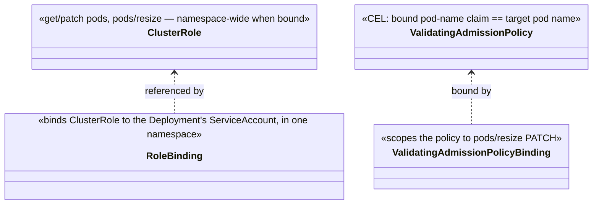
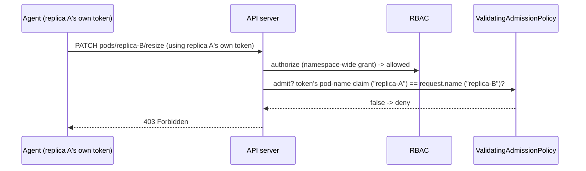

# Design: #71 — RBAC for Deployment/StatefulSet-managed agents

started: 2026-07-21

#69's demo grants `get`/`patch` on every pod in the namespace, because every replica of a
Deployment/StatefulSet shares one `ServiceAccountName` (a single `PodTemplateSpec` field — there
is no way to give each replica a different one), and RBAC's only scoping primitive,
`resourceNames`, is exact-name matching only — no label selector, no "the pod holding this
token." That's a hard, structural limitation of Kubernetes RBAC, not an oversight: confirmed
against the actual RBAC API, not assumed.

## The read side genuinely cannot be scoped tighter — confirmed, not assumed

Admission control (both `ValidatingAdmissionPolicy` and webhooks) never sees `GET`/`LIST`/`WATCH`
requests at all — verified against the Kubernetes docs' own explicit statement: reads bypass the
admission layer entirely, by design. So there is **no native mechanism, full stop**, that lets a
shared-ServiceAccount replica read only its own pod object. The namespace-wide `get` grant this
issue flags is not fixable without abandoning the shared-ServiceAccount model entirely (a
per-replica ServiceAccount + Role, which the single-`PodTemplateSpec` limitation above already
rules out for a native Deployment/StatefulSet).

## The write side — the actually dangerous action — can be scoped, natively

`pods/resize` PATCH *is* a write operation, so `ValidatingAdmissionPolicy` (GA since Kubernetes
1.30 — confirmed against the docs, and already implied by this project's existing 1.35+
requirement for in-place resize itself, so no new version floor) can gate it. Every pod's
projected service-account token is bound to that specific pod by default (has been since the
`BoundServiceAccountTokenVolume` feature went GA) — its claims include
`authentication.kubernetes.io/pod-name` and `pod-uid`, readable in a policy's CEL expression as
`request.userInfo.extra` (confirmed against Kubernetes' own documented pattern for exactly this
check, not invented). So even though every replica shares one ServiceAccount, each one's *token*
still says which specific pod it belongs to — a policy can require that identity to match the
pod being resized:

```
request.userInfo.extra['authentication.kubernetes.io/pod-name'][0] == request.name
```

This is the property that actually matters for safety: **a bug or compromised agent can never
resize a pod other than its own**, even with the namespace-wide RBAC grant underneath. The read
exposure (one replica can `GET` a sibling's pod object) is a real, remaining information
disclosure — but Warden's own code never does this (`IntentWatcher` only ever reads the pod name
it was configured with), so it is a theoretical blast-radius concern, not something the current
design actively exercises.

## `ClusterRole` + per-namespace `RoleBinding`, not a duplicated `Role`

The issue's second question has a clean, no-tradeoff answer: for a namespace-wide grant, a
`ClusterRole` referenced by a `RoleBinding` in one namespace has **identical effective scope** to
a `Role` defined directly in that namespace — the difference is purely reuse. A `ClusterRole`
defines the rule once; installing this workload into N namespaces (or a future Helm chart, M6)
means N `RoleBinding`s referencing the same `ClusterRole`, not N copies of the same rule. Strictly
better, no security cost either way.

## Class diagram



## Sequence: replica A tries to resize replica B



## Out of scope for this slice

- Scoping the read (`GET pods`) side — confirmed structurally impossible via native admission
  control; would need abandoning the shared-ServiceAccount model, which the single
  `PodTemplateSpec` limitation already rules out for Deployment/StatefulSet.
- A Helm chart or other multi-namespace install tooling that would actually reuse the
  `ClusterRole` across namespaces (M6).
