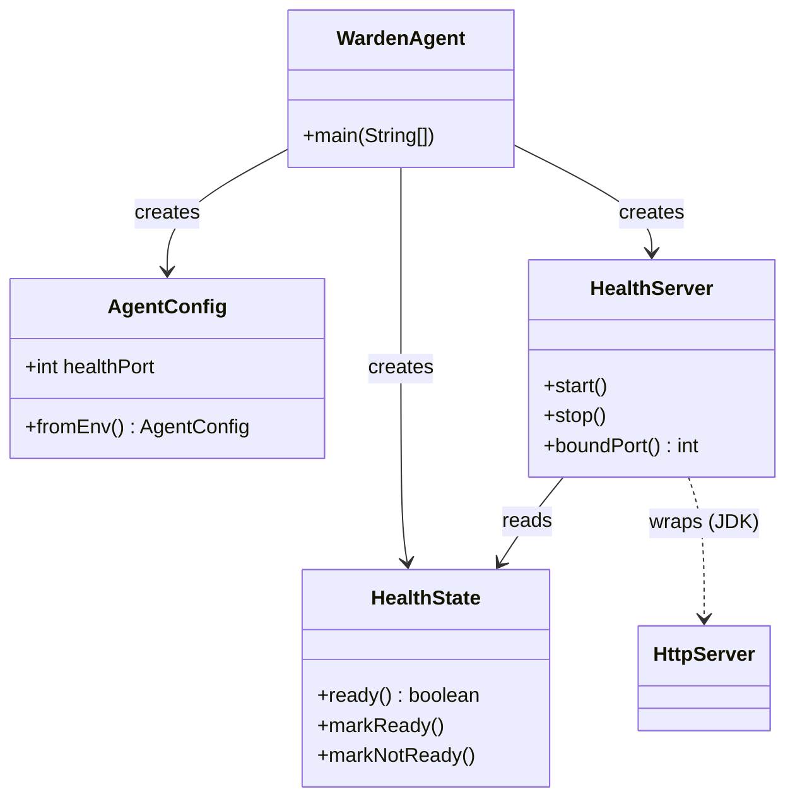
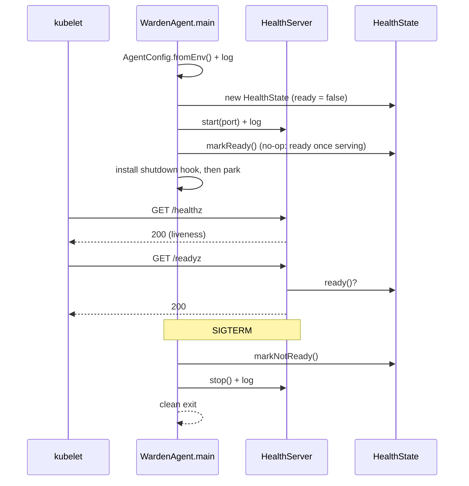

# Design: Agent runtime skeleton: config load, /healthz and /readyz, clean lifecycle, no-op

started: 2026-07-12

The sidecar boots, reads env config, serves `/healthz` + `/readyz`, and shuts down cleanly —
as a no-op, on **zero dependencies beyond the JDK**. The lean spine every later agent slice
builds on.

Key decisions (all flow from §4 — the agent earns its footprint):

- **HTTP via the JDK's `com.sun.net.httpserver.HttpServer`**, not Spring Boot/Quarkus — zero
  deps, single-digit-MB baseline, instant start, for what is two trivial endpoints.
- **Config from the environment** (K8s-native) into an immutable `AgentConfig` record; no YAML
  or config library.
- **Two endpoints even though identical today** — `/readyz` reads a `ready` flag that is the
  seam for M1: it stays `503` until the agent attaches to the target JVM, while `/healthz` stays
  `200` (liveness) so the kubelet doesn't restart a healthy-but-not-ready agent (§2).
- **Logging via the JDK `System.Logger`** — built-in facade, no SLF4J/Logback in the sidecar.

## Class diagram — runtime shapes

## Sequence — startup, serving, shutdown

## Constitution check

- **§4 (lean agent):** JDK `HttpServer`, `System.Logger`, env config — the whole module stays
  dependency-free (JUnit remains the only test dependency).
- **§1 (YAGNI):** no config library; liveness is implicit (server responds means alive) rather
  than a second stored flag.
- **§2 (seams):** the `ready` flag is the extension point M1 flips; the endpoint split exists
  before it's needed so M1 adds no surface.
- **§5 (no unverified shrink):** not exercised — this slice has no heap/resize logic.

No conflicts.
