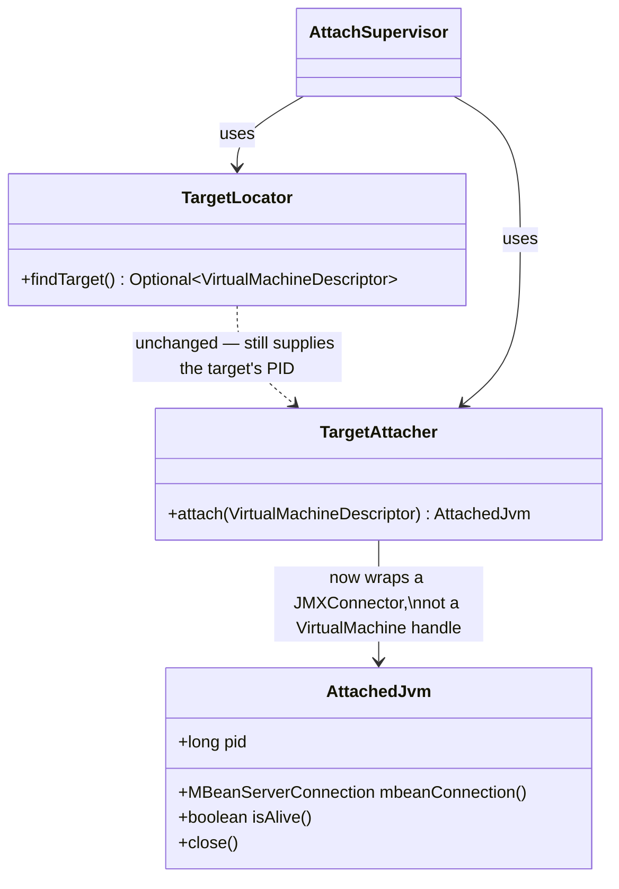
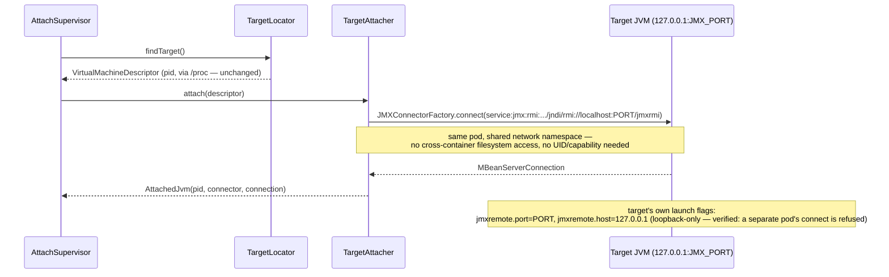

# Design: Bug #55 — replace Attach API with a target-opened JMX port

started: 2026-07-21

`TargetAttacher`'s Attach-API mechanism (W-102) turned out to fundamentally require the agent to
run as real root (UID 0) to reach a target running under a different UID &mdash; the common case,
since most app images default to root while the agent hardens to a non-root user. Exhaustively
verified on a real kind cluster: `CAP_SYS_PTRACE`, `CAP_DAC_OVERRIDE`, `CAP_DAC_READ_SEARCH`,
`CAP_SYS_ADMIN`, unconfined seccomp, unconfined AppArmor, and even *exactly matching* non-root
UID+GID all fail to enable it. Only `runAsUser: 0` on both containers works.

Replaced with a plain JMX port the target opens at launch &mdash; a network socket over the
pod's shared network namespace, not a filesystem crossing, so it needs no special UID/capability
at all. Every downstream class (`GcDetector`, `SoftMax`, `DeepGc`, `G1PeriodicGc`) already
consumes only `AttachedJvm.mbeanConnection()`, an `MBeanServerConnection` &mdash; verified all
three MBean paths (`GarbageCollectorMXBean`, `HotSpotDiagnosticMXBean`,
`DiagnosticCommand.gcRun`) work identically over this connection. This is a connection-layer
swap, not a rewrite of the heap-control code.

**A serious near-miss, caught before it shipped.** The first working version of this fix
(`-Dcom.sun.management.jmxremote.port=<port> ... .authenticate=false ... .ssl=false`) opened an
**unauthenticated JMX port reachable from any other pod in the cluster**, not just from within
the target's own pod &mdash; confirmed with a real second pod successfully completing a raw TCP
connect to the target's pod IP. Unauthenticated JMX effectively means remote code execution.
Fixed by adding `-Dcom.sun.management.jmxremote.host=127.0.0.1`, which binds the listener to the
pod's own loopback interface; re-verified on the same live deployment that a separate pod's
connection is now refused while the sidecar's own (same network namespace, same loopback) still
succeeds.

`TargetLocator` (PID discovery via `/proc`) is unaffected and unchanged &mdash; it never crossed
into the target's mount namespace, so it was never part of the broken mechanism.

## Class diagram

## Sequence: connect over the target's own JMX port, loopback only

