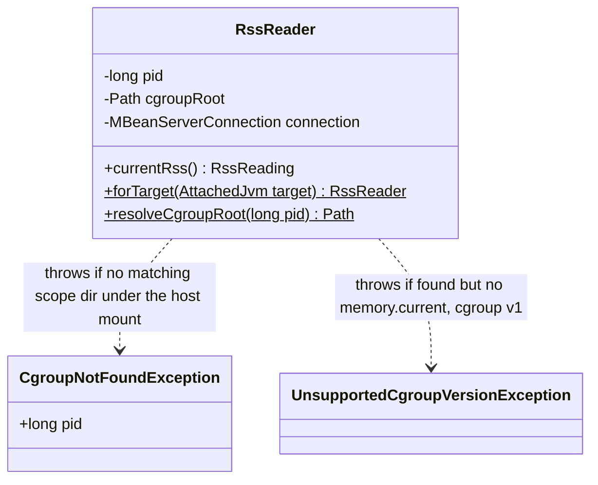

# Design: Bug #57 — RssReader cgroup access via hostPath mount

started: 2026-07-21

`RssReader`'s `/proc/<pid>/root/sys/fs/cgroup` mechanism (W-105) hits the identical UID-gated
restriction that broke the Attach API (#55): confirmed on a real cluster that it returns
`Permission denied` under a genuine agent/target UID mismatch, and (unlike #55) there is no
network-based escape hatch for reading raw files &mdash; JMX only exposes container-*aware*
memory metrics (`OperatingSystemMXBean.getTotalMemorySize()`/`getFreeMemorySize()`), and those
turned out to be raw `memory.current`-equivalent, **not** the working-set-minus-reclaimable-cache
number `RssReader` was specifically built to compute (verified: with ~300MB of page cache present,
the JMX numbers tracked `memory.current`, not `memory.current - inactive_file`). Adopting them
would silently regress the exact safety property W-105 exists for.

The verified fix instead reads the *same* cgroup files through a different path: a `hostPath`
mount of `/sys/fs/cgroup` into the agent container. Confirmed on a real cluster with a genuine UID
mismatch that this works and returns numbers matching ground truth (`anon`/`inactive_file` both
correct) &mdash; the restriction was specifically on **traversing `/proc/PID/root`**, not on the
cgroup files' own permissions (they're plain, world-readable files once reached by a path that
doesn't cross a namespace boundary via `/proc`).

**This is a real, explicit cost, not a free fix.** Cgroup namespacing deliberately hides a
container's real absolute path from its own namespaced view (confirmed: `/proc/<pid>/cgroup`
reports only a relative, ancestry-obscured path like `0::/../cri-containerd-<id>.scope`) &mdash;
there is no Kubernetes-native way to mount *just one pod's* cgroup subtree, since that path isn't
known until the container runtime assigns it after scheduling. The `hostPath` mount therefore
gives the sidecar read visibility into **every cgroup on the node**, not just its own pod's, and
finding the target's specific directory requires a bounded-depth search by container-ID substring
match (verified real depth on kind/containerd: 5 levels,
`kubelet.slice/kubelet-kubepods.slice/kubelet-kubepods-<qos>.slice/kubelet-kubepods-<qos>-pod<uid>.slice/<container-id>.scope`
&mdash; the cgroup driver and exact naming vary by cluster, so the search uses a generous depth
rather than assuming this exact shape). Confirmed acceptable and proceeding with this tradeoff
after weighing it explicitly (no narrower verified alternative was found).

The search runs once per attach/reconnect (`RssReader.forTarget()`, not per `currentRss()` call),
matching the class's existing structure &mdash; `currentRss()` already just re-reads the cached
`cgroupRoot` field, so no additional caching machinery is needed.

## Class diagram



## Sequence: resolve via host mount, search by container-ID substring

```mermaid
sequenceDiagram
  participant Caller
  participant RR as RssReader
  participant Proc as /proc/&lt;pid&gt;/cgroup (metadata only)
  participant Host as /host-cgroup (hostPath mount)

  Caller->>RR: forTarget(attachedJvm)
  RR->>Proc: read cgroup file
  Proc-->>RR: "0::/../&lt;container-id&gt;.scope" (ancestry hidden by cgroup namespacing)
  RR->>RR: extract last path segment ("&lt;container-id&gt;.scope")

  RR->>Host: bounded-depth search for a directory named "&lt;container-id&gt;.scope"
  alt found, and it has memory.current
    Host-->>RR: absolute host-relative path
    RR-->>Caller: RssReader (cgroupRoot cached for reuse)
  else found, but no memory.current
    RR-->>Caller: throw UnsupportedCgroupVersionException (cgroup v1)
  else not found anywhere under the host mount
    RR-->>Caller: throw CgroupNotFoundException (hostPath mount likely missing/misconfigured)
  end

  Caller->>RR: currentRss()
  RR->>Host: read memory.current, memory.stat (cached cgroupRoot, no re-search)
  Host-->>RR: anon, inactive_file, ...
  RR-->>Caller: RssReading(workingSetBytes = memory.current - inactive_file, ...)
```
