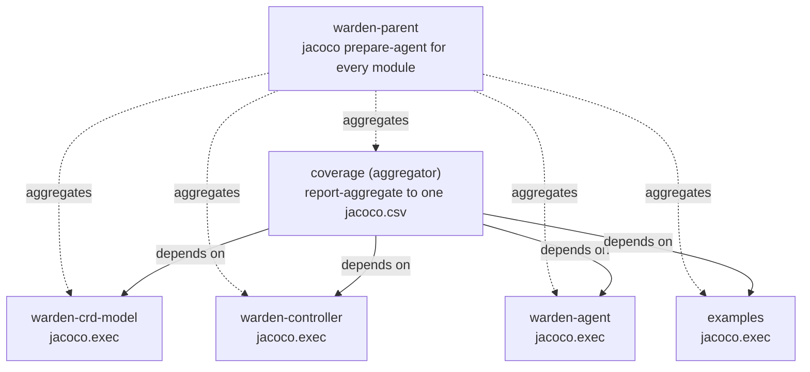
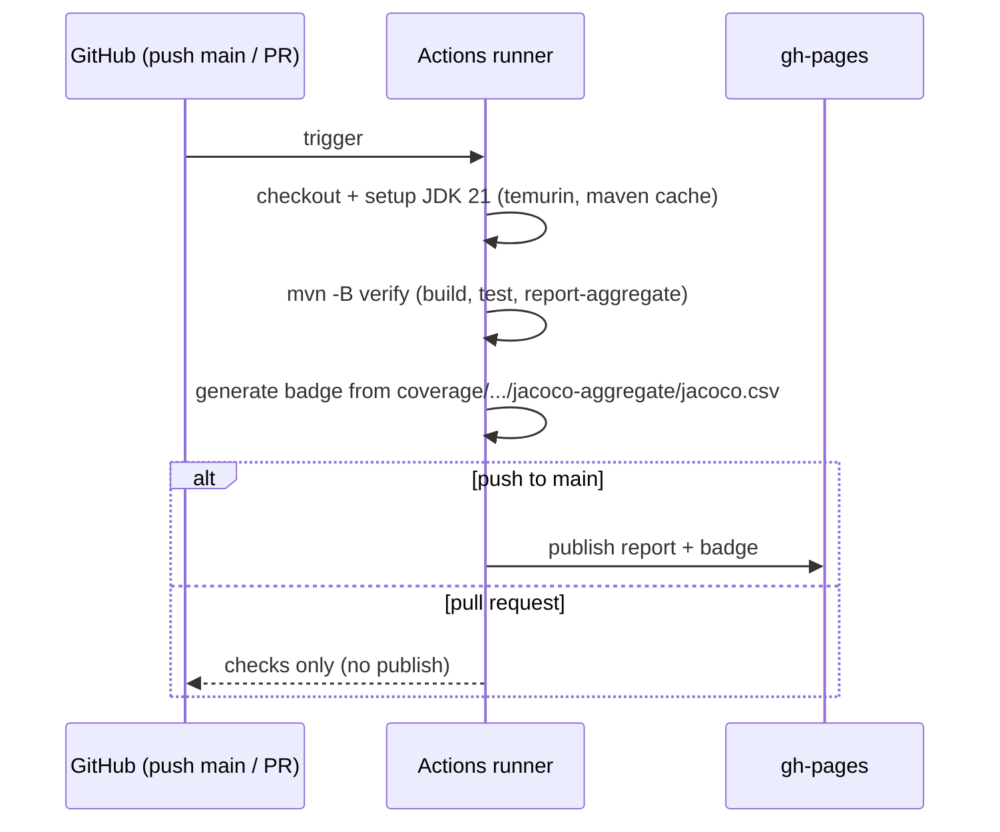

# Design: CI: build + test on PR with aggregated JaCoCo coverage badge published to gh-pages (mirror mnemo-cache)

started: 2026-07-13

Build and test every push and PR, merge one project-wide JaCoCo number from all modules, and
publish the coverage report + badge to GitHub Pages — so "green" becomes a fact the repo enforces,
not a claim. Closes an M0 gap: PRs #42/#43/#44 all merged (or are merging) with no automated check.

Mirrors `mnemo-cache`'s `build.yml` (JDK 21 Temurin, `cicirello/jacoco-badge-generator`,
`JamesIves/github-pages-deploy-action`, `permissions: contents: write`). The one thing that can't
be mirrored: `mnemo-cache` is single-module, so its badge reads one `target/site/jacoco/jacoco.csv`;
a multi-module reactor needs an **aggregator** to produce a project-wide number.

## Class diagram — the coverage aggregator in the reactor

## Sequence — CI pipeline

## Constitution check

- **§1 (YAGNI):** the `coverage` module holds no product code, but it is the only way Maven+JaCoCo
  yields a single project-wide number (`report-aggregate` reads its dependencies' exec data, and a
  parent cannot depend on its children). Justified by the requirement, not speculative.
- **least privilege / §5-adjacent:** the publish step runs only on push to `main`; PRs verify but
  never write to `gh-pages`.
- **consistency:** mirrors the sibling repo's CI idiom rather than inventing a new one.

No conflicts.
