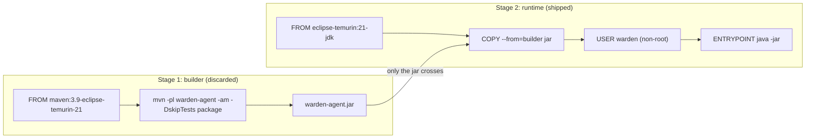
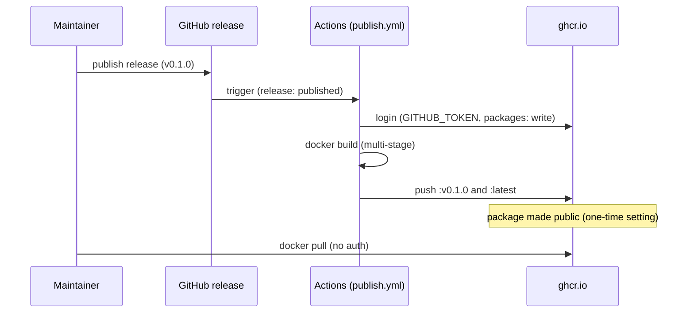

# Design: Container build + GHCR publish: multi-stage Dockerfile for the agent, release-triggered image push

started: 2026-07-13

A multi-stage Dockerfile that builds the agent and ships only what runs it, plus a
release-triggered Action that pushes the image to GitHub Container Registry — so anyone can
`docker pull` a Warden agent. Closes an M0 gap and unblocks W-005 (the example manifest needs
an image to reference).

## Class diagram — multi-stage build

## Sequence — release to GHCR

## The base-image decision

The agent needs the **Attach API** (`jdk.attach`) to control the target JVM in W-102 — the next
M1 slice. A JRE has no `jdk.attach`, so it would be a false economy reverted immediately. Ship a
**`eclipse-temurin:21-jdk`** base now; trimming to a jlink/distroless runtime (~90 MB) is a real
win but belongs in its own slice (W-605), not smuggled in here.

## Constitution check

- **§4 (lean agent) / §1 (YAGNI):** the runtime image ships only the jar (no Maven, source, or
  `.m2` cache). A JDK base is bigger than a JRE, but it's the *correct* floor for the imminent
  Attach API; the size optimization (jlink/distroless) is deferred to W-605 explicitly, not
  ignored.
- **security:** the container runs as a non-root `warden` user.
- **least privilege:** the publish workflow requests only `contents: read` + `packages: write`,
  and fires on release, not on every push.

No conflicts.
