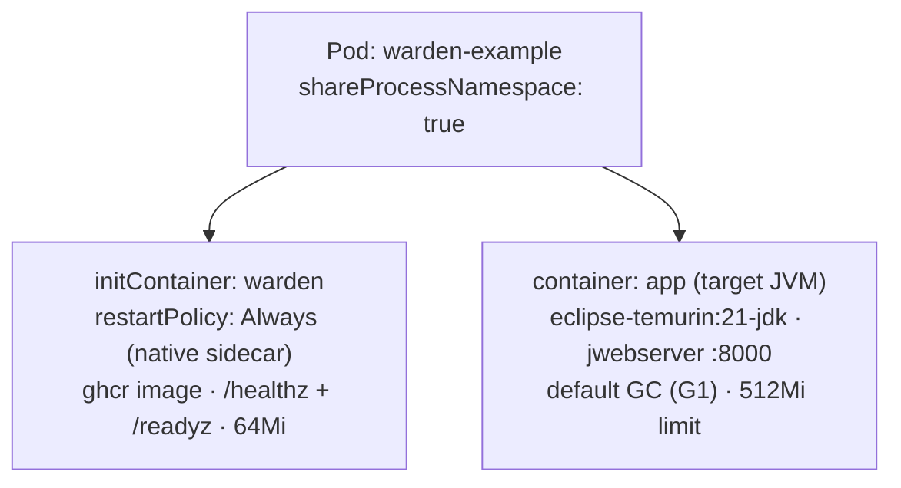
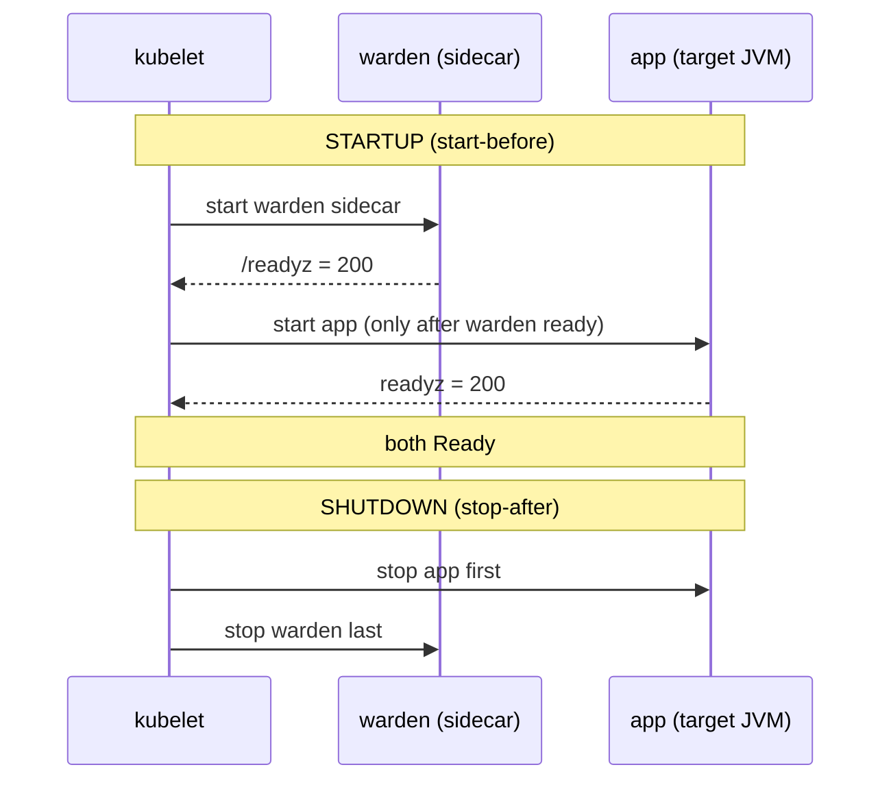

# Design: Example native-sidecar manifest: target JVM + Warden as init container with restartPolicy Always, applies on kind

started: 2026-07-13

A runnable pod showing Warden attached to a real JVM as a native sidecar — the K8s-level
start-before / stop-after guarantee the agent's safety ordering relies on. Closes M0.

## Class diagram — pod shape

## Sequence — native-sidecar lifecycle

## Decisions

- **`shareProcessNamespace: true` now** — the Attach API (W-102) needs the sidecar to see the
  target's PID. The current no-op agent doesn't use it; included with a comment so the example
  documents the attach prerequisite (mild §1 tension, named).
- **Target = stock `jwebserver`** — a real long-running JVM (the JDK's Simple Web Server), no
  custom sample app or extra image to build/publish (§1). Default GC (G1), which `GcDetector`
  recognises.
- **`imagePullPolicy: IfNotPresent`** — one manifest works both locally (a `kind load`-ed image)
  and on real clusters (pull from GHCR once a release is published).
- **A Pod, not a Deployment** — a self-contained runnable unit for an example; native sidecars
  behave identically in a Deployment (§1).

## Constitution check

- **§4 (lean agent):** the sidecar requests a small footprint (64Mi) next to the app's 512Mi.
- **§1 (YAGNI):** stock target image, a single Pod object, no custom app; `shareProcessNamespace`
  is the one forward-looking inclusion, named rather than silent.
- **§5-adjacent:** the manifest demonstrates the native-sidecar start-before/stop-after lifecycle
  that the agent's safety ordering (W-202) depends on.

No conflicts.
