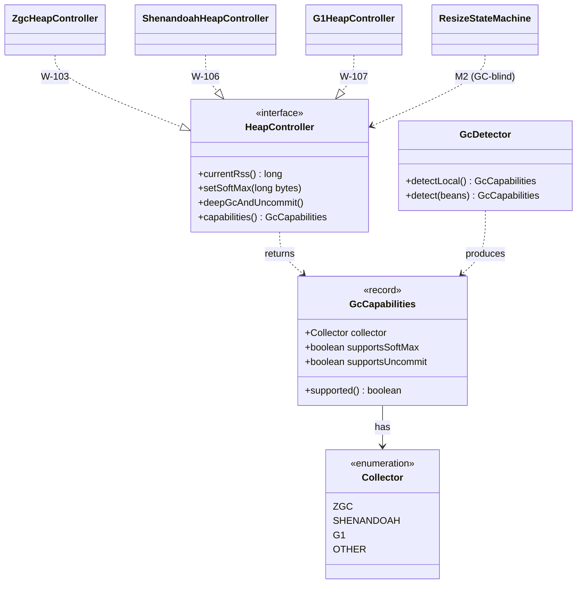
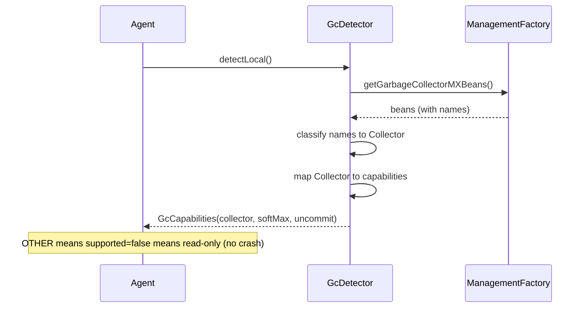

# Design: HeapController port + GC capability detection (collector-agnostic contract, ZGC/Shenandoah/G1 detection)

started: 2026-07-12

A collector-agnostic contract for controlling a JVM's heap, plus detection of which collector
the target runs and what it can do. The seam that keeps every later safety decision GC-blind
(§2). M1 begins here.

Scope of W-101: the `HeapController` **interface**, the `Collector` enum, the `GcCapabilities`
record, and `GcDetector` (with tests). The per-collector drivers (W-103/106/107) and the M2
consumer plug into the port later. Detection runs against the **local** JVM now; W-102 retargets
the identical logic at the attached target.

Capability map (declared here, verified as each real driver lands):

| Collector | setSoftMax | deepGcAndUncommit | Warden can shrink? |
|---|---|---|---|
| ZGC | real | real | yes |
| SHENANDOAH | real | real | yes |
| G1 | no-op (no soft-max) | real (periodic GC) | weaker |
| OTHER | no-op | no-op | read-only |

## Class diagram — the port and its model

## Sequence — detection

## Constitution check

- **§2 (abstractions at the seams):** one `HeapController` port + a `capabilities()` descriptor;
  callers read what's possible instead of branching on the collector, so the M2 state machine
  never sees a GC type.
- **§1 (YAGNI):** interface + detection only; no driver implementation in this slice.
- **§3 (clean units):** detection is a pure `classify(names)` + `capabilitiesFor(collector)`,
  each independently testable.
- **§5 (no unverified shrink / degrade safely):** an unknown collector is `OTHER` → read-only
  capabilities, not an exception; the agent degrades to observe-only rather than crashing.

No conflicts.
