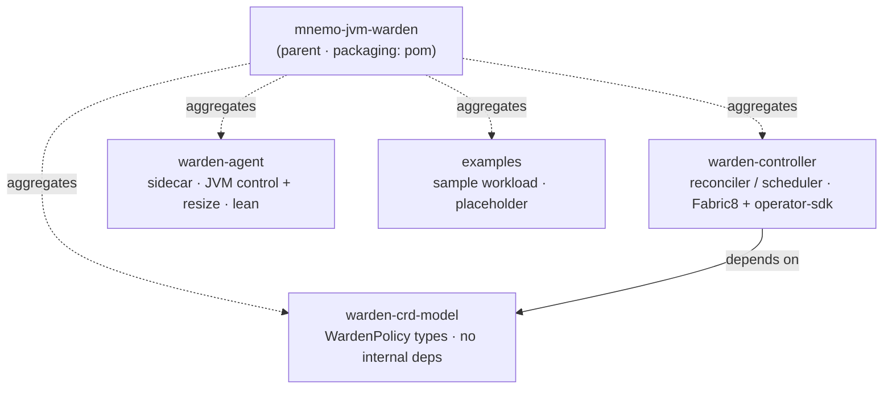
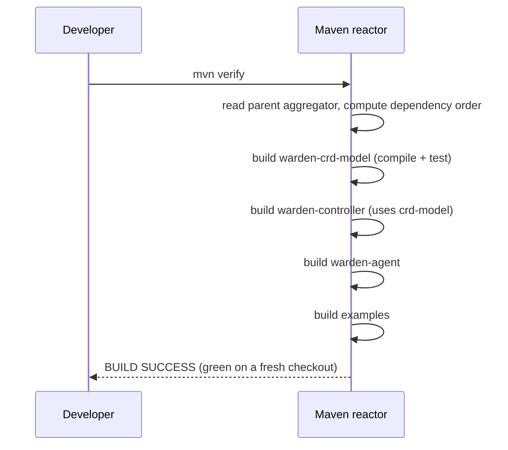

# Design: Maven multi-module skeleton (warden-agent, warden-controller, warden-crd-model, examples) building green

started: 2026-07-12

Four decoupled modules under one aggregator parent, building green on a fresh checkout.
The parent owns `dependencyManagement` and the Java target (**21**); child modules declare
dependencies without versions.

Resolved design decisions:

- **Java target: 21** — widest cluster/base-image reach; both 21 and 25 are LTS and nothing
  in Warden needs 22–25.
- **`warden-agent` has no dependency on `warden-crd-model`** — the controller interprets the
  `WardenPolicy` and hands the agent a simple instruction (target profile via annotation), so
  the sidecar stays lean (§4) and decoupled from the CRD (§1, §2).
- **`examples` is a minimal buildable placeholder** now, growing into a sample target-JVM
  workload for W-005 (§1).

## Class diagram — module dependency graph

## Sequence — reactor build (`mvn verify`)

## Constitution check

- **§1 (YAGNI):** exactly the four modules the issue names; no speculative `warden-common`,
  no empty layers. `examples` stays a placeholder until W-005 needs it.
- **§2 (abstractions at seams):** the agent is kept off the CRD module so the sidecar isn't
  welded to the CRD/Fabric8 CRD machinery it doesn't use.
- **§4 (lean agent):** the decoupling decision is made in the skeleton's favour from day one.

No conflicts.
