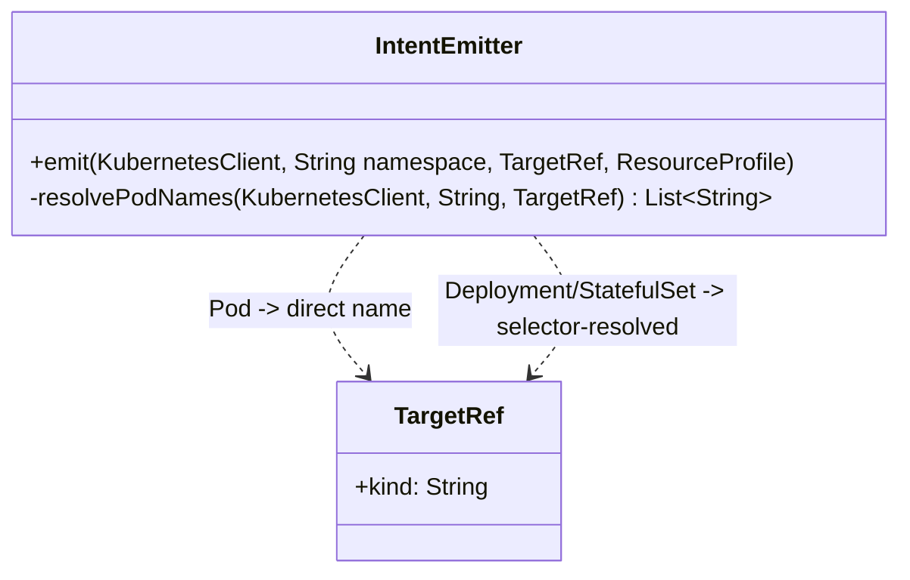
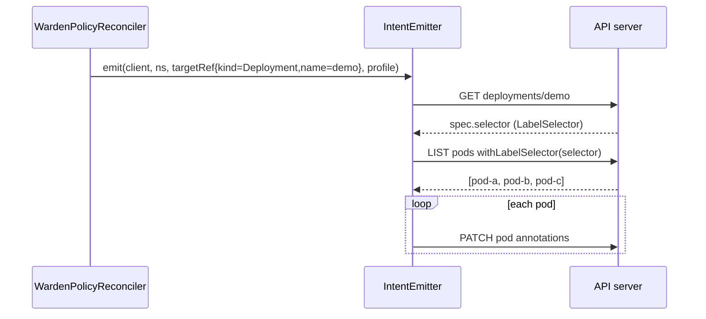

# Design: Resolve targetRef for Deployment/StatefulSet (#69)

started: 2026-07-21

W-306's `IntentEmitter` only supported `targetRef.kind: Pod`, direct by name. This resolves the
three questions #69 itself raised, and one it didn't (RBAC).

## Which pods get the annotation: all of them

A Deployment/StatefulSet's replicas are interchangeable — the schedule applies to "the workload,"
not a subset of it. `IntentEmitter` resolves `targetRef` to the workload's live pods via its own
`spec.selector` (a `LabelSelector`, read straight off the `Deployment`/`StatefulSet` object) and
annotates every matching pod identically. Each pod's own sidecar agent is completely unaware of
this — it already only ever reads its own pod's annotations (W-306), so **no agent-side change
at all** is needed to support this.

## Rolling-update catch-up: periodic resync, not a secondary watch

A new pod from a rollout won't have the annotation until something re-triggers `reconcile()`.
Watching Pods as a secondary resource (java-operator-sdk's `InformerEventSource`) would need a
label selector known statically at controller-startup — but each `WardenPolicy`'s target selector
is only known once its own targetRef is resolved, which is dynamic, per-instance. Building that
(a per-policy dynamic secondary watch with a custom `SecondaryToPrimaryMapper`) is real,
non-trivial machinery for a problem `@ControllerConfiguration`'s own built-in
`maxReconciliationInterval` already solves at the right proportion: this schedule already only
resolves at minute-granularity (`ScheduleEvaluator`'s cron grain), so a **30-second periodic
resync** (verified against the annotation's real source at the pinned tag: `interval`/`timeUnit`
on `@MaxReconciliationInterval`) catches a new replica within a bound well inside that grain,
with no new event-source machinery.

## Transport stays pod annotations — not the pod template

Annotating the Deployment/StatefulSet's **pod template** instead (so new pods inherit it at
creation) was considered and rejected: Kubernetes does not retroactively push a template
annotation change to already-running pods — only a new rollout does, which means changing a
schedule's profile would force a full rolling restart of every replica just to deliver an
annotation. That directly contradicts Warden's entire premise (in-place resize, no restart, warm
pods) for the sake of solving a problem per-pod annotations already solve correctly.

## The RBAC gap this surfaces, deliberately not solved here

Every existing example (`example-sidecar.yaml`, `oomkill-safety-check.yaml.tmpl`) scopes each
pod's own RBAC `Role` to its own pod name via `resourceNames`, fixed at deploy time — this only
works because that name is static. A Deployment/StatefulSet's replica names are **dynamic**
(generated per pod), so a `resourceNames`-scoped `Role` can't be provisioned per-replica ahead of
time; a real deployment would need a namespace-scoped grant (`get`/`patch` on all pods in the
namespace, not just "this one"), trading away the least-privilege scoping every other example in
this repo uses. Designing that tradeoff properly (a `ClusterRole`? A per-namespace `Role` with no
`resourceNames`? Something narrower?) is real, separate work — filed as a new follow-up issue
rather than solved inline here, matching how this repo already treats "the controller's own
production RBAC/Deployment manifest" as M6 Helm-chart territory.

## Class diagram

## Sequence: resolving a Deployment target

## Out of scope for this slice

- RBAC for dynamically-named pods under a Deployment/StatefulSet (new follow-up issue).
- Any change to the agent (already workload-shape-agnostic since W-306).
