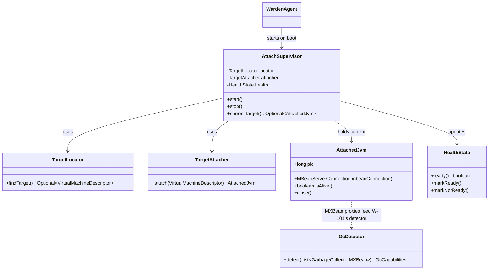
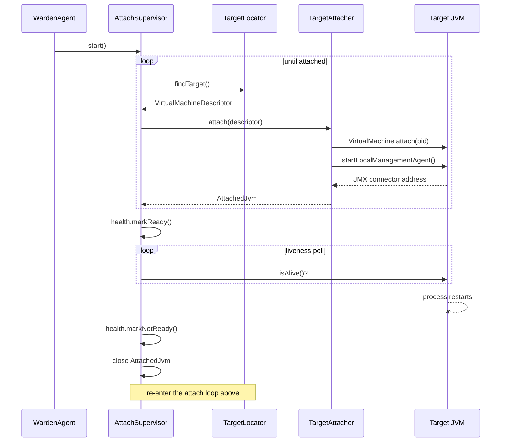

# Design: W-102 — Attach to target JVM

started: 2026-07-19

The agent needs a live control channel to the app JVM sharing its pod (`shareProcessNamespace:
true`, see `deploy/example-sidecar.yaml`). This slices into three parts: find the target PID,
attach to it and open an MBean connection, and supervise that connection for the target's whole
lifetime (including restarts), surfacing the result on `/readyz`.

## Class diagram

## Sequence: attach on boot, reconnect after target restart

