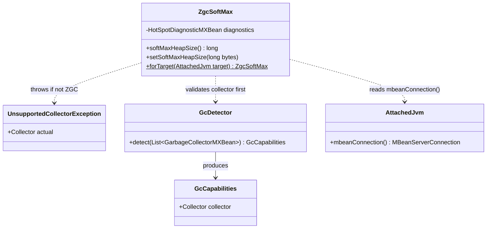
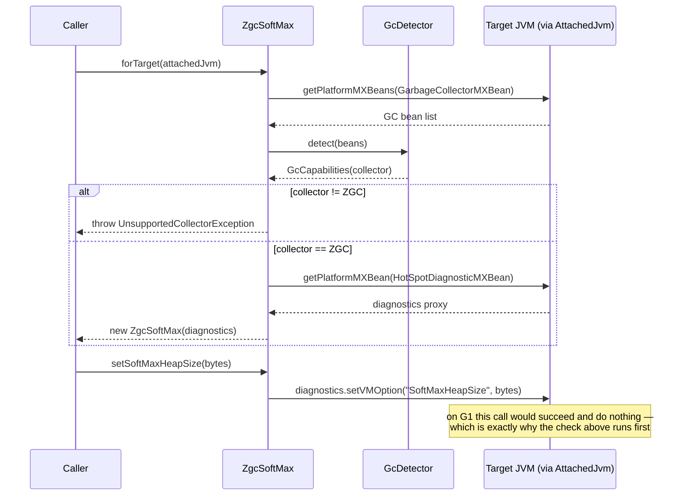

# Design: W-103 — ZGC driver, SoftMaxHeapSize get/set

started: 2026-07-19

`ZgcSoftMax` reads and writes ZGC's runtime soft heap ceiling over the connection W-102 already
opened. It is deliberately **not yet** a `HeapController` implementation: `currentRss()` needs
W-105's cgroup/NMT reader and `deepGcAndUncommit()` needs W-104, neither of which exist yet.
`ZgcHeapController implements HeapController` gets assembled once all three parts exist and the
M2 resize state machine actually needs the whole contract &mdash; no stub methods promising
behavior this ticket doesn't deliver.

The one non-obvious finding from spiking this against a real target: `SoftMaxHeapSize` is a
generic HotSpot flag. `HotSpotDiagnosticMXBean.setVMOption("SoftMaxHeapSize", ...)` **succeeds
silently on G1** &mdash; there is no exception to catch. G1 just ignores the value. So "reject if
not ZGC" has to be an explicit check against the collector *before* calling the API, not error
handling after it.

## Class diagram

## Sequence: forTarget() validates before touching the VM option

