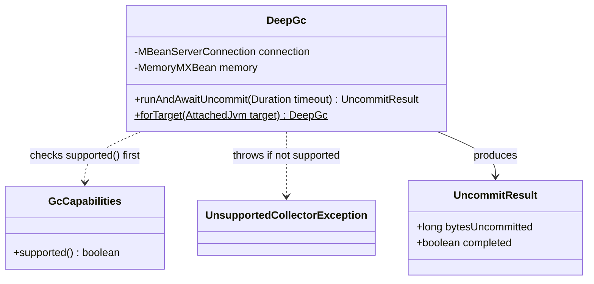
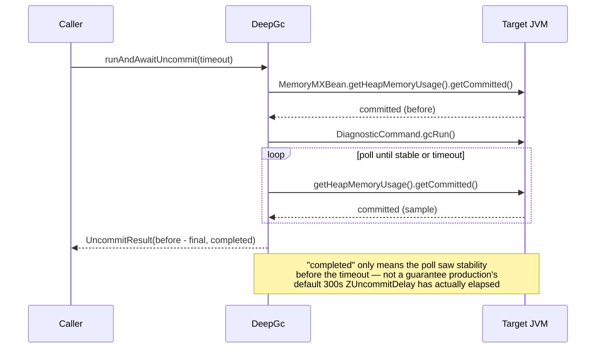

# Design: W-104 — Deep GC + uncommit

started: 2026-07-19

`DeepGc` forces a full collection on the target and waits for the collector's asynchronous
uncommit to actually return pages to the OS, reporting how much came back. Unlike W-103's
`ZgcSoftMax`, this is **not** ZGC-specific: the roadmap has W-106/W-107 (Shenandoah/G1) reuse
"the same contract" as W-104, and G1 genuinely does uncommit (via periodic GC) even though it has
no soft max &mdash; so the guard here is `GcCapabilities.supported()` (uncommit support), not
"collector == ZGC". Only `OTHER` (Serial/Parallel/Epsilon) gets rejected.

Two things confirmed by spiking against a real ZGC target before writing any code:

1. **`GC.run` is invoked over JMX, not `System.gc()`.** HotSpot exposes jcmd's diagnostic
   commands as JMX operations on `com.sun.management:type=DiagnosticCommand`; `gcRun()` (zero
   args) is the remote equivalent of `jcmd <pid> GC.run` &mdash; `System.gc()` can't be called on
   a remote process at all.
2. **Uncommit has no completion signal to wait on** &mdash; it's a concurrent background activity.
   The only way to know it's done is to poll `MemoryMXBean.getHeapMemoryUsage().getCommitted()`
   until it stops changing, or give up at a timeout. Worth flagging for M2: ZGC's default
   `ZUncommitDelay` is **300 seconds** &mdash; production uncommit can be far slower than a test
   environment with a short delay suggests.

## Class diagram

## Sequence: force a collection, poll until committed heap stabilizes

