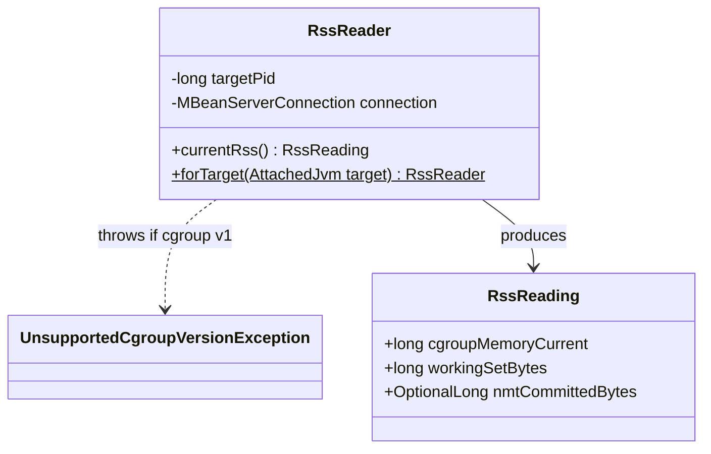

# Design: W-105 — RSS reader (cgroup v2 + NMT)

started: 2026-07-20

`RssReader` produces the "trustworthy resident-set number" the roadmap asks for &mdash; the
number M2's shrink-verify step will gate on (constitution §5). Two things had to be verified for
real before this could be designed responsibly, both against a real two-container pod in a kind
cluster (mirroring `deploy/example-sidecar.yaml`'s `shareProcessNamespace: true` shape):

1. **How does a sidecar read a *different* container's cgroup?** The agent and target are
   separate containers in the same pod &mdash; the agent's own `/sys/fs/cgroup` is its **own**
   cgroup, not the target's. Verified: `/proc/<target-pid>/root/sys/fs/cgroup/memory.current`,
   read from the sidecar, resolves through the shared PID namespace into the target's own mount
   namespace and returns the target's real number. Confirmed by inflating the target's memory to
   ~83MB and reading the same value both ways, while the sidecar's own cgroup stayed at ~1.6MB.
2. **Is raw `memory.current` actually trustworthy?** No. On the same real target, `memory.current`
   read ~88MB, but `memory.stat`'s breakdown showed `anon 262144` (256KB of true, non-reclaimable
   memory) against `inactive_file 83902464` (~80MB of reclaimable page cache from a file write).
   Raw `memory.current` would have made an idle container look like it was under heavy memory
   pressure. `memory.current - inactive_file` is the same "working set" formula kubelet/cAdvisor
   use for eviction decisions &mdash; reusing it means Warden's RSS number tracks the same signal
   Kubernetes itself already uses to decide OOM risk.

NMT (`vmNativeMemory summary` over JMX) is reconciled in as a **best-effort** cross-check, not a
requirement: verified that an unNMT-enabled target returns the plain string
`"Native memory tracking is not enabled"` rather than an error, so `RssReader` treats it as
optional data, never a hard dependency.

## Class diagram



## Sequence: read, reconcile, refuse cleanly on cgroup v1

```mermaid
sequenceDiagram
  participant Caller
  participant RR as RssReader
  participant Proc as /proc/&lt;pid&gt;/root/sys/fs/cgroup (via shared PID ns)
  participant Target as Target JVM (via AttachedJvm's JMX)

  Caller->>RR: forTarget(attachedJvm)
  RR->>Proc: memory.current exists?
  alt cgroup v1 (no memory.current)
    RR-->>Caller: throw UnsupportedCgroupVersionException
  else cgroup v2
    RR-->>Caller: RssReader
  end

  Caller->>RR: currentRss()
  RR->>Proc: read memory.current
  RR->>Proc: read memory.stat (inactive_file)
  Proc-->>RR: cgroupMemoryCurrent, inactive_file
  RR->>RR: workingSetBytes = cgroupMemoryCurrent - inactive_file
  RR->>Target: DiagnosticCommand.vmNativeMemory(["summary"])
  Target-->>RR: NMT text report, or "not enabled"
  RR-->>Caller: RssReading(cgroupMemoryCurrent, workingSetBytes, nmtCommittedBytes?)
```
