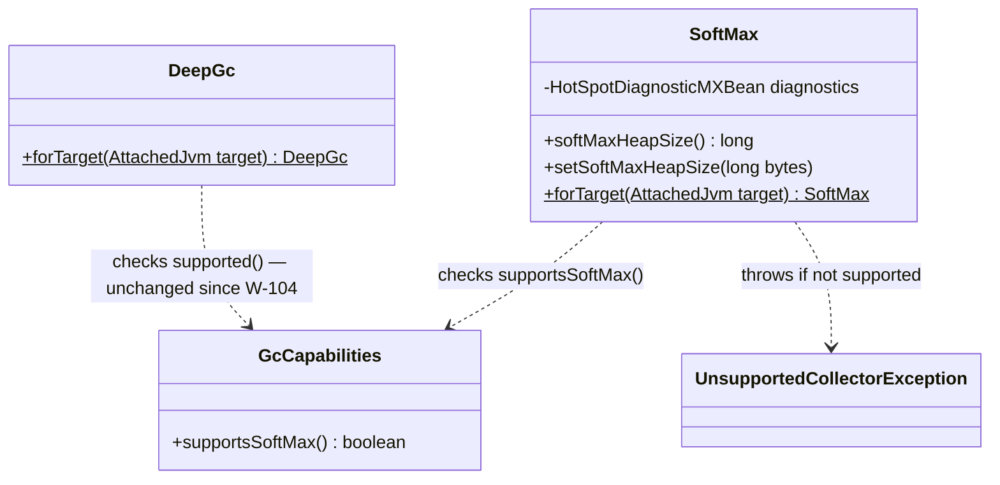
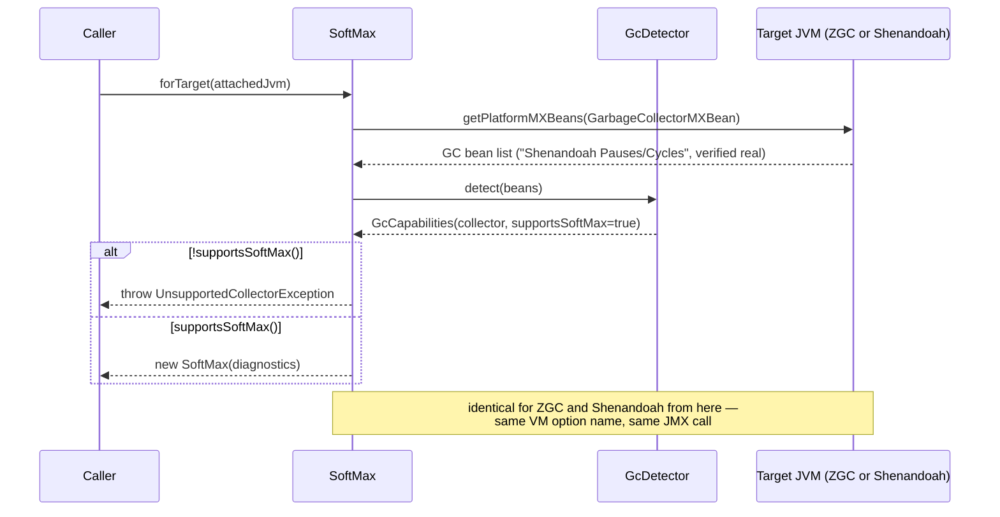

# Design: W-106 — Shenandoah driver

started: 2026-07-20

Smaller than the previous four tickets: both pieces of "the driver contract" already work for
Shenandoah without new mechanism.

- **`DeepGc`** already guards on `GcCapabilities.supported()` (== `supportsUncommit()`), true for
  ZGC, Shenandoah, and G1. Zero changes needed.
- **`ZgcSoftMax`**'s actual get/set logic (`HotSpotDiagnosticMXBean.getVMOption`/`setVMOption` on
  `SoftMaxHeapSize`) is already collector-agnostic &mdash; `SoftMaxHeapSize` is the same flag on
  both collectors (confirmed in W-103). The only ZGC-specific part is its guard
  (`collector != ZGC`), and `GcCapabilities.supportsSoftMax()` &mdash; already `true` for both
  ZGC and Shenandoah &mdash; already exists to replace it.

So W-106 is a **generalize + rename**, not a new class: `ZgcSoftMax` &rarr; `SoftMax`, guard
broadened to `!capabilities.supportsSoftMax()`.

Verified against a real target before finalizing (this dev machine's own JDK doesn't build with
Shenandoah; the project's actual runtime, `eclipse-temurin:21-jdk`, does):

- Real Shenandoah GC bean names are `"Shenandoah Pauses"` / `"Shenandoah Cycles"` &mdash; already
  matched by `GcDetector`'s existing `contains("shenandoah")` check from W-101. No changes needed.
- `ShenandoahUncommitDelay` (the ticket's namesake tunable) exists, defaults to 300000ms &mdash;
  the same 300s default as ZGC's `ZUncommitDelay` &mdash; but is gated behind
  `-XX:+UnlockExperimentalVMOptions`, unlike `ZUncommitDelay` which needs no unlock flag.

## Class diagram

## Sequence: same forTarget() shape, broader guard

