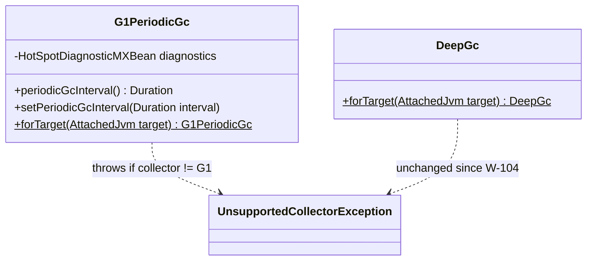
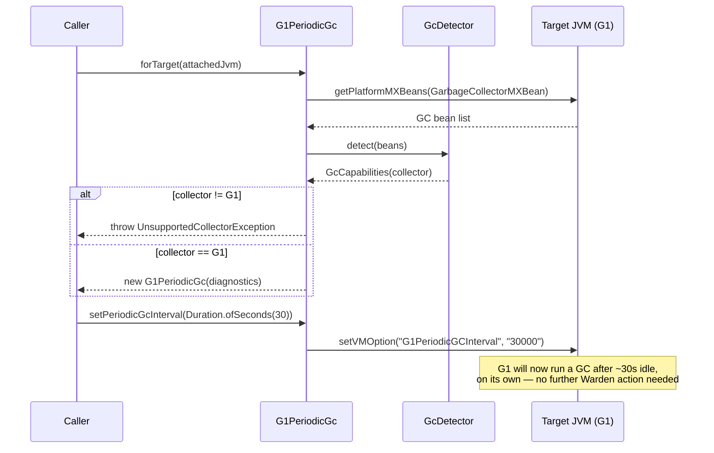

# Design: W-107 — G1 driver

started: 2026-07-20

G1 has no runtime soft max (`SoftMax.forTarget()` already rejects it, verified in W-103) and
`DeepGc` already covers on-demand uncommit (guards on `GcCapabilities.supported()`, true for G1).
The one genuinely new piece is `G1PeriodicGCInterval`: verified against a real target (unlocked
via `-XX:+PrintFlagsFinal`) that it's `{manageable}` &mdash; settable at runtime over JMX, exactly
like `SoftMaxHeapSize` &mdash; but defaults to `0` (disabled). Without it, G1 never proactively
collects on idle; Warden's only lever otherwise is `DeepGc`'s on-demand `GC.run`.

`G1PeriodicGc` exposes get/set for this interval. Unlike `SoftMax`/`DeepGc`, this one is
genuinely G1-only (the flag doesn't exist on ZGC/Shenandoah), so its guard checks
`collector() == Collector.G1` directly rather than adding a new shared `GcCapabilities` field for
a knob only one collector has.

This slice also closes a real gap: `DeepGcTest` only ever exercised ZGC (plus a Serial-GC
rejection case) &mdash; there was no test proving the existing on-demand mechanism actually works
against a real G1 target. Verified now with a dedicated case.

## Class diagram

## Sequence: expose the one G1-specific lever

