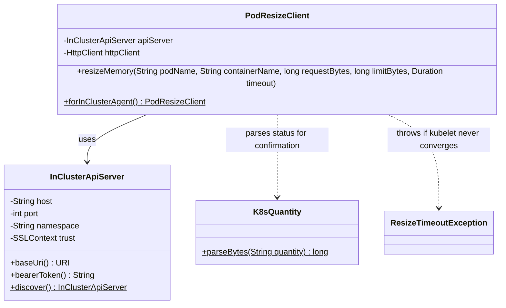
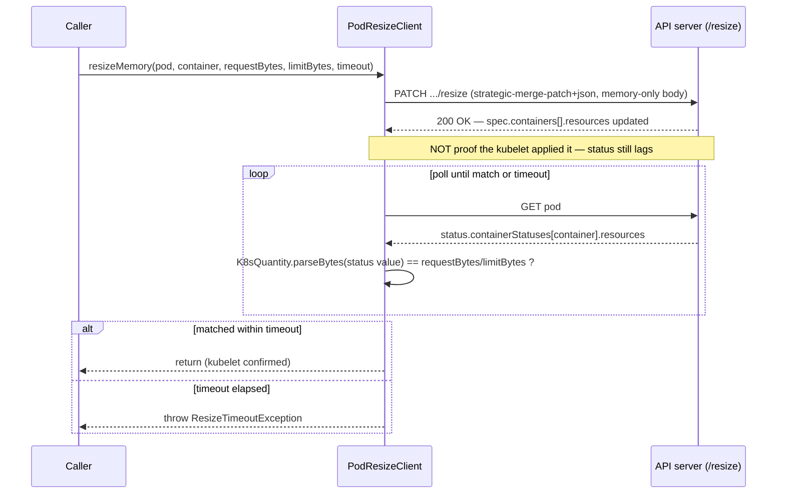

# Design: W-201 — In-place resize client

started: 2026-07-20

The agent's own container needs to change the *app* container's memory request/limit without a
restart — the K8s 1.35 (GA) `/resize` subresource. `warden-agent` is zero-dependency (pure JDK);
Fabric8's `kubernetes-client` was ruled out after spiking it (see below) in favour of the JDK's
own `HttpClient`, matching the module's existing style (`HealthServer`, `AttachSupervisor`, etc.).

Everything below was verified against a real two-container-shaped setup in a kind cluster
(K8s 1.36, in-place resize GA), not assumed from docs:

1. **Fabric8's footprint.** Even the narrowest entry point (`kubernetes-client-api` +
   `kubernetes-httpclient-jdk`) pulls **~15MB across 32 transitive jars**, because its POM
   requires every `kubernetes-model-*` extension module (apps, rbac, batch, networking, &hellip;)
   regardless of which one you asked for &mdash; there is no cheap slice of it. That's a real
   tension with constitution &sect;4 (lean sidecar), so the agent uses the JDK's `HttpClient`
   against the pod's own in-cluster credentials instead.
2. **Strategic-merge patch is required, not JSON merge patch.** A `Content-Type:
   application/merge-patch+json` request wholesale-replaces the `containers` array (JSON Merge
   Patch's array semantics), so any container field not repeated in the patch body reads as
   "removed" &mdash; the API server rejected it with `only cpu and memory resources are mutable`.
   `application/strategic-merge-patch+json` merges the array by the `name` key and only touches
   the fields actually present in the patch.
3. **A memory-only patch body correctly leaves CPU untouched.** Confirmed: PATCHing
   `resources.requests/limits` with only a `memory` key, omitting `cpu` entirely, leaves the
   container's CPU request/limit exactly as they were. Warden is a memory-efficiency product
   (README) with no CPU-resize acceptance criterion anywhere in the roadmap, so the client only
   ever deals in memory.
4. **Plain decimal byte counts are valid memory quantities** &mdash; no `Mi`/`Gi` suffix
   formatting needed; Warden already computes memory as byte counts everywhere else (`RssReading`,
   `SoftMax`), so the patch body is just `Long.toString(bytes)`.
5. **The PATCH's 200 response does not mean the kubelet applied it.** `spec.containers[].resources`
   updates immediately; `status.containerStatuses[].resources` (what the kubelet actually
   configured) lags behind &mdash; confirmed converging within ~1s in kind, but the acceptance
   criterion ("confirms the kubelet applied it") means polling `status`, not trusting the PATCH
   response. Same shape as constitution &sect;7 (positive evidence, not absence of change).
6. **The API server normalizes quantities in status.** A byte count PATCHed as `"209715200"` came
   back in `status.containerStatuses[].resources` as `"200Mi"` &mdash; a *different string* for
   the *same value*. Confirmation must parse both sides into byte counts and compare numerically;
   string equality would never match, even on success.

## Class diagram

## Sequence: PATCH the spec, poll status until it matches

