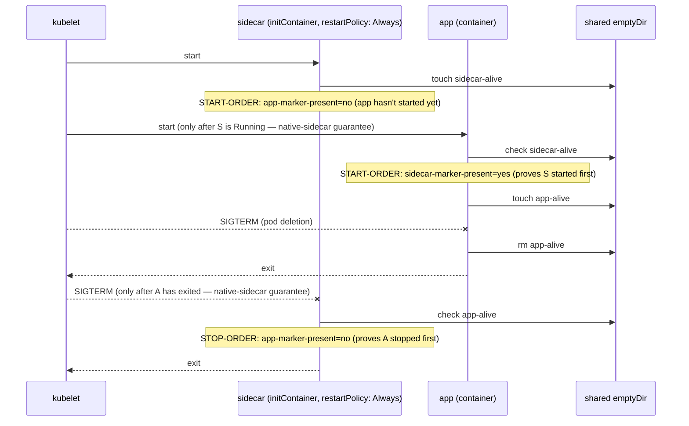

# Design: W-202 — Native-sidecar lifecycle ordering

started: 2026-07-20

No new Java classes — this ticket verifies a *Kubernetes platform guarantee* (that an
`initContainer` with `restartPolicy: Always` starts before the main container and stops after
it), not Warden application logic. The deliverable is a manifest
(`deploy/lifecycle-check.yaml`) and a runnable script
(`deploy/verify-lifecycle-ordering.sh`) that prove it against a real cluster, using minimal
generic containers rather than the real Warden image, so the proof stays independent of anything
else in the agent. No class diagram; the interesting shape is the verification flow below.

**A real, unrelated bug was found while setting this up**, severe enough to file separately
rather than fold into this ticket: deploying the actual shipped image (non-root, per the
`Dockerfile`) against an `app` container running as root (the default for most images) showed
the agent's `AttachSupervisor` never attaches at all &mdash; confirmed the JDK's Attach API
requires matching UIDs across the shared PID namespace, not just the namespace itself. Filed as
[#55](https://github.com/baokhang83/mnemo-jvm-warden/issues/55); W-202 does not depend on attach
succeeding, so it proceeded independently with generic containers.

## Verification design: causality, not wall-clock

The first approach tried was comparing container-start/stop timestamps. Two problems, both found
by actually running it: `busybox`'s `date` doesn't support `%N` (sub-second precision), and even
with precision, two containers starting in the same wall-clock second on the same node is not
distinguishable that way. Switched to **causality**: each container touches a marker file on a
shared `emptyDir` when it starts, and removes it right before it exits (in a `TERM` trap); the
*other* container checks for that marker's presence at its own start/stop moment. That's a direct
proof of "was already running" / "had already exited" &mdash; no clock involved, no precision
needed.

**A false-positive was caught while building this**: an early version searched `/proc/*/cmdline`
for a literal marker string identifying the other container's process. It reliably reported the
wrong answer, because the *search pattern itself*, embedded in the searching container's own
`trap` script text, showed up in that same container's own `/proc/<self>/cmdline` &mdash; the
grep matched itself. Switched to marker *files* on a shared volume instead, which have no such
self-reference risk. Verified the fix by rerunning against the same real cluster.

**The check was proven to have teeth, not just proven to pass**: ran the identical proof logic
against a deliberately non-native-sidecar manifest (both containers as plain `containers`, no
`restartPolicy: Always`) on a real cluster. Start ordering happened to look fine by chance, but
stop ordering did not: the sidecar's `TERM` trap saw the app's marker still present &mdash; a
real, observed violation, confirming the check actually discriminates instead of trivially
passing.

## Sequence: the proof, start to stop

