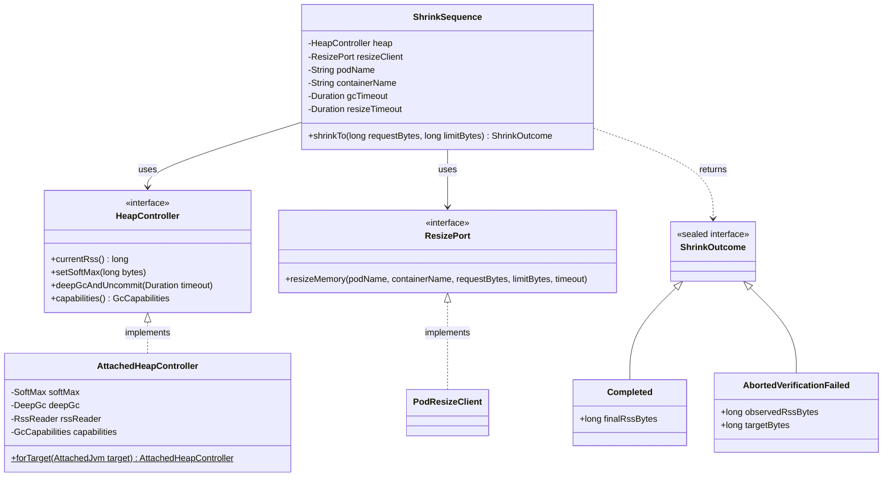

# Design: W-203: Shrink sequence with the verification gate

started: 2026-07-21

This is the centerpiece safety handshake M2 is named for: lower SoftMax → deep GC + uncommit →
**verify RSS < target** → cgroup down. Every collaborator already exists (`SoftMax`, `DeepGc`,
`RssReader` from M1; `PodResizeClient` from W-201) — this feature composes them behind the
`HeapController` port that's been sitting unimplemented since M1 (its own javadoc says as much:
"a `HeapController` implementation gets assembled once the M2 resize state machine actually
needs the whole contract" — that's now).

**`HeapController`'s signature needed to change to actually be implementable.** As originally
sketched, `currentRss()`, `setSoftMax()`, and `deepGcAndUncommit()` declared no checked
exceptions and `deepGcAndUncommit()` took no timeout. But the real methods they delegate to —
`RssReader.currentRss()` and `DeepGc.runAndAwaitUncommit(Duration)` — do throw `IOException`
(and the latter `InterruptedException` too, and needs a caller-supplied timeout: `DeepGc`'s own
javadoc notes ZGC's default uncommit delay is 300 seconds, so no single hardcoded timeout could
be right for every collector). `setSoftMax()` needed no change — `HotSpotDiagnosticMXBean`'s
proxy methods don't declare checked exceptions (an unchecked `java.io.IOError` on real connection
failure, per its javadoc), matching the existing unchanged `SoftMax.setSoftMaxHeapSize()`.

**`ResizePort` is extracted from `PodResizeClient`** so `ShrinkSequence` depends on an
abstraction, not the concrete Kubernetes HTTP client — constitution §2 says exactly this
("Safety and orchestration logic depends on narrow ports ... never directly on ... the
Kubernetes client"). It also means the ordering/gate logic in `ShrinkSequence` can be unit
tested with a fake, no real API server needed.

**The safety gate is literal, not padded.** `rss < limitBytes` is exactly what W-203's acceptance
criteria states — no headroom margin baked in here. Any richer safety policy (a margin, a veto,
an emergency-grow trigger) belongs to the controller-side principles this repo already has open
issues for (W-402 `shrinkBelow` veto, W-403 `emergencyGrowAbove`) — piling that onto the agent's
gate now would be speculative generality this slice doesn't need (§1).

**On an aborted shrink, `SoftMax` is deliberately left lowered, not reverted.** `SoftMaxHeapSize`
is advisory — it nudges the collector, it doesn't force anything and carries no OOM risk by
itself. Restoring it to its pre-attempt value on failure would need a new getter on
`HeapController` (something to restore from) that nothing else needs yet, for a rollback that
buys no safety (§1). Leaving it low is also strictly better for a retry: the next attempt starts
from a heap that's already been nudged down once.

**`ShrinkOutcome` is a sealed interface**, not a boolean-plus-fields result: `Completed(long
finalRssBytes)` or `AbortedVerificationFailed(long observedRssBytes, long targetBytes)`. A
caller pattern-matching on it is forced to handle both exit states of the safety gate explicitly
— there's no way to silently ignore an abort, which is exactly the property a safety-critical
result type should have (§3: intention-revealing, no ambiguous blob).

## Class diagram



## Sequence: shrink attempt, verification gate, conditional resize

```mermaid
sequenceDiagram
  participant Caller
  participant SS as ShrinkSequence
  participant HC as HeapController
  participant RP as ResizePort

  Caller->>SS: shrinkTo(requestBytes, limitBytes)
  SS->>HC: setSoftMax(limitBytes)
  Note right of HC: no-op on G1 (no runtime soft max) — capabilities() guards this inside AttachedHeapController
  SS->>HC: deepGcAndUncommit(gcTimeout)
  SS->>HC: currentRss()
  HC-->>SS: rss

  alt rss < limitBytes (verified)
    SS->>RP: resizeMemory(pod, container, requestBytes, limitBytes, resizeTimeout)
    RP-->>SS: kubelet confirmed (status matches spec)
    SS-->>Caller: Completed(rss)
  else rss >= limitBytes (gate failed)
    Note over SS: cgroup is NEVER touched; SoftMax stays lowered — no revert (see rationale above)
    SS-->>Caller: AbortedVerificationFailed(rss, limitBytes)
  end
```
