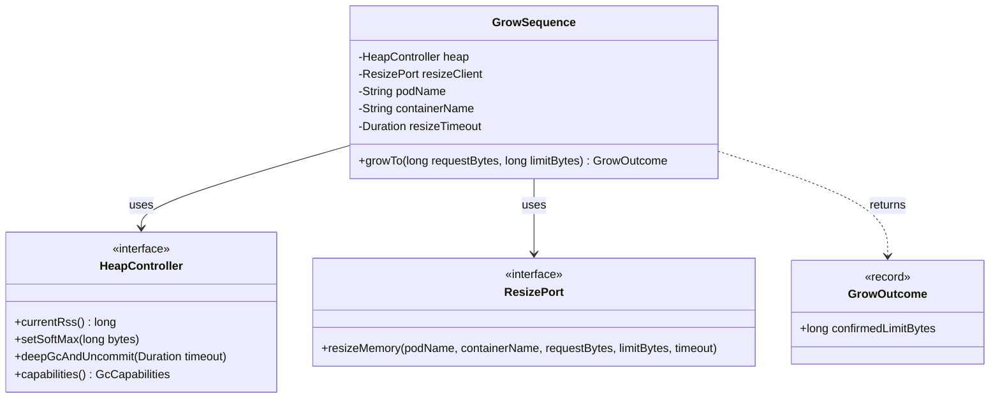
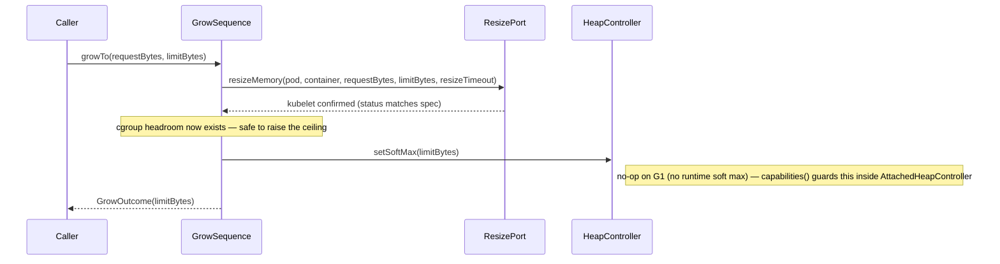

# Design: W-204 — Grow sequence

started: 2026-07-21

The other half of the M2 handshake: resize **up** without ever letting the collector believe
it has headroom that the cgroup hasn't granted yet. Order is the mirror image of W-203's
`ShrinkSequence` — cgroup **first**, then `SoftMax` — and the constitution already states this
ordering invariant explicitly (§5: "grow → resize → raise"), so `GrowSequence` is that
invariant made literal in code, exactly the way `ShrinkSequence` made "shrink → verify →
resize" literal.

**No verification gate, unlike shrink.** W-204's acceptance criteria is purely an ordering
constraint ("cgroup up first, then raise SoftMax") — there is no analogous "verify before
raising" step because raising `SoftMax` after the cgroup limit is already up cannot allocate
into space the cgroup hasn't granted; the failure mode `ShrinkSequence`'s gate exists to catch
(OOMKilling the pod) isn't reachable in this order. Adding a gate here anyway would be a check
against nothing — speculative generality (§1).

**`GrowOutcome` is a plain record, not a sealed interface like `ShrinkOutcome`.** `ShrinkOutcome`
had to be sealed because the shrink has two real business outcomes a caller must handle
(`Completed` / `AbortedVerificationFailed`). Grow has exactly one — the two ways it can fail
(kubelet timeout, I/O failure) are already distinct exceptions (`ResizeTimeoutException`,
`IOException`), not alternate success states. A sealed interface with a single variant would
just be ceremony around a value the caller can't branch on differently — §1 again.

**Same GC-blind boundary as `ShrinkSequence`.** `GrowSequence` depends only on `HeapController`
and `ResizePort`, never a concrete collector or the Kubernetes client (§2) — `setSoftMax`'s
no-op-on-G1 behavior stays inside `AttachedHeapController`, exactly as it already does for
shrink.

## Class diagram

## Sequence: grow, cgroup first then SoftMax

