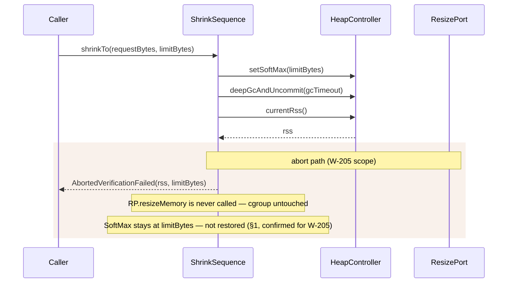

# Design: W-205 — Abort path

started: 2026-07-21

W-205's acceptance criteria ("if RSS won't drop or load returns mid-shrink, restore SoftMax,
leave cgroup untouched") turns out to already be half-shipped and half out of scope, so this
slice is a formalization, not new orchestration code.

**The RSS-gate-fails half is already the safe no-op the issue asks for.** W-203's
`ShrinkSequence.shrinkTo` returns `AbortedVerificationFailed` without ever calling
`ResizePort.resizeMemory` when the post-GC RSS doesn't clear the target &mdash; the cgroup is
never touched, proven by `ShrinkSequenceTest.abortsWithoutTouchingTheCgroupWhenRssDoesNotVerify`.
No new code needed here.

**"Restore SoftMax" is rejected, not implemented &mdash; it conflicts with a decision already
made and journaled in W-203.** `SoftMaxHeapSize` is advisory: it nudges the collector but forces
nothing and carries no OOM risk by itself. Restoring it on abort would need a new getter on
`HeapController` (something to restore *from*) that nothing else needs yet, purely to buy back a
rollback with no safety payoff &mdash; speculative generality (&sect;1). Leaving it low is also
strictly better for the next retry: it starts from a heap already nudged down once. This design
decision was re-confirmed explicitly for W-205 rather than silently inherited, given the issue
text's literal wording conflicts with it.

**"Load returns mid-shrink" is out of scope for the agent, deferred to M4.** That clause implies
a live cancellation signal reaching a shrink already in progress &mdash; nothing in
`ShrinkSequence` (or any caller) does that today, and it's the same class of thing W-203's own
design notes already routed to controller-side principles: a veto (W-402 `shrinkBelow`) or an
emergency-grow trigger (W-403 `emergencyGrowAbove`), both M4 tickets that don't exist yet. Building
a cancel hook into the agent now, with no controller caller to drive it, would itself be
speculative generality (&sect;1). W-205's remaining scope is corrected to reflect this rather than
built against.

## Sequence: the abort path that already exists (W-203)

## Out of scope for this slice

- Restoring `SoftMax` to its pre-attempt value on abort.
- Any mid-shrink cancellation/interrupt signal (moves to M4: W-402, W-403).
