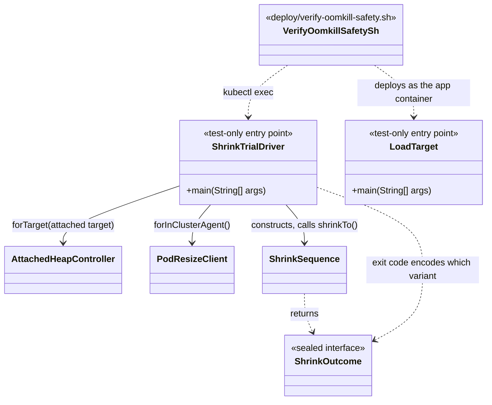
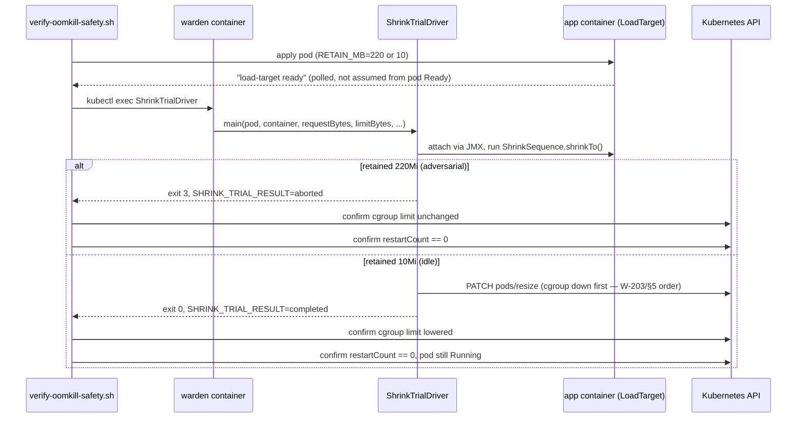

# Design: W-206 — OOMKill safety test harness

started: 2026-07-21

The last M2 item, and the one that proves the whole handshake (W-201&ndash;W-205) actually holds
under adversarial conditions, not just in unit-test fakes. Two scenarios against a real kind
cluster: adversarial load must abort a shrink safely (cgroup untouched), and idle load must let a
shrink actually complete — neither may ever OOMKill the pod.

**Nothing wires `ShrinkSequence` into the running agent yet**, so there's no production trigger
this harness can drive through. `WardenAgent.main` only starts the health server and the attach
supervisor (that's M3's intent handoff, W-306). Rather than block W-206 on M3, or build the intent
handoff early just to unblock a test, this adds a minimal **test-only** entry point,
`harness.ShrinkTrialDriver` &mdash; `kubectl exec`'d into the running `warden` container, it
constructs the real `AttachedHeapController` + `PodResizeClient` + `ShrinkSequence` and runs one
`shrinkTo()` call. It ships in the same jar (so no separate image build) but is never invoked by
`WardenAgent.main` &mdash; the production entry point is unchanged.

**Adversarial "load" is a controllable live heap, not driven HTTP traffic.** A companion
test-only fixture, `harness.LoadTarget`, retains a fixed number of megabytes of live `byte[]`
data and blocks. Traffic-driven garbage would mostly be collected by `ShrinkSequence`'s own deep
GC step regardless of "load," so it can't reliably force the RSS gate either way; a fixed live
set can, deterministically, in either direction (small enough to clear the gate, or large enough
to fail it).

**Manual-run script, not CI-wired, for this slice** &mdash; matching W-202's
`verify-lifecycle-ordering.sh` precedent: `deploy/verify-oomkill-safety.sh` builds the agent
image, loads it into a throwaway (or reused) kind cluster, and asserts both scenarios. CI
automation (building the image and running kind inside GitHub Actions) is a deliberate
fast-follow, not part of this slice.

**Two bugs only surfaced by actually running this against a real cluster (constitution §8), not
from writing the code:**

1. *A 1&nbsp;MiB `byte[]` chunk in `LoadTarget` was a G1 "humongous object."* G1's default region
   size can be as small as 1&nbsp;MiB, and any object over half a region's size gets its own
   dedicated region(s) instead of packing normally &mdash; a 1&nbsp;MiB array (slightly over
   1&nbsp;MiB once its header is added) needed roughly double the intended heap space, OOMing
   the fixture well before it reached its target retained size. Fixed by using 256&nbsp;KiB
   chunks, comfortably under half of any region size G1 would pick at these heap sizes.
2. *A `return $exit_code` inside a bash helper, after re-enabling `set -e`, tripped `errexit`
   immediately on the shrink-abort scenario's own expected non-zero exit code* &mdash; killing
   the whole script before the caller's own `set +e` guard ever took effect, since bash applies
   `errexit` based on the state *at the point a command executes*, not at the call site. Fixed by
   never re-enabling `set -e` inside a helper that returns a deliberately non-zero status;
   callers instead use the `cmd || exit_code=$?` idiom, which bash does correctly exempt from
   `errexit`.

**A related correctness gap, also only visible from a real run: `ShrinkTrialDriver`'s abort exit
code originally collided with the JVM's own default uncaught-exception exit code.** Both were
`1`. A real JMX/RMI hiccup during one cluster run threw an uncaught exception, which exited `1`
— indistinguishable from a deliberate `EXIT_ABORTED`, so the safety check logged a false PASS on
a run that had actually crashed, not aborted correctly. Fixed by moving `EXIT_ABORTED` to `3` and
explicitly catching `Throwable` in `main` to exit `70` (`EX_SOFTWARE`) on anything unexpected,
so a genuine abort and an unrelated crash can never share an exit code.

## Class diagram

## Sequence: the two scenarios

## Out of scope for this slice

- Wiring `ShrinkSequence`/`GrowSequence` into `WardenAgent`'s own runtime (M3, W-306).
- CI automation of this check (fast-follow; manual-run only for now).
