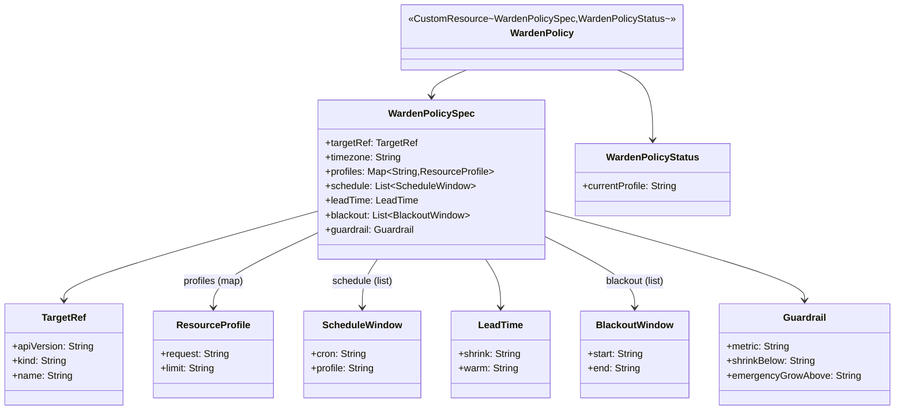

# Design: W-301 — WardenPolicy CRD model + validation

started: 2026-07-21

The first M3 slice, and the first thing built in `warden-crd-model` (still an empty skeleton) or
`warden-controller`. Declares the `WardenPolicy` custom resource as Fabric8-generated Java types,
matching the roadmap's own Stack section ("Fabric8 Kubernetes Client + java-operator-sdk — CRD,
informers"). Nothing reconciles this yet (that's W-302); this slice is the shape, plus one
concrete validation rule the acceptance criteria names explicitly: no `timezone`, no policy.

## What each field means, inferred from the M3/M4 tickets that consume it

The issue names seven fields with no further detail; their shape is fixed by what later tickets
already say they'll do with them, not invented fresh here:

- **`targetRef`** — which workload this policy governs: `apiVersion`/`kind`/`name`, the same shape
  as HPA's `scaleTargetRef` (a convention worth matching, not reinventing).
- **`timezone`** — an IANA zone id (e.g. `Europe/Paris`). W-303 evaluates the `schedule` cron
  windows "in the policy's zone," DST-aware. Required — the one explicit acceptance criterion.
- **`profiles`** — named memory configurations (request/limit pairs) the schedule/lead-time
  machinery switches between, e.g. `off-peak` / `peak`. W-304's "fire shrink... warm..." implies
  at least two named targets to transition toward.
- **`schedule`** — the cron windows themselves, each naming which `profiles` entry is active
  during that window. W-303's whole job is evaluating these.
- **`leadTime`** — `shrink` and `warm` durations, read verbatim from W-304: "fire shrink at
  `window_start − leadTime.shrink`; warm at `peak_start − leadTime.warm`."
- **`blackout`** — a list of hard "do not touch" windows/dates. W-305: "beats both schedule and
  (later) metric signals."
- **`guardrail`** — the live-metric thresholds M4 reads: `shrinkBelow` (veto a shrink, W-402) and
  `emergencyGrowAbove` (force a grow, W-403), plus the PromQL query W-401 evaluates them against.

This slice models all seven so later tickets have real types to build on, but only **wires
validation for `timezone`** — the one criterion this ticket actually states. The rest are
present but unvalidated beyond basic non-null structure; richer validation (a schedule's cron
syntax, a blackout window's date range) belongs to the tickets that actually evaluate them
(W-303, W-305), not invented ahead of time here (§1).

## Two-layer validation, not one

Fabric8's `crd-generator` (annotation-processor based) turns Bean Validation annotations on the
Java model into the generated CRD's OpenAPI v3 schema — so a required field is enforced **by the
Kubernetes API server itself**, rejecting a bad `kubectl apply` before it ever reaches a
controller. `@Required` (or a non-primitive field with no default) on `timezone` is the
mechanism. This is verified against a real cluster (constitution §8): generate the CRD, apply it,
apply a `WardenPolicy` missing `timezone`, confirm the API server itself rejects it — not just a
Java-side check that could be bypassed by any other client.

## Class diagram

## Out of scope for this slice

- The reconciler / any evaluation of schedule, lead-time, blackout, or guardrail logic (W-302+).
- Validation beyond `timezone` being required (richer per-field validation belongs to the
  tickets that consume each field).
