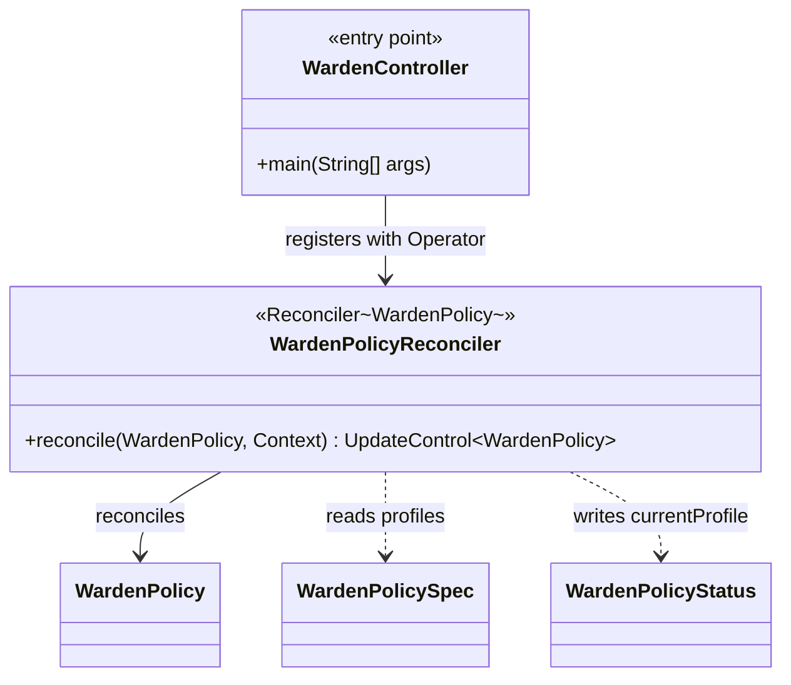
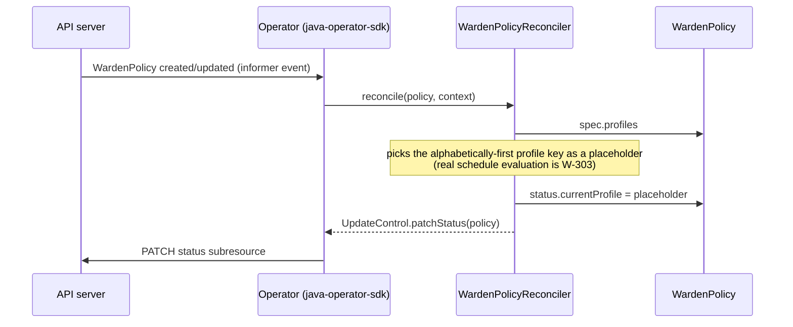

# Design: W-302 — Reconciler skeleton

started: 2026-07-21

The first real code in `warden-controller` (previously an empty skeleton, same as
`warden-crd-model` before W-301). Proves the watch → reconcile → status-update loop actually
works end-to-end against a real cluster, using `java-operator-sdk` &mdash; nothing here evaluates
a schedule, a lead time, a blackout, or a guardrail (that's W-303 onward).

**`java-operator-sdk` 5.1.1 pins the exact same Fabric8 client version (7.3.1) W-301 already
uses** &mdash; verified against its own `pom.xml` on GitHub, not assumed. No version conflict to
resolve.

## What "status reflects current profile" means at skeleton stage

W-302's acceptance criteria says "status reflects current profile," but real profile selection
is schedule-driven, and the schedule evaluator doesn't exist yet (W-303). Evaluating cron
expressions here to compute a real answer would be building W-303 early, inside the wrong
ticket. Instead, this reconciler picks a **deterministic placeholder**: the alphabetically-first
key of `spec.profiles`, or `null` if the map is empty. This is honest about what it is &mdash; a
placeholder proving the reconcile-then-patch-status loop works, not a real scheduling
decision &mdash; and W-303 replaces the placeholder call with the real one behind the same
`UpdateControl.patchStatus` call site, so nothing here needs to change shape when that lands.

## Class diagram

## Sequence: one reconcile

## Out of scope for this slice

- Any schedule/cron, lead-time, blackout, or guardrail evaluation (W-303 onward).
- Emitting shrink/grow intent to the agent (W-306).
