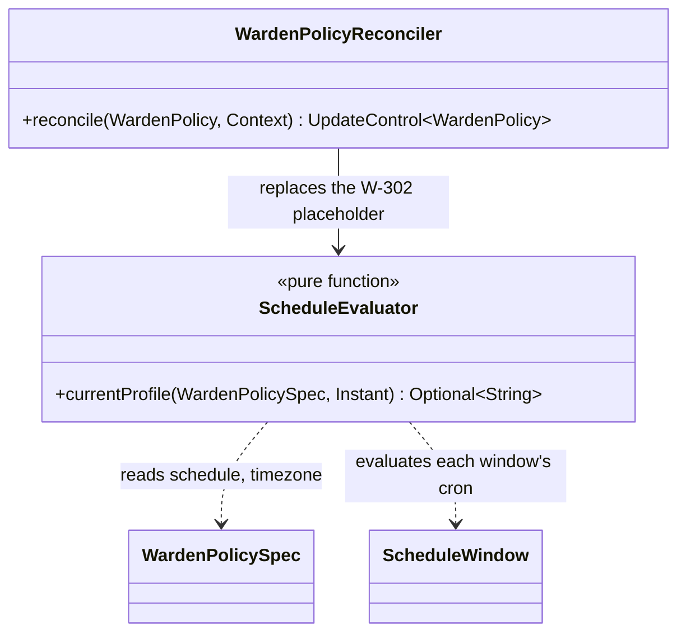
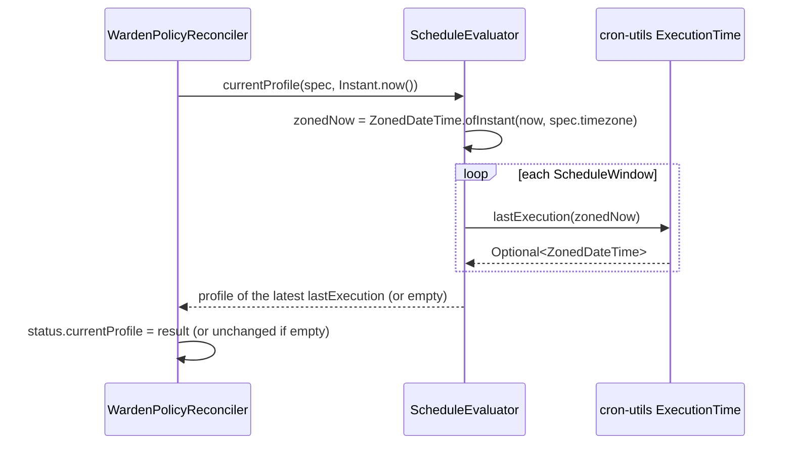

# Design: W-303 — Cron schedule evaluation

started: 2026-07-21

Replaces W-302's deliberate placeholder (`status.currentProfile` = alphabetically-first
`profiles` key) with the real thing: evaluate `spec.schedule`'s cron windows in `spec.timezone`,
correctly across DST shifts, and pick the actually-active profile.

## Semantics: the most recently fired window wins

Each `ScheduleWindow` (`cron`, `profile`) means "switch to `profile` at every occurrence of
`cron`." The currently active profile is whichever window's cron **most recently fired** relative
to now — not the next one coming up. For the sample policy's two windows (`0 22 * * *` →
`off-peak`, `0 7 * * *` → `peak`), a `now` of 23:00 has last-fired `22:00 → off-peak` more
recently than `07:00 → peak` (fired yesterday morning), so `off-peak` wins; the reverse holds at
09:00.

## DST safety comes from the library, not hand-rolled arithmetic

**Verified, not guessed:** `com.cronutils:cron-utils` 9.2.1 (latest on Maven Central) computes
`ExecutionTime.forCron(cron).lastExecution(ZonedDateTime)` returning `Optional<ZonedDateTime>`
&mdash; confirmed by reading the actual `ExecutionTime` interface source at the pinned tag, not
assumed from the README summary alone. Working in `java.time.ZonedDateTime` throughout means a
cron like "22:00 daily" keeps meaning 22:00 **local wall-clock time** across a DST transition,
the exact property "DST aware" requires and the one a hand-rolled fixed-UTC-offset calculation
would get wrong.

**Why a library, not hand-rolled parsing:** cron field parsing plus DST-correct "when did this
last/next fire" arithmetic is a well-known source of subtle, hard-to-test bugs (leap years,
day-of-week/day-of-month interaction, the skipped/repeated hour on a spring-forward/fall-back
day). A mature, widely-used library gets this tested by a much larger surface than this repo
could reasonably replicate for a skeleton scheduler.

## `ScheduleEvaluator` is a pure function of `(spec, Instant)`

Takes an `Instant`, not "now" implicitly, so tests can pin exact moments (including moments
straddling a real DST transition) without a clock-injection seam elsewhere in the codebase.
Converts to the policy's zone internally (`ZonedDateTime.ofInstant(instant,
ZoneId.of(spec.getTimezone()))`) once, then asks every window's `ExecutionTime` for its last
execution before that point, and returns the profile of whichever fired most recently. No window
having ever fired returns empty — `WardenPolicyReconciler` leaves `currentProfile` unset in that
case (there's nothing later to derive from either; W-304's lead-time triggering is a separate
concern).

## Class diagram

## Sequence: evaluating at reconcile time

## Out of scope for this slice

- Lead-time-shifted triggering (fire *ahead* of the window edge) — W-304.
- Blackout override — W-305.
- Guardrail/metric veto — M4.
