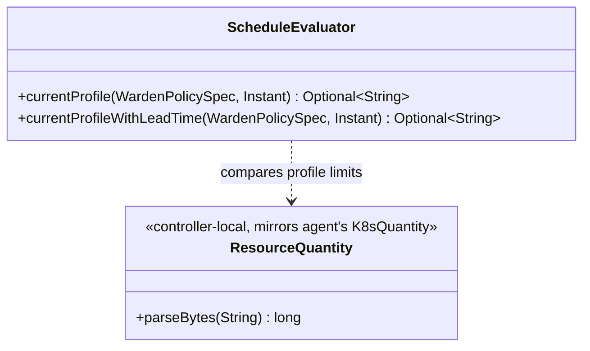
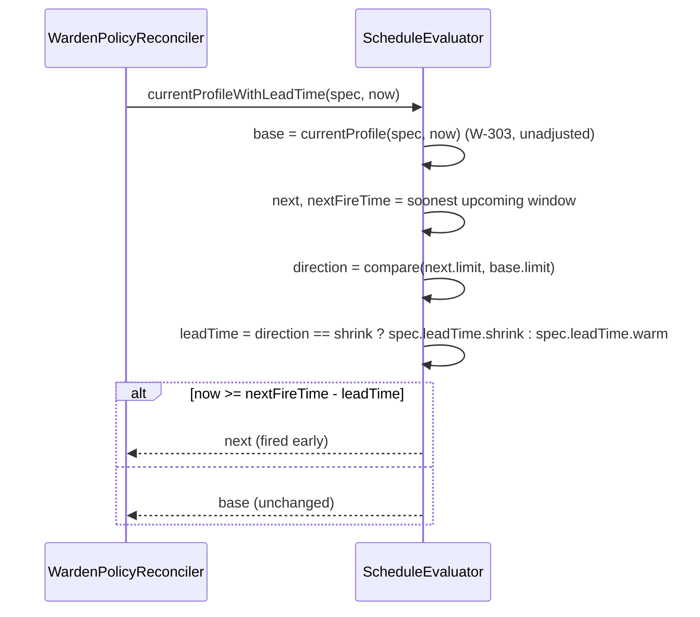

# Design: W-304 — Lead-time transition triggering

started: 2026-07-21

W-303's `ScheduleEvaluator` picks whichever window's cron **already fired**. W-304's acceptance
criteria ("fire shrink at `window_start − leadTime.shrink`; warm at `peak_start − leadTime.warm`")
asks for the opposite kind of anticipation: the profile switch should happen **before** the
window's nominal cron time, by however long `leadTime` says.

## The real gap: nothing marks a transition as "shrink" or "warm"

`LeadTime` has exactly two fields, `shrink` and `warm` — but `ScheduleWindow` just carries
`{cron, profile}`, with no direction. Every existing example (`off-peak`/`peak`) only has two
profiles, so it's tempting to hardcode profile names, but `WardenPolicySpec.profiles` is a
generic map — nothing says which key is "the small one."

**Resolution: classify by comparing `ResourceProfile.limit` sizes, not names.** Moving to a
*smaller* limit is a shrink (use `leadTime.shrink`); moving to a *larger* one is a warm (use
`leadTime.warm`). This generalizes past exactly two profiles and needs no naming convention.

## Algorithm: base profile now, then peek at the next transition

Rather than lead-time-shifting every window (which would need classifying *every* window's
direction relative to whatever precedes it — a much bigger problem), this looks one step ahead
from the already-solved base case:

1. **Base profile** — `ScheduleEvaluator.currentProfile(spec, now)` (W-303, unadjusted): what's
   active right now if no lead time existed.
2. **Next transition** — among all windows, the one whose cron's `nextExecution(now)` is soonest.
   Call its target profile `next` and its nominal fire time `nextFireTime`.
3. **Classify `next` vs `base`** by comparing `limit` bytes: smaller → `leadTime.shrink`, larger →
   `leadTime.warm`, equal → no early trigger (nothing to anticipate).
4. **Decide:** if `now >= nextFireTime - leadTime` (the appropriate one from step 3), the
   effective current profile is `next` (fired early); otherwise it's still `base`.

This only reasons about *one* upcoming transition at a time — correct for the common
alternating-profile case this repo's examples all use, and not speculatively generalized to
multiple simultaneous imminent transitions nothing has asked for yet (§1).

## Quantity comparison: a small, controller-local parser, not a shared dependency

`warden-agent` already has `K8sQuantity.parseBytes` for exactly this (Ki/Mi/Gi/... suffix
parsing), but `warden-agent` and `warden-controller` are deliberately decoupled modules (each
module's own `pom.xml` says so explicitly) — reusing it would mean either a new inter-module
dependency neither module currently declares, or relocating agent code out of the module whose
own javadoc ties it to `PodResizeClient`'s normalization concern (a different problem: comparing
a PATCHed value against its API-server-normalized echo, not comparing two static spec values).
A small, controller-scoped equivalent keeps the module boundary intact.

## Class diagram

## Sequence: evaluating with lead time

## Out of scope for this slice

- Blackout override (W-305).
- Guardrail/metric veto (M4).
- Classifying more than one upcoming transition at a time.
