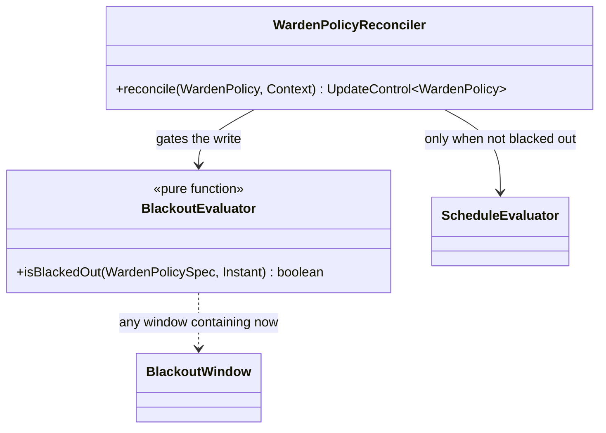
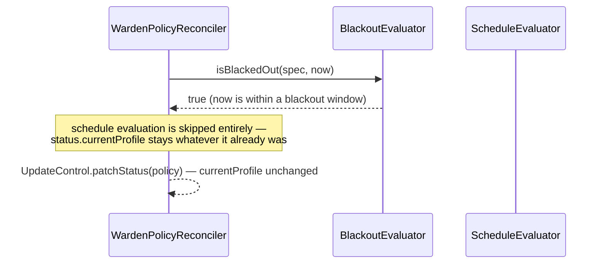

# Design: W-305 — Blackout windows

started: 2026-07-21

The last M3 ticket. "Beats both schedule and (later) metric signals" plus the issue's own framing
("a hard 'do not touch' override") points at one specific semantic: during a blackout, **freeze
`status.currentProfile` at whatever it already is** — don't let the schedule (or, once it exists,
a guardrail) change it. Not "switch to a blackout-specific profile": `BlackoutWindow` has no
`profile` field, only `start`/`end`, and the "do not touch" language means leave it alone, not
force it somewhere else.

## Absolute instants, not local wall-clock — so no DST question here at all

`BlackoutWindow.start`/`end` are ISO-8601 instants with an explicit UTC offset (every example
uses `Z`, e.g. `"2026-12-24T00:00:00Z"`), unlike `ScheduleWindow`'s crons, which are recurring
local wall-clock expressions in the policy's timezone. Comparing `Instant`s directly is exactly
right and needs no timezone conversion — a launch freeze or a holiday blackout is "this exact
moment in time," not "10pm every day." (Contrast with W-303/§11, where DST-safety mattered
precisely *because* crons are local-time-recurring; blackout doesn't have that problem, so it
doesn't need that treatment.)

## Where the check lives: gating the reconciler's write, not inside ScheduleEvaluator

`BlackoutEvaluator.isBlackedOut(spec, now)` is a small, separate, single-purpose check (§3) — not
folded into `ScheduleEvaluator`, which already has one job (schedule + lead time). The reconciler
gates on it once, before calling schedule evaluation at all:

```
if (!blackedOut) { patch status.currentProfile from ScheduleEvaluator }
// else: leave status untouched this reconcile
```

This same gate is where a future guardrail check would also plug in (M4) — "blackout beats
schedule *and* metric signals" becomes one `if`, not two separate overrides to keep in sync.

## Class diagram



## Sequence: a reconcile during blackout



## Out of scope for this slice

- Guardrail/metric veto itself (M4) — only the same gating shape is anticipated, not built.
- Validating that `start` <= `end`, or that blackout windows don't overlap.
