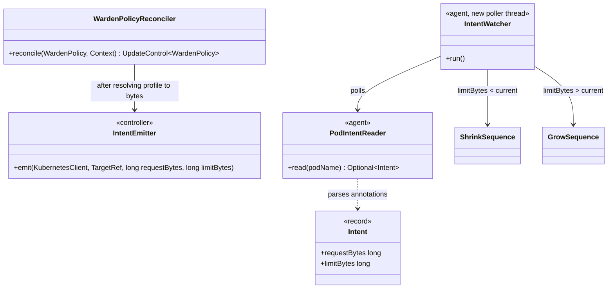
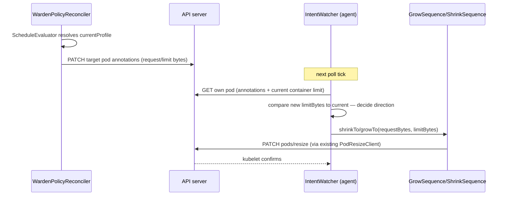

# Design: W-306 — Intent to agent handoff

started: 2026-07-21

The capstone of M2+M3: the controller's schedule decision (`status.currentProfile`) has to
actually reach the agent and drive a real `ShrinkSequence`/`GrowSequence` call. Everything each
side needs already exists — `ScheduleEvaluator` on the controller, `ShrinkSequence`/
`GrowSequence` on the agent — this ticket is purely the wire between them.

## Transport: the target pod's own annotations, not a direct network channel

The controller PATCHes **the target pod's** annotations (not the `WardenPolicy` CR's own), and
the agent polls its own pod's annotations. Both sides already talk to the API server directly
(the controller via Fabric8 informers, the agent via `PodResizeClient`'s raw `HttpClient`) — this
keeps that the *only* communication path, rather than opening a second one (agent-to-controller
or controller-to-agent networking, which would need service discovery and doesn't survive a pod
IP changing across a restart the way "read your own pod object" trivially does).

## Annotation content: resolved byte values, not a profile name

```
warden.mnemo.io/target-request-bytes: "134217728"
warden.mnemo.io/target-limit-bytes: "268435456"
```

Not `warden.mnemo.io/target-profile: peak`. The agent only ever needs two numbers to call
`ShrinkSequence`/`GrowSequence` — encoding the profile *name* instead would mean the agent has to
resolve it against `spec.profiles`, which means depending on `warden-crd-model`, which
`warden-agent`'s own `pom.xml` explicitly says it doesn't ("no dependency on
warden-crd-model"). The controller resolves the profile to bytes once (it already depends on
`warden-crd-model`); the agent stays exactly as CRD-ignorant as it already is.

## Scope: `targetRef.kind: Pod` only, direct by name

Every existing example (`wardenpolicy-sample-*.yaml`) already targets `kind: Pod` directly by
name. Resolving a `Deployment`/`StatefulSet` targetRef to its live pod(s) via label selectors is
real, separate work (which pods? all of them? how does per-pod annotation reconcile with a
rolling update?) that nothing has asked for yet — out of scope for this slice (§1).

## New required agent identity: `WARDEN_POD_NAME`, `WARDEN_TARGET_CONTAINER_NAME`

The agent needs to know its own pod's name (to GET/watch itself) and its sibling container's
name (`ShrinkSequence`/`GrowSequence` both take a `containerName`). Rather than infer the pod
name from the container hostname (kubelet sets it to the pod name by default, but that's an
implicit OS-level assumption, not a documented contract — unlike, say, `WARDEN_TARGET_PID`,
which is an explicit override this repo already uses for exactly this reason), both are explicit,
required env vars — `WARDEN_POD_NAME` sourced from the Downward API (`fieldRef: metadata.name`)
in the deployment manifest, matching the standard Kubernetes pattern. No default for either:
guessing wrong here means silently resizing nothing, or resizing the wrong container — the same
"fail loud on missing identity" posture `InClusterApiServer` already takes for
`KUBERNETES_SERVICE_HOST`.

## Direction decision: compare intent to the pod's actual current limit

The agent doesn't track "current profile" (that's the controller's concept) — it just compares
the new intent's `limitBytes` against the target container's **actual current**
`resources.limits.memory` (read from the same pod GET used for annotations). Smaller → shrink;
larger → grow; equal → no-op. This mirrors the controller's own W-304 classification logic
(compare sizes, not names) rather than inventing a second convention.

## Class diagram



## Sequence: schedule window fires, agent resizes for real



## Out of scope for this slice

- `targetRef.kind` other than `Pod` (Deployment/StatefulSet label-selector resolution).
- Guardrail/metric veto (M4) — the intent path this builds is what M4's overrides will also
  route through, unchanged in shape.
