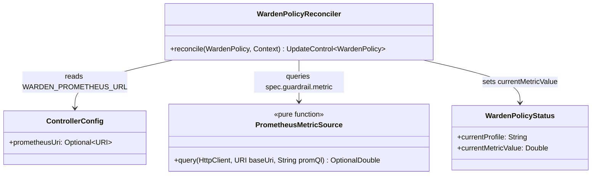
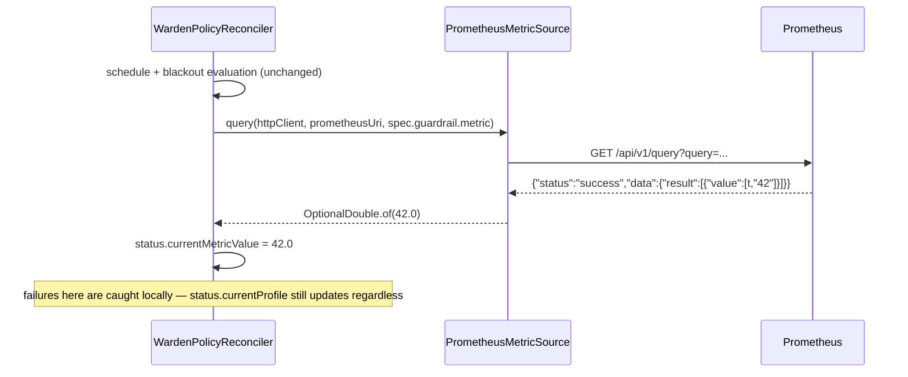

# Design: W-401 — Prometheus metric source

started: 2026-07-21

The first M4 slice: give the controller a live traffic signal to eventually gate/react to
(W-402's veto, W-403's emergency grow). This ticket only builds the *read* — nothing acts on the
value yet.

## Evaluated synchronously inside the existing reconcile loop, not a dedicated poller

"Evaluate on an interval" doesn't require a *new* interval: `WardenPolicyReconciler` already
reconciles on a cadence (event-driven, plus #69's 30s `maxReconciliationInterval` periodic
resync). Querying Prometheus synchronously each reconcile reuses that cadence directly, rather
than running a second background thread with its own timer and a cache the reconciler would need
to read from. One clock, not two (§1).

## Config source: a controller-wide env var, not a new CRD field

`spec.guardrail.metric` (already modeled, W-301) is the PromQL *query* — but nothing says *where*
Prometheus lives. Rather than add a per-policy URL field to the CRD, this reads a single
controller-wide `WARDEN_PROMETHEUS_URL` env var (mirroring the agent's own env-var config
pattern), matching the common single-Prometheus-per-cluster reality this roadmap's own examples
already assume ("Prometheus queue length, RPS" as cluster infrastructure, not a per-workload
concern). **Optional**, not required: if unset, metric evaluation is skipped entirely for every
policy — the same "optional and safely absent" posture the roadmap already states for `CacheHook`
(W-501), applied here to guardrails too, since nothing requires every policy to declare one.

## Jackson, not a third minimal JSON reader

`warden-agent` has `MinimalJson` for its own zero-dependency reasons, and `warden-controller`
already pulls Jackson databind/core transitively via Fabric8's own client (confirmed against the
real dependency tree, not assumed: `jackson-databind:2.19.0` is already on the classpath).
Declaring it as a direct, version-pinned dependency (matching the transitive version exactly, no
conflict) is simpler than a third hand-rolled parser in the same ecosystem of modules — unlike
the `warden-agent`/`warden-controller` `ResourceQuantity` duplication (W-304), which existed
specifically to avoid a *new* inter-module dependency; here, nothing new is being introduced,
just using what's already present.

## Failure isolation follows §12

A Prometheus query failure (network error, Prometheus down, a malformed PromQL query) must not
prevent `status.currentProfile` or intent emission from proceeding — the same principle W-306's
real bug already established. Metric evaluation gets its own `try`/`catch`, exactly like intent
emission does.

## Class diagram

## Sequence: one reconcile with a guardrail configured

## Out of scope for this slice

- Any veto/grow decision based on the value (W-402, W-403).
- The blackout-vs-metric-vs-schedule precedence rule (W-404).
