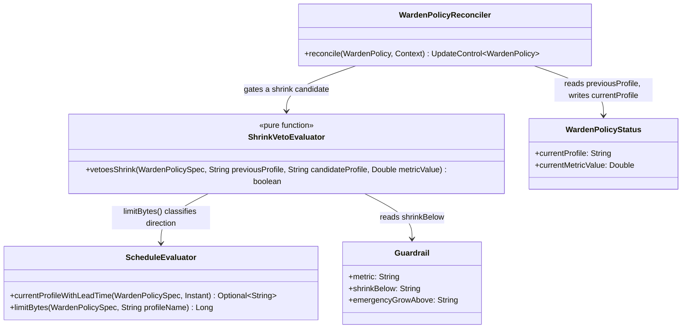

# Design: W-402 — shrinkBelow veto

started: 2026-07-21

The second M4 slice: W-401 gave the controller a live traffic reading; this ticket makes the
schedule actually respect it. Acceptance criteria: a scheduled transition to a *smaller* profile
is blocked while `spec.guardrail.metric` reads at or above `shrinkBelow` — traffic isn't actually
quiet, so the shrink is vetoed and the pod stays on its current, larger profile.

## Metric evaluation moves before the schedule block

`evaluateMetric` used to run *after* the schedule/intent block, since it only wrote the
independent `status.currentMetricValue` field. The veto now needs *this reconcile's* fresh
reading to gate a same-reconcile shrink decision, not last reconcile's stale status value, so
`evaluateMetric` runs first and returns the value (still setting `status.currentMetricValue` as a
side effect, unchanged). One evaluation, two consumers — not a second query.

## Fail-closed on a missing reading (the key decision)

If `shrinkBelow` is configured but no metric value is available this reconcile (Prometheus down,
query error, or `PrometheusMetricSource` returning empty), the veto **fires** — the shrink is
blocked, not allowed through. This was a genuine fork:

- **Fail-open** (rejected): treat a missing reading as "no guardrail," let the shrink proceed —
  mirrors W-401's own failure isolation (a Prometheus outage never blocks `status.currentProfile`
  itself, per constitution §12).
- **Fail-closed** (chosen): a missing reading is *unverified*, not *verified quiet* — an opted-in
  `shrinkBelow` is a claim "don't shrink until you can prove traffic is low," and silence can't
  prove that. This extends the spirit of constitution §5 ("no unverified shrink") from the RSS
  gate to this business-level gate: once a guardrail is configured, absence of proof is not proof
  of safety.

The two don't conflict: §12's isolation is about `status.currentProfile` (schedule/intent) staying
correct and current *regardless* of a metric outage — it says nothing about whether a shrink
should proceed *without* a reading. This slice keeps status accurate either way (unchanged) while
being conservative specifically about the shrink action.

## Direction classification reuses `ScheduleEvaluator.limitBytes`

Classifying "is this transition a shrink" (candidate profile's `limit` smaller than the
*previously active* profile's) is exactly what `ScheduleEvaluator.currentProfileWithLeadTime`
already does internally to pick a lead time. Rather than a second private copy of "look up a
named profile in `spec.profiles`, parse its `limit` to bytes," `limitBytes` becomes `public
static` and `ShrinkVetoEvaluator` (guardrail package — a new small evaluator alongside
`BlackoutEvaluator`, same shape: pure static function of `spec` + inputs) calls it directly. No
new class takes on CRD-lookup responsibility that `ScheduleEvaluator` doesn't already have.

## Veto is a candidate-level check, not a second precedence gate

`BlackoutEvaluator` gates *before* `ScheduleEvaluator` even runs (blackout beats schedule
entirely, no candidate to evaluate). The shrink veto is different: it needs the *candidate*
profile to know whether this transition is even a shrink, so it plugs in *after*
`currentProfileWithLeadTime` resolves a candidate, inside the same `ifPresent` that used to go
straight to applying it. Vetoing leaves `status.currentProfile` and the emitted intent untouched
for this reconcile — the same "leave whatever's active alone" shape blackout already uses, so a
vetoed reconcile is indistinguishable in effect from a blacked-out one, just for a different
reason. (W-404's precedence engine is where blackout-vs-metric-vs-schedule becomes one documented
truth table; this slice only adds the second gate, not the ordering proof between them.)

## Class diagram



## Sequence: a scheduled shrink candidate gets vetoed

```mermaid
sequenceDiagram
  participant R as WardenPolicyReconciler
  participant PMS as PrometheusMetricSource
  participant SE as ScheduleEvaluator
  participant SVE as ShrinkVetoEvaluator

  R->>PMS: query(guardrail.metric)
  PMS-->>R: metricValue (or empty)
  R->>R: status.currentMetricValue = metricValue
  R->>SE: currentProfileWithLeadTime(spec, now)
  SE-->>R: candidateProfile = "off-peak"
  R->>SVE: vetoesShrink(spec, previousProfile="peak", candidateProfile="off-peak", metricValue)
  SVE->>SE: limitBytes("peak"), limitBytes("off-peak")
  SE-->>SVE: previousBytes, candidateBytes
  Note over SVE: candidateBytes < previousBytes -> this is a shrink
  Note over SVE: metricValue == null, or metricValue >= shrinkBelow -> not verified quiet
  SVE-->>R: true (veto)
  Note over R: status.currentProfile stays "peak"; no intent emitted this reconcile
```

## Out of scope for this slice

- `emergencyGrowAbove` reactive grow (W-403).
- The documented blackout-vs-metric-vs-schedule precedence truth table (W-404) — this slice adds
  the metric gate; it doesn't yet prove the three-way ordering.
