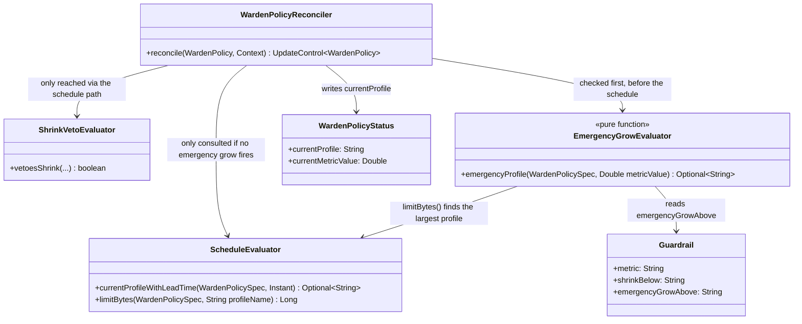
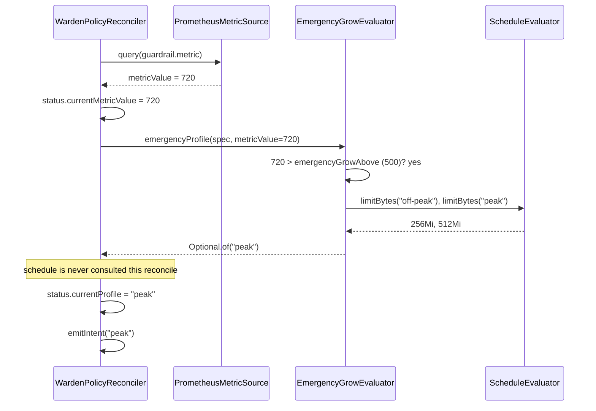

# Design: W-403 — emergencyGrowAbove reactive grow

started: 2026-07-21

The third M4 slice: W-401 gave the controller a live traffic reading, W-402 taught the schedule
to defer to it before shrinking. This ticket adds the opposite reaction: an off-schedule traffic
spike forces an immediate grow, without waiting for the next scheduled transition — "Scenario 2
insurance" from the roadmap (an underestimated spike gets covered even between scheduled windows).

Acceptance criteria: `metric > emergencyGrowAbove` grows now, bypassing the calendar.

## Grow target: infer the largest declared profile, not a new CRD field

`spec.guardrail` only has `metric` / `shrinkBelow` / `emergencyGrowAbove` — nothing names *which*
profile to grow to. Two options:

- **New CRD field** (`guardrail.emergencyProfile`) — explicit, but changes the schema W-301
  already fixed and needs its own validation/docs for a single-purpose knob.
- **Infer the largest profile** (chosen) — `spec.profiles` already declares every profile's
  `limit`; the one with the biggest limit *is* "give it the most headroom you have," which is
  exactly what an emergency grow means. No schema change, and in the common two-profile
  off-peak/peak shape it resolves to `peak` anyway — the field would be redundant in the case
  that matters most.

## Bypasses the calendar literally: schedule isn't consulted at all this reconcile

When `EmergencyGrowEvaluator.emergencyProfile(...)` returns a target, the reconciler applies it
*instead of* calling `ScheduleEvaluator.currentProfileWithLeadTime(...)` for that reconcile — not
as a candidate that competes with the schedule's pick. This is the literal meaning of "bypassing
the calendar": while the spike holds, the schedule's own opinion is never even asked for. Once the
metric drops back at or under the threshold, the very next reconcile resumes the normal
schedule/shrink-veto path — reactive, not sticky, and no extra state to track "are we still in
emergency mode."

## Missing metric reading never triggers an emergency grow (fail-open, the opposite of W-402)

If the metric can't be read this reconcile, `emergencyProfile` returns empty — the normal
schedule path runs as if no spike is happening. This is the mirror image of W-402's fail-closed
choice, and deliberately so: W-402 was conservative about a *safety-critical omission* (don't
shrink without proof it's safe); here, missing data is not evidence of a spike, so there is
nothing to react to — forcing a grow on silence would be an ungrounded guess, not caution. The
two decisions don't conflict: each fails toward "keep the pod at least as big as it needs to be,"
which is what both a withheld shrink and a withheld emergency grow both do when data is absent.

## Direction/target sizing reuses `ScheduleEvaluator.limitBytes` again

Finding "the profile with the largest `limit`" needs the same `spec.profiles` name-to-bytes
resolution `ScheduleEvaluator.limitBytes` already provides (now `public`, since W-402). This is
its third call site (W-304's lead-time direction, W-402's shrink classification, W-403's largest-
profile search) — the reuse W-402 set up already pays for itself.

## Class diagram

## Sequence: an off-schedule spike forces an emergency grow

## Out of scope for this slice

- The documented blackout-vs-metric-vs-schedule precedence truth table (W-404) — this slice adds
  the reactive grow gate; blackout still wins over it (the check sits inside the same
  `!isBlackedOut` block the schedule path already used), but the three-way ordering isn't
  formally proven here.
