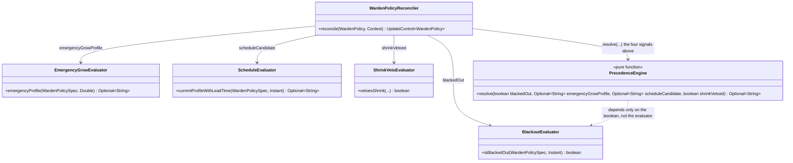
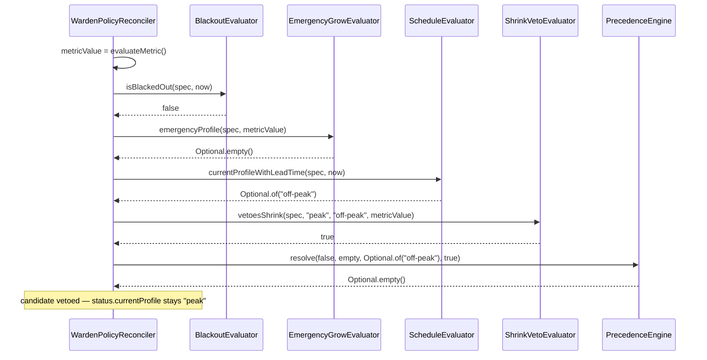

# Design: W-404 — Precedence engine

started: 2026-07-21

The last M4 story. W-305 (blackout), W-402 (shrink veto), and W-403 (emergency grow) each shipped
their own pure evaluator, and `WardenPolicyReconciler.reconcile()` already wires them together in
the right order — the roadmap's stated rule, `blackout > metric > schedule`, already holds today.
What's missing is the thing this ticket actually asks for: **one named, deterministic function**
that states the rule directly and can be **unit-tested as an exhaustive truth table**, rather than
the rule living only as control flow scattered across `reconcile()` — which has no unit test today
(it needs a live `Context<WardenPolicy>`/Kubernetes client, so it's only ever exercised in `mvn
verify`'s integration-style tests).

Acceptance criteria: unit-tested truth table over all three inputs.

## `PrecedenceEngine.resolve` — a pure function over three already-resolved signals

```java
Optional<String> resolve(
    boolean blackedOut,
    Optional<String> emergencyGrowProfile,
    Optional<String> scheduleCandidate,
    boolean shrinkVetoed)
```

It takes each input **pre-resolved** by the evaluator that already owns that judgment —
`BlackoutEvaluator.isBlackedOut`, `EmergencyGrowEvaluator.emergencyProfile`,
`ScheduleEvaluator.currentProfileWithLeadTime`, `ShrinkVetoEvaluator.vetoesShrink` — rather than
re-deriving any of them from `WardenPolicySpec` itself. That keeps the rule genuinely about
*precedence*, decoupled from *how* each input is computed (constitution §2: the engine depends on
the abstract signal, not the concrete evaluator or the CRD shape), and means the truth table's
fixtures are four primitives, not four `WardenPolicySpec` builders.

The rule, in order:

1. **Blackout wins outright.** `blackedOut` &rarr; `Optional.empty()` (no candidate resolved,
   nothing changes) — the hard override, independent of what metric or schedule would otherwise say.
2. **Metric-triggered emergency grow wins over the schedule.** Not blacked out and
   `emergencyGrowProfile` present &rarr; that profile, regardless of what `scheduleCandidate` is.
3. **Schedule applies only if the metric didn't veto it.** Not blacked out, no emergency grow,
   `scheduleCandidate` present and `!shrinkVetoed` &rarr; the candidate.
4. **Otherwise nothing changes** — `Optional.empty()` (no schedule candidate this reconcile, or
   the one candidate there is got vetoed).

## Why "metric" is two booleans, not one

The roadmap names three inputs — blackout, metric, schedule — but the metric's *effect* depends on
what the schedule is doing: it can *force a grow* independent of the schedule, or it can *veto a
shrink the schedule itself proposed*. Those aren't the same event, and only one of them makes sense
without a schedule candidate to react to. Rather than force both into one enum (`NONE` /
`EMERGENCY_GROW` / `VETO_SHRINK`) and lose the "veto only applies to *this* candidate" nuance, the
engine takes the metric's two possible effects as they already exist: a value
(`emergencyGrowProfile`) and a boolean gate on the schedule's own candidate (`shrinkVetoed`). The
truth table still covers "all three inputs" — it's just that the schedule and its veto travel
together, since a veto with no candidate to veto is meaningless.

## The reconciler becomes a thin caller, not a second copy of the rule

Today `reconcile()` *is* the rule, expressed as nested `if`/`else`. After this slice, `reconcile()`
computes the four inputs (as it already does) and hands them to `PrecedenceEngine.resolve`; the
`if`/`else` that encodes precedence moves into the engine, so there is exactly one place the rule
is written down, and the truth table tests are the only place its correctness is proven. Not doing
this refactor — writing `PrecedenceEngine` as a second, documentation-only copy of a rule
`reconcile()` still implements independently — was rejected outright, not treated as a real option:
two copies of "blackout > metric > schedule" can silently drift the same way two copies of
`limitBytes` could have (§1).

## Class diagram



## Sequence: one reconcile, four signals, one rule



## Out of scope for this slice

- Changing any individual evaluator's own logic — W-305/W-402/W-403 stay exactly as shipped; this
  slice only names and tests the rule that already combines their outputs.
