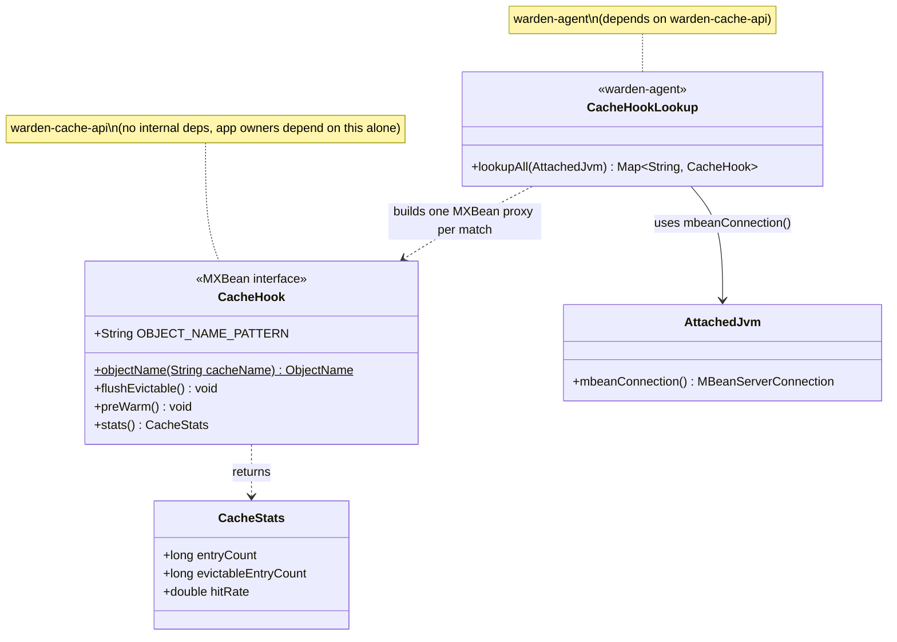

# Design: W-501 — CacheHook SPI

started: 2026-07-22

First story of M5 — Cache Integration. Roadmap wording: "As an app owner, I want Warden to
coordinate with my cache during resizes. SPI: `flushEvictable()`, `preWarm()`, `stats()`;
optional and safely absent."

This slice ships the SPI itself — the interface, its value type, and the discovery mechanism
that makes "optional and safely absent" a real, testable property. It does **not** call
`flushEvictable()`/`preWarm()` from `ShrinkSequence`/`GrowSequence` — that's W-502/W-503, once
there's an actual reference implementation (W-504) to call it against.

## Transport: the JMX connection Warden already has

`warden-agent` never injects code into the target JVM. `AttachedJvm.mbeanConnection()` (built by
`TargetAttacher`) gives an `MBeanServerConnection` over the target's loopback-bound JMX port, and
`G1PeriodicGc`/`SoftMax` already read the target's platform MXBeans through it via
`ManagementFactory.getPlatformMXBean(s)(connection, Type.class)`. `CacheHook` reuses exactly that
channel, just for an **app-registered** MBean instead of a platform one: the app owner's cache
implementation registers itself under an agreed `ObjectName` on its own `MBeanServer`, and the
agent looks it up over the same connection it already holds. No new port, no new protocol.

## `CacheHook` — an `@MXBean`, not a `FooMBean`

```java
@MXBean
public interface CacheHook {
  String DOMAIN = "io.github.baokhang83.mnemo";
  String TYPE = "CacheHook";
  /** Pattern every registered CacheHook's ObjectName matches — see {@link #objectName}. */
  String OBJECT_NAME_PATTERN = DOMAIN + ":type=" + TYPE + ",name=*";

  /** The ObjectName one cache instance registers under; {@code cacheName} must be unique per JVM. */
  static ObjectName objectName(String cacheName) throws MalformedObjectNameException {
    return new ObjectName(DOMAIN + ":type=" + TYPE + ",name=" + ObjectName.quote(cacheName));
  }

  void flushEvictable();
  void preWarm();
  CacheStats stats();
}
```

`@MXBean` (from `javax.management`, JDK-standard, zero extra dependency) is chosen over the
classic `CacheHookMBean` naming-convention style specifically so the app owner's implementation
class can be named anything — `RedisCacheHook`, `CaffeineCacheHook`, whatever fits their code —
without the class name itself carrying protocol meaning.

### Multiple caches per app JVM

A single fixed `ObjectName` can only ever name **one** registered MBean per `MBeanServer` —
`registerMBean` throws `InstanceAlreadyExistsException` on a second registration under the same
name. An app with more than one independently-manageable cache (a session cache and a query
cache, say) needs Warden to discover *all* of them, not just the first. So the name carries a
per-cache key property (`name=sessionCache`, `name=queryCache`, ...) rather than being fixed, and
discovery queries the pattern instead of looking up one exact name. `ObjectName.quote(...)` is
used when building the name so an arbitrary app-chosen `cacheName` string (spaces, commas,
whatever) can't produce a malformed or spoofed `ObjectName`.

`CacheStats` is a **plain JavaBean-style class with a `@ConstructorProperties`-annotated
constructor**, not a record:

```java
public final class CacheStats {
  @ConstructorProperties({"entryCount", "evictableEntryCount", "hitRate"})
  public CacheStats(long entryCount, long evictableEntryCount, double hitRate) { ... }

  public long getEntryCount() { ... }
  public long getEvictableEntryCount() { ... }
  public double getHitRate() { ... }
}
```

This is the same pattern the JDK's own `java.lang.management.MemoryUsage` uses. It matters
because it's not cosmetic: standard MXBeans convert compound return values to `CompositeData` on
the wire and reconstruct them on the client via reflection, and that reconstruction requires
either JavaBean setters or a `@ConstructorProperties` constructor matching the getter names. A
record's accessors (`entryCount()`, not `getEntryCount()`) don't satisfy the JavaBean getter
convention the framework looks for, so a record would silently fail to round-trip through the
standard MXBean machinery — this is a real constraint, not a style preference. Only the three
fields the roadmap's "cache coordination" framing actually motivates are included (entry count,
evictable-entry count, hit rate); nothing downstream consumes `stats()` yet in this ticket, so it
stays exactly this small (§1).

## Discovery: `Map<String, CacheHook>`, empty when nothing's registered

```java
public final class CacheHookLookup {
  public static Map<String, CacheHook> lookupAll(AttachedJvm target) { ... }
}
```

`lookupAll` queries `connection.queryNames(new ObjectName(CacheHook.OBJECT_NAME_PATTERN), null)`
— every registered name matching `type=CacheHook,name=*` — then builds one
`JMX.newMXBeanProxy(connection, name, CacheHook.class)` per match, keyed by that name's `name`
key property (`ObjectName.getKeyProperty("name")`), so a caller can log or reason about *which*
cache a given hook is. No app-registered cache at all just means `queryNames` returns an empty
set, so `lookupAll` returns an empty map — no exception, no special case, the plural version of
the same "safely absent" property the single-hook design had.

`CacheHookLookup` lives in `warden-agent` (it's the only module holding an `AttachedJvm`), in a
new `cache` package alongside `attach` and `heap`.

## Module placement: a new `warden-cache-api`, not inside `warden-agent`

`CacheHook` itself — the interface an app owner's *own application* implements and compiles
against — goes in a **new, dependency-free module**, `warden-cache-api`, mirroring the precedent
`warden-crd-model` already sets for CRD consumers: a small artifact with no internal dependencies,
so a party outside the sidecar can depend on just the contract. Putting `CacheHook` inside
`warden-agent` instead was rejected: the app being sidecar'd runs its own JVM, entirely separate
from the agent's — depending on `warden-agent` (JMX attach, K8s resize orchestration, the health
server) just to implement one three-method interface would be backwards, and drags an unrelated
dependency surface into third-party application code. `warden-agent` depends on
`warden-cache-api` (for `CacheHookLookup` to reference `CacheHook`/`CacheStats`), the same
direction `warden-controller` already depends on `warden-crd-model`.

## Class diagram



## Sequence: N caches registered, or none

```mermaid
sequenceDiagram
  participant Caller as (future) ShrinkSequence/GrowSequence
  participant L as CacheHookLookup
  participant C as MBeanServerConnection
  participant Hooks as CacheHook instances (app-registered)

  Caller->>L: lookupAll(attachedJvm)
  L->>C: queryNames(type=CacheHook,name=*)
  alt one or more caches registered
    C-->>L: {name=sessionCache, name=queryCache}
    L->>C: newMXBeanProxy(...) per matched name
    L-->>Caller: {"sessionCache": proxy, "queryCache": proxy}
  else no cache ever wired up
    C-->>L: {} (empty set)
    L-->>Caller: {} (empty map)
  end
  Note over Caller: this slice stops at the lookup; W-502/W-503 call<br/>flushEvictable()/preWarm() on every value in the map
```

## Out of scope for this slice

- Calling `flushEvictable()` from `ShrinkSequence` or `preWarm()` from `GrowSequence` — W-502 and
  W-503.
- A reference `CacheHook` implementation — W-504 (`mnemo-cache`), which is also what will finally
  exercise `stats()`'s shape end to end.
