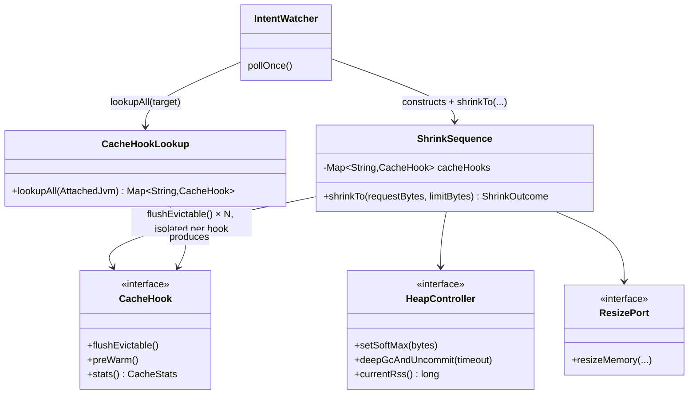
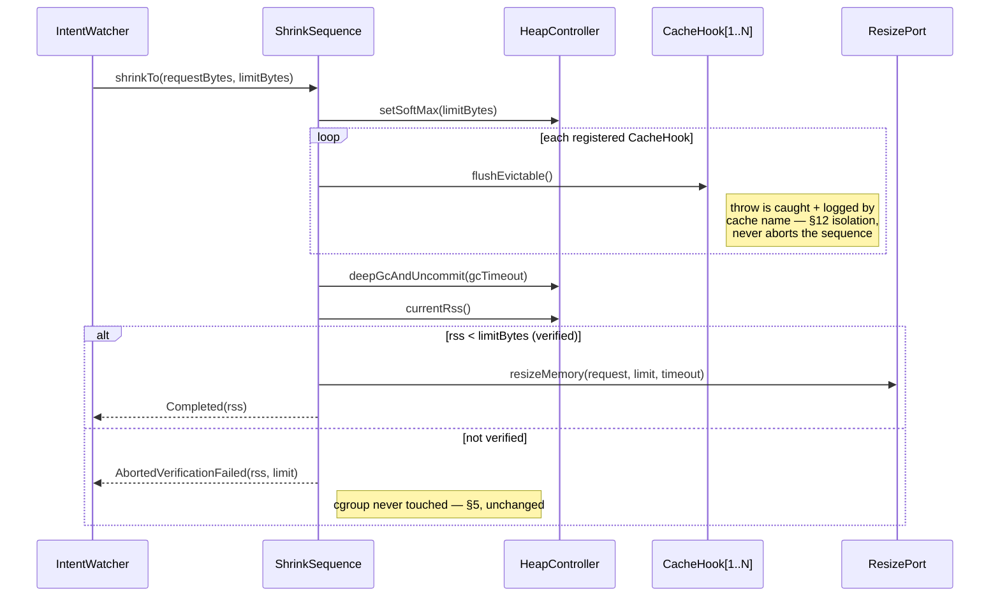

# Design: W-502 — Flush evictable-only on shrink: ShrinkSequence calls CacheHook.flushEvictable() on every registered app cache before the deep-GC/uncommit step, so shrink reclaims idle cache without ever touching the hot working set

started: 2026-07-22

Before `ShrinkSequence` runs its deep-GC/uncommit step, it now tells every app-registered
`CacheHook` to shed whatever it considers safely evictable — so a shrink reclaims idle cache,
never the hot working set the app owner is protecting.

## Class diagram

## Sequence: one shrink attempt

## Decisions

- **Flush lives inside `ShrinkSequence`, not the caller.** Ordering (setSoftMax → flush →
  deep-GC/uncommit → verify → resize) is enforced in the sequence itself, not left to
  `IntentWatcher`/`ShrinkTrialDriver` discipline — constitution §5.
- **Per-hook failure isolation.** Each `flushEvictable()` call is individually caught and
  logged by cache name; one broken app cache can neither abort the shrink nor block its
  sibling hooks — constitution §12, applied to untrusted app-owner code.
