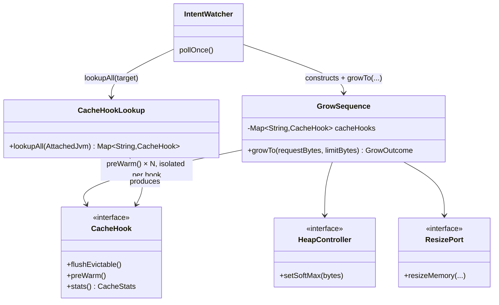

# Design: W-503 — Pre-warm on grow: GrowSequence calls CacheHook.preWarm() on every registered app cache after raising SoftMax, so the cache is warm before the predicted-peak traffic that leadTime.warm grew ahead of actually arrives

started: 2026-07-22

The mirror image of W-502: `GrowSequence` calls `CacheHook.preWarm()` on every registered app
cache *after* raising SoftMax, so the cache is repopulated while there's already room for it —
before the predicted-peak traffic that `leadTime.warm` already grew ahead of actually arrives.
"Ahead of the predicted peak" is not new machinery here: W-304's `ScheduleEvaluator
.currentProfileWithLeadTime` already makes the controller emit the larger profile's intent during
the `leadTime.warm` window, so `IntentWatcher` already calls `GrowSequence.growTo` early — this
story just adds `preWarm()` as the last step of that already-early call.

## Class diagram



## Sequence: one grow attempt

```mermaid
sequenceDiagram
  participant IW as IntentWatcher
  participant GS as GrowSequence
  participant HC as HeapController
  participant CH as CacheHook[1..N]
  participant RP as ResizePort

  IW->>GS: growTo(requestBytes, limitBytes)
  GS->>RP: resizeMemory(request, limit, timeout)
  Note right of GS: a kubelet timeout propagates here;<br/>SoftMax is never touched — unchanged
  GS->>HC: setSoftMax(limitBytes)
  loop each registered CacheHook
    GS->>CH: preWarm()
    Note right of CH: throw is caught + logged by<br/>cache name — §12 isolation,<br/>never fails the grow
  end
  GS-->>IW: GrowOutcome(limitBytes)
```

## Decisions

- **`preWarm()` runs last, after `setSoftMax` raises the ceiling.** A cache repopulating itself
  allocates heap; running `preWarm()` before the ceiling is raised risks those very allocations
  getting evicted again by GC pressure honoring the stale, lower SoftMax. Ordering stays
  "cgroup up → raise SoftMax → preWarm" — constitution §5's existing grow mirror, with one more
  step appended, not reordered.
- **Per-hook failure isolation, same as W-502.** Each `preWarm()` call is individually caught and
  logged by cache name; one broken app cache can't fail the grow or block sibling hooks —
  constitution §12, applied identically to the shrink-side `flushEvictable()` wiring.
