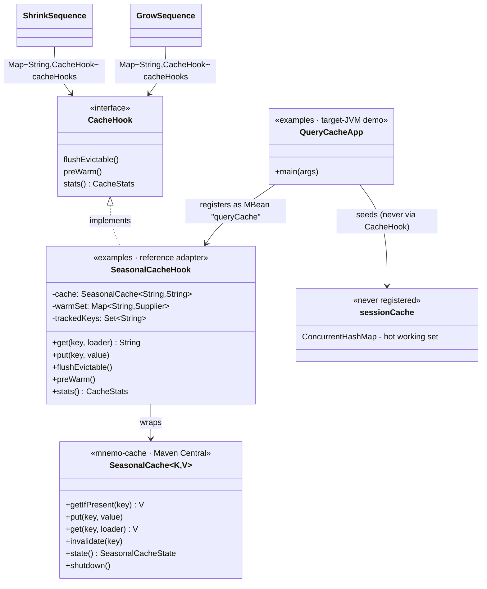
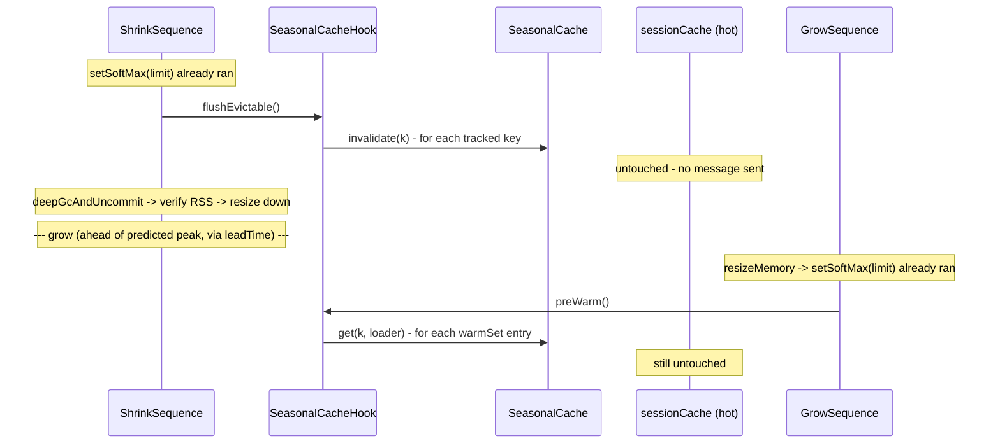

# Design: W-504 — mnemo-cache reference adapter

started: 2026-07-22

A real `CacheHook` implementation for the actual [mnemo-cache](https://github.com/baokhang83/mnemo-cache)
library (Maven Central `0.1.0`, not a fake), plus a small target-JVM demo app (`examples`
module) that proves the README's stateful-node story end to end: shrink flushes the evictable
cache, grow pre-warms it, and a separate hot cache that was never registered as a `CacheHook`
stays untouched throughout.

## Class diagram

## Sequence: shrink flushes queryCache, grow pre-warms it, sessionCache is never touched

## Decisions

- **`flushEvictable()` empties the whole cache, not a hot/cold split inside it** — SeasonalCache
  exposes no per-key hotness signal and no `invalidateAll()`; Caffeine's W-TinyLFU owns that
  judgment internally and doesn't surface it. "Evictable" is decided at the granularity of which
  *cache* an app owner registers a hook for, not which *key* — matching `CacheHook`'s own javadoc
  ("whatever *this cache* considers safely evictable"). Rejected alternative: extend mnemo-cache's
  public API with a forced-evict primitive — a cross-repo change to a library already published to
  Maven Central, for a distinction the reference app doesn't need.
- **The "hot working set" is a second, unregistered cache, not a flag inside the adapter** —
  proves the README's stateful-node promise using the SPI's actual mechanism: registration is
  opt-in (W-501), so anything never registered is architecturally invisible to Warden. Rejected
  alternative: one cache with per-entry pinning — adds real complexity to a reference adapter
  whose whole job is to be legible to an evaluator reading the source.
- **No changes to the mnemo-cache repository** — it's an independently versioned, already-published
  library with zero knowledge of Warden. The adapter lives entirely in `examples`, built only
  against mnemo-cache's existing public surface (constitution §2: depend on a volatile third-party
  seam, don't reach into it).
- **`examples` gets a normal test-scope dependency on `warden-agent`'s main artifact** — lets an
  end-to-end test drive the real `ShrinkSequence`/`GrowSequence` against the real adapter
  in-process, no test-jar plumbing. `CacheHookLookupTest` already proved the spawn/attach/JMX path
  works for any `CacheHook`; this feature only needs to prove the *real* adapter's behavior.
