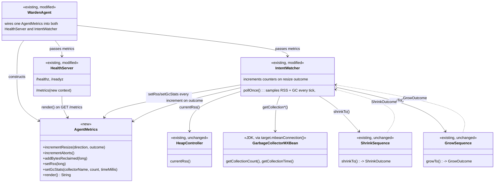
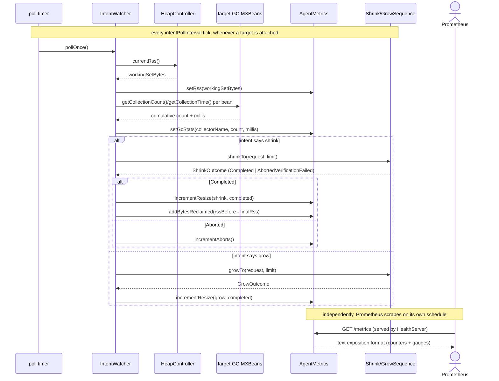

# Design: W-602: Agent self-telemetry - expose resize/abort/RSS/GC-pause metrics in Prometheus text format from warden-agent (zero-dep, hand-rolled exposition)

started: 2026-07-22

An SRE watching `warden-agent` today has only `/healthz`/`/readyz` — up or not, ready or not, no
history of what the agent actually *did*. W-602 adds a `/metrics` endpoint on the same health
port, in Prometheus text exposition format, covering: resize counts, aborts, bytes reclaimed, the
target's current RSS, and the target's cumulative GC pause time.

The ticket names Micrometer/Prometheus, but `warden-agent`'s `pom.xml` states a deliberate
invariant: zero runtime dependencies, plain jar, no shade step. Real Micrometer
(`micrometer-core` + `micrometer-registry-prometheus`) would break that. Since what an SRE
actually needs is the Prometheus *text format* on the wire — not the Micrometer *library* — this
design hand-rolls a small internal registry and a text-format writer in plain JDK, reusing the
`HttpServer` `HealthServer` already runs. See Decisions.

## Class diagram

## Sequence: a poll tick, and a scrape

## Decisions

- **Hand-rolled Prometheus text exposition, not real Micrometer.** `warden-agent`'s `pom.xml`
  states zero runtime dependencies as a deliberate property (plain jar, no shade step). Pulling in
  `micrometer-core` + `micrometer-registry-prometheus` would break that and likely require the
  same shade-plugin treatment `warden-controller` needed for fabric8. What an SRE scrapes is the
  Prometheus text format on the wire, not a specific client library — so a small internal counter
  /gauge registry plus a text-format `render()` in plain JDK satisfies the ticket's actual need
  without the dependency.
- **Metrics live on the existing health port, not a new listener.** `HealthServer` already runs
  one `HttpServer` for `/healthz`/`/readyz`; adding `/metrics` as a third context on the same
  instance avoids a second port, a second env var, and a second thing that can fail to bind.
- **RSS and GC-pause gauges are sampled every `IntentWatcher` poll tick, not at scrape time.**
  Scraping is Prometheus's own schedule and could hit the agent mid-attach or between ticks;
  sampling happens where a live target and a constructed `HeapController` already exist every
  tick regardless of whether an intent resize fires, so the gauges reflect the last observed
  value rather than opening a fresh JMX round-trip per scrape.
- **`ShrinkSequence`/`GrowSequence` stay untouched — metrics recording lives in `IntentWatcher`.**
  Both sequence classes are deliberately documented as depending only on `HeapController` and
  `ResizePort`, "never a concrete GC driver," so the ordering/gate logic is exactly what's under
  test — adding a metrics registry dependency there would be coupling neither class needs.
  `IntentWatcher` is already the one call site that resolves the target, decides the direction,
  and receives the outcome, so it's the natural (and only) place to record the event.
