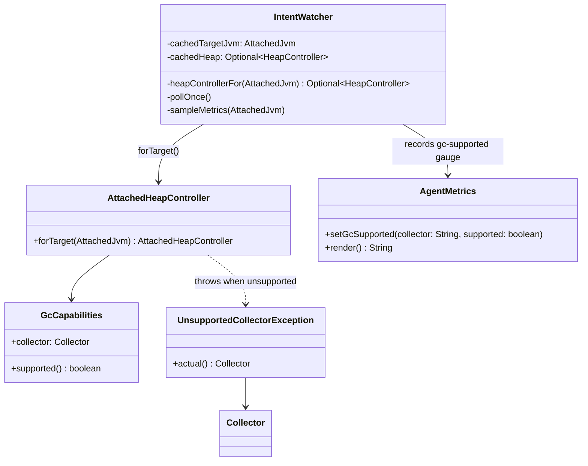

# Design: W-603: GC support matrix completion — clear read-only mode for unsupported collectors

started: 2026-07-22

The detection matrix itself (ZGC / Shenandoah / G1 → capabilities, OTHER → unsupported) already
exists from W-101/W-103/W-106/W-107 and is not touched here. The gap this feature closes is
purely in `IntentWatcher`: an unsupported collector currently surfaces as a generic, retried
poll-tick error instead of a distinct, one-time, operator-visible "read-only, won't resize"
signal.

## Class diagram



## Sequence: resolving a target's HeapController once per attach

```mermaid
sequenceDiagram
  participant Loop as IntentWatcher.pollOnce()
  participant HCF as heapControllerFor()
  participant AHC as AttachedHeapController
  participant Metrics as AgentMetrics
  participant Log as AgentLog

  Loop->>HCF: resolve(jvm)
  alt first tick for this jvm identity
    HCF->>AHC: forTarget(jvm)
    alt collector unsupported
      AHC-->>HCF: throws UnsupportedCollectorException
      HCF->>Log: one clear "read-only, won't resize" line
      HCF->>Metrics: setGcSupported(collector, false)
      HCF-->>Loop: Optional.empty() (cached)
    else collector supported
      AHC-->>HCF: HeapController
      HCF->>Metrics: setGcSupported(collector, true)
      HCF-->>Loop: Optional.of(heap) (cached)
    end
  else already resolved for this jvm identity
    HCF-->>Loop: cached Optional — no retry, no re-log, no re-walk of cgroupfs
  end
  Loop->>Loop: skip resize/grow this tick if empty, else proceed as before
```
