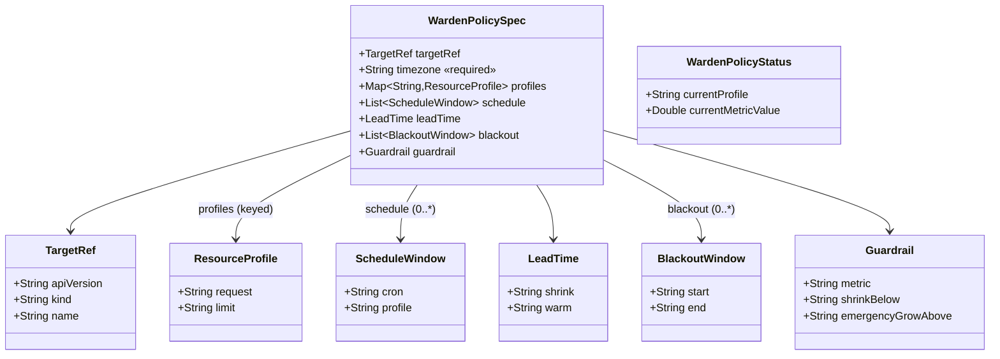
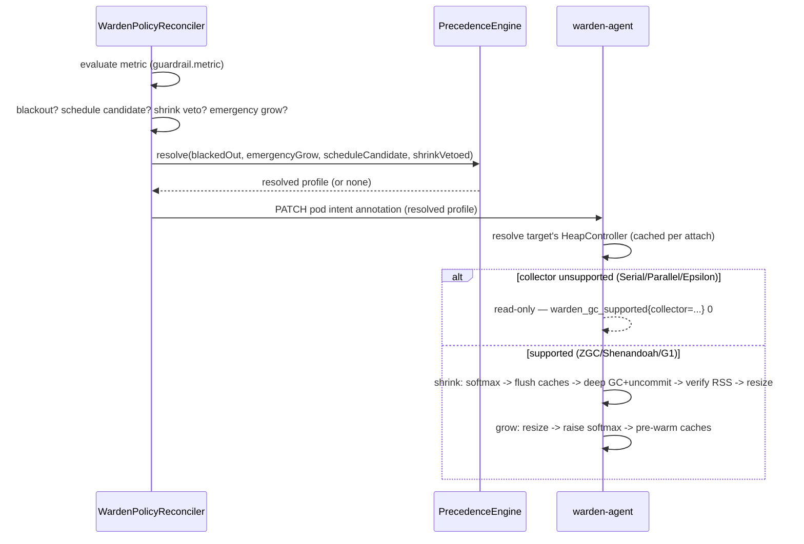

# Design: W-604 — Docs: configuration reference + runbook

started: 2026-07-22

This is a docs-only ticket (no new code): `docs/configuration.md` documenting every
`WardenPolicy` field plus an operator runbook. The two diagrams below are the shape the
document itself walks through, not new classes being introduced.

## Class diagram — the schema the reference documents

## Sequence: the runbook's mental model (precedence + read-only gate)

The runbook section exists to answer "why isn't Warden doing what I expect" — this is the
one flow an operator needs in their head to answer that themselves.

