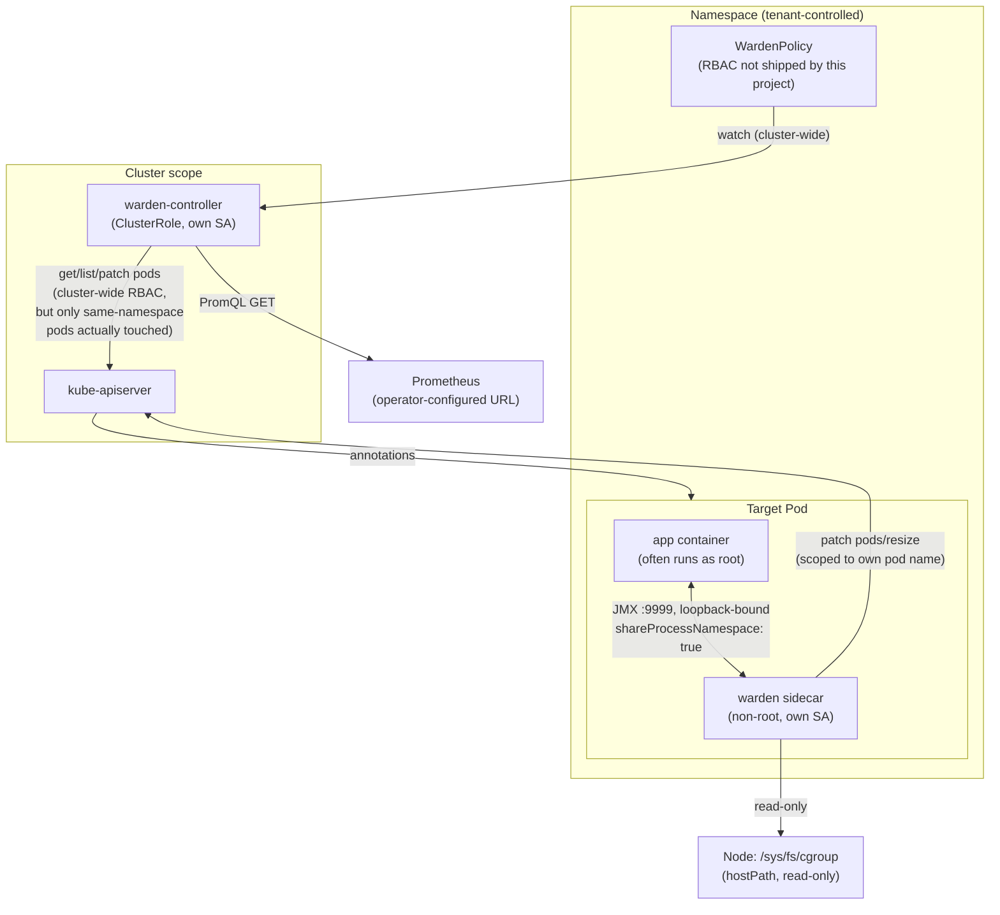

# Threat model

This document exists so a security reviewer can evaluate Warden's controller
and sidecar **before** installing them in a cluster that matters, without
reading every line of Java first. It describes what Warden can touch, who
could abuse that, what already stops them, and where a real gap is accepted
rather than hidden.

> For *how the code implements* each RBAC grant, see
> [`rbac-mapping.md`](rbac-mapping.md). For a checklist tying every threat
> below to a mitigation, a test, or an accepted risk, see
> [`security-review-checklist.md`](security-review-checklist.md).

Method: informal STRIDE-style walkthrough of the real data flows in
`warden-controller` and `warden-agent`, cross-checked against the actual
RBAC manifests (`charts/warden/templates/controller-rbac.yaml`,
`deploy/example-sidecar.yaml`) and the `deploy/verify-*.sh` scripts that
already exercise several of these boundaries against a live cluster. Where a
claim below says "verified," it means one of those scripts (or a unit test)
proves it against a real kind cluster — not just that the YAML looks right.

---

## Assets

| Asset | Why it matters |
| --- | --- |
| Target JVM's memory footprint / availability | A wrong shrink can OOMKill the workload Warden is supposed to protect. |
| Target JVM's JMX MBean server | Read/write access to heap, GC, and (via `DiagnosticCommand`) arbitrary diagnostic commands on the target. |
| Pod's memory `request`/`limit` (the `pods/resize` subresource) | This is the actual lever Warden pulls; abusing it can starve or OOM a workload, or falsely inflate a node's booked capacity. |
| `WardenPolicy` objects (schedule, guardrail, `targetRef`) | The declarative input that drives what gets resized, when. |
| Pod annotations (`warden.mnemo.io/target-*-bytes`) | The controller→agent handoff channel; whoever can write these controls what the agent resizes toward. |
| Kubernetes service-account tokens (controller's and each sidecar's) | Bearer credentials for the in-cluster API server; theft grants everything the token's RBAC allows. |
| Host cgroup filesystem (read-only mount) | Read visibility into **every** cgroup on the node, not just the target's — a real, accepted privilege cost (see below). |
| Prometheus guardrail readings (`status.currentMetricValue`) | Currently observational only, but it's the seam the M7 predictive/guardrail-action work will build on. |
| Agent/controller logs (stdout) | Must not leak tokens, JMX data, or other pods' information. |

## Actors

| Actor | Trust level | Notes |
| --- | --- | --- |
| Cluster/namespace admin | Fully trusted | Installs the Helm chart, grants RBAC, writes `WardenPolicy` objects. |
| WardenPolicy author | Namespace-trusted, not necessarily workload-trusted | Anyone with write access to `wardenpolicies` in a namespace. Kubernetes RBAC for this resource is **not** shipped by this project (see "Malicious or misconfigured WardenPolicy" below) — whoever the cluster grants that access to is this actor. |
| Target workload (the `app` container) | Semi-trusted | The thing Warden manages. Assumed non-malicious at deploy time, but may be compromised at runtime (the interesting case below). |
| Another tenant / pod on the same node | Untrusted | Can reach the target's JMX port only if network isolation is missing; cannot reach the host-cgroup mount (that's sidecar-container-only, not node-wide-accessible). |
| Warden controller process | Trusted, but a single point of cluster-wide failure if compromised | Runs with a `ClusterRole`; see "Controller compromise" below. |
| Warden agent (sidecar) process | Trusted per-pod | Runs with a `Role` scoped to its own pod's name via `resourceNames`. |
| External attacker (network) | Untrusted | Relevant only insofar as any of the above surfaces are reachable from outside their intended boundary. |

## Entry points

1. `WardenPolicy` create/update (Kubernetes API, namespaced).
2. Pod annotations (`warden.mnemo.io/target-request-bytes` / `target-limit-bytes`) — written by the controller, read by every agent.
3. The target JVM's JMX port (loopback-bound, same pod as the sidecar).
4. `pods/resize` subresource PATCH (sidecar → API server).
5. `pods` GET/LIST/PATCH (controller → API server, cluster-wide RBAC).
6. Host `/sys/fs/cgroup` read-only mount (sidecar container only).
7. Agent's `/healthz`, `/readyz`, `/metrics` HTTP endpoints (pod network namespace).
8. Prometheus PromQL queries (controller → an operator-configured Prometheus URL).
9. `kubectl exec` into the `warden` sidecar container (requires separate `pods/exec` RBAC — not granted by this project's manifests, but worth naming as an entry point since the shipped image includes harness/test entry points; see below).

## Trust boundaries

The crossing points that matter:

- **Namespace boundary → cluster scope:** the controller's `ClusterRole`
  crosses every namespace boundary for `get`/`list`/`watch` on
  `wardenpolicies` and for `get`/`list`/`patch` on `pods`. The *code path*
  (`IntentEmitter`) only ever acts within the `WardenPolicy`'s own namespace
  (`policy.getMetadata().getNamespace()`), but the RBAC grant itself does not
  encode that restriction — see "Controller compromise" below.
- **Pod boundary → node scope:** the sidecar's `hostPath` mount of
  `/sys/fs/cgroup` crosses from "this pod's cgroup" to "every cgroup on the
  node," because Kubernetes has no native way to scope a `hostPath` mount to
  one pod's subtree. Explicit, accepted cost — see "Host cgroup mount" below.
- **Container boundary → pod boundary:** `shareProcessNamespace: true`
  crosses the `app`/`warden` container boundary at the process-table level
  (not filesystem, not network). See "Shared process namespace" below.
- **Pod boundary → pod boundary (same ServiceAccount, different replica):**
  closed by `warden-resize-admission-policy.yaml` (#71) — see "Resize API
  abuse" below.

## Data flows

1. **Schedule/guardrail evaluation:** controller reads `WardenPolicy.spec`
   (schedule, blackout, guardrail) + a PromQL reading → resolves a profile
   name → writes `status.currentProfile`/`status.currentMetricValue`.
2. **Intent handoff:** controller resolves `targetRef` to concrete pod
   name(s) in its own namespace → PATCHes two byte-count annotations onto
   each pod.
3. **Intent consumption:** each agent polls its **own** pod (never another
   pod) for those two annotations, compares against the target container's
   actual live limit, and drives a resize sequence if they differ.
4. **Resize execution:** agent PATCHes `pods/resize` for its own pod name
   (RBAC-scoped via `resourceNames`), then polls `status.containerStatuses`
   until the kubelet confirms it.
5. **Safety verification:** agent reads JVM heap/GC state over the loopback
   JMX connection and RSS/working-set from the host-cgroup mount, gating the
   shrink sequence on both.

No data flow in the current codebase crosses a namespace the `WardenPolicy`
doesn't itself live in, and none writes to a `Secret` or any resource other
than `wardenpolicies/status` and `pods`/`pods/resize`.

---

## Abuse cases

### 1. Controller compromise

**Scenario:** an attacker achieves arbitrary code execution inside the
`warden-controller` process (e.g. a dependency CVE in the fabric8 client,
operator-framework, or cron-utils — the controller's shaded jar bundles all
three).

**Impact:** the controller's `ClusterRole` grants, cluster-wide (every
namespace): `get`/`list`/`watch` on `wardenpolicies`, `get`/`patch` on
`wardenpolicies/status`, `get` on `deployments`/`statefulsets`, and
`get`/`list`/`patch` on **pods**. A compromised controller could therefore
read every pod's metadata (not `Secret`s — no RBAC grant exists for those)
and patch arbitrary mutable fields (annotations/labels) on **any pod in the
cluster**, not just ones targeted by a real `WardenPolicy`. It cannot delete
pods, exec into them, read/write `Secret`s, or resize a pod itself (`pods/resize`
is only ever granted to a sidecar's own `Role`, never to the controller).

**Mitigation:**
- No `Secret`, `exec`, `delete`, or node-mutation verb is granted anywhere in
  `controller-rbac.yaml` — verified by the `kubectl auth can-i` matrix in
  [`deploy/verify-rbac-boundaries.sh`](../deploy/verify-rbac-boundaries.sh).
- The controller image runs as a non-root user (`Dockerfile.controller`).
- Dependencies are declared explicitly and shaded into one jar (auditable
  surface, no runtime classpath surprises).

**Accepted risk:** the `pods` grant's `patch` verb is not narrowed to "only
annotation patches" or "only pods in this policy's own namespace" — Kubernetes
core RBAC has no field-level or same-namespace-as-caller scoping for a
`ClusterRole`. A `ValidatingAdmissionPolicy` analogous to
`warden-resize-admission-policy.yaml` (#71) could narrow the *write* side
further (e.g. reject a controller-identity PATCH that touches anything but
the two `warden.mnemo.io/target-*-bytes` annotation keys); this is tracked as
a follow-up in the review checklist, not yet implemented.

### 2. Malicious or misconfigured WardenPolicy

**Scenario:** an actor with write access to `wardenpolicies` in a namespace
(this project ships no RBAC for that resource itself — see "Actors" above)
creates a policy whose `targetRef` names a workload they don't own, or sets
an aggressive schedule/profile against their own workload.

**Impact:** `IntentEmitter` resolves `targetRef` by name/selector with **no
opt-in check** — no required label, annotation, or `ownerReference` on the
target confirming it agreed to be managed by *this* policy. Any
`WardenPolicy` in a namespace can annotate any `Pod`/`Deployment`/
`StatefulSet` in that same namespace. Two distinct outcomes:
- **Target has no Warden sidecar:** the annotations are inert — nothing
  reads them, no resize happens. Worst case is annotation churn (a `PATCH`
  storm) and confusion for whoever inspects that pod's metadata.
- **Target does have a Warden sidecar (i.e., it's genuinely managed by
  Warden, just not by *this* policy):** the sidecar cannot tell which
  `WardenPolicy` an annotation came from — it trusts whatever the two
  annotation keys currently say. A second, unrelated policy in the same
  namespace targeting the same pod can therefore override the intended
  schedule, including forcing an unsafe shrink profile.

**Mitigation:** the shrink path itself is still gated by the agent's own
RSS-verification state machine (`docs/architecture.md`'s `Verifying` step) —
a malicious annotation can request a bad target, but the agent still refuses
to lower the cgroup until it verifies the JVM's actual RSS is below it. This
bounds the blast radius to "wrong schedule," not "OOMKill despite a
verification gate."

**Accepted risk:** there is no cluster-shipped RBAC or admission control
restricting who may create a `WardenPolicy`, nor any requirement that a
target opt in (e.g. via a label) to being resolved by a given policy's
`targetRef`. This is explicitly out of scope for this ticket (RBAC for
`wardenpolicies` itself is left to the installing cluster's own policy) but
recorded here rather than left implicit — see the review checklist for the
suggested follow-up (an opt-in label check in `IntentEmitter`).

### 3. Target-workload compromise

**Scenario:** the `app` container is compromised (arbitrary code execution),
e.g. via a vulnerable dependency in the workload itself.

**Impact:** the attacker inherits whatever the `app` container's own
Kubernetes identity and network position already grant — Warden does not
expand that on its own. The two Warden-specific paths a compromised `app`
container gains additional reach into are the shared JMX port (see below,
already same-pod/loopback-only) and, if `app` runs as root (the common case
for stock JVM base images — see `deploy/example-sidecar.yaml`'s `app`
container), the shared process namespace (next section).

**Mitigation:** the sidecar's own Kubernetes service-account token
(bearer credential for `pods`/`pods/resize`) is never placed on a volume the
`app` container mounts, and JMX carries no filesystem or Kubernetes-API
capability by itself.

**Accepted risk:** see "Shared process namespace" — if `app` runs as root,
compromise of that container is roughly equivalent to compromise of the
sidecar too, at the process-inspection level.

### 4. Shared process namespace

**Scenario:** `example-sidecar.yaml` sets `shareProcessNamespace: true` so
`TargetLocator` can find the target JVM's PID via `/proc` (W-102). This
shares the **PID namespace** across both containers in the pod — each
container's process tree is visible to the other via `/proc`.

**Impact:** a root-privileged process in either container can inspect (and
on Linux, `ptrace`) processes owned by a different UID in the same PID
namespace — that's how `CAP_SYS_PTRACE`/root cross-UID access works,
independent of container boundaries once the PID namespace is shared. Stock
JVM base images (`eclipse-temurin:*-jdk`, used by both the `warden` container
before it drops privilege at build time via `USER warden`, and commonly by
`app` containers that don't set their own `securityContext`) default to
**root**. If `app` runs as root, a compromise there gains the ability to
inspect the `warden` sidecar's process — environment variables
(`/proc/<pid>/environ`), open file descriptors, and in principle memory
(`ptrace`) — which is where the sidecar's Kubernetes service-account bearer
token transiently lives in memory (`InClusterApiServer.bearerToken()` reads
it from disk per-call rather than caching it long-term, but a `ptrace`'d
process's memory can still be inspected while it's in a local variable).

**Mitigation:** the sidecar container already runs as a dedicated non-root
`warden` user (`Dockerfile`), which limits the *reverse* direction (sidecar
inspecting/tracing `app`) to what a non-root ptrace scope (`yama` LSM,
default `ptrace_scope=1` on most distros) allows — same-UID or an explicit
`CAP_SYS_PTRACE`, neither of which the sidecar has toward `app`'s processes
when they run as a different, non-matching UID.

**Accepted risk:** this project does not, and cannot from the sidecar's
side, force the `app` container to run as non-root — that's the operator's
container image and `securityContext` choice. **Hardening recommendation
for operators:** set `runAsNonRoot: true` / an explicit non-root `runAsUser`
on the `app` container. `deploy/README.md` documents this as a real,
explicit cost of `shareProcessNamespace`, not a free feature.

### 5. JMX access

**Scenario:** the target JVM opens an unauthenticated JMX port
(`jmxremote.authenticate=false`) so the sidecar can attach without needing to
run as root (the JDK Attach API's actual requirement — see bug #55,
documented in `TargetAttacher`'s javadoc).

**Impact:** an unauthenticated JMX port with unrestricted MBean access is
close to remote code execution (JMX exposes `DiagnosticCommand`, which can
invoke arbitrary VM diagnostic operations). If this port were reachable from
outside the pod, any pod in the cluster (or anything with network access to
the pod IP) could connect.

**Mitigation:** `jmxremote.host=127.0.0.1` binds the listener to loopback
only. **Verified against a real cluster** (`deploy/README.md`): a separate
pod's connection attempt to the same port is refused, while the sidecar's
(same pod, same network namespace) still succeeds. `authenticate=false` is
only safe *because of* that binding — the two flags are a pair, not
independent choices.

**Accepted risk:** this depends entirely on the target JVM actually being
launched with `jmxremote.host=127.0.0.1`. There is no code-level enforcement
inside Warden that verifies a target's JMX flags before attaching — a
misconfigured target that binds JMX to `0.0.0.0` (dropping the host flag)
would be unauthenticated and cluster-reachable, but that misconfiguration is
entirely in the target's own launch command, outside Warden's control.
**Hardening recommendation:** operators should treat the six JMX flags in
`deploy/README.md` as a unit and verify the binding (e.g. `verify-*` style
check) for their own target images, not just copy the port number.

### 6. Host cgroup mount

**Scenario:** `RssReader` needs the target container's cgroup files, but the
agent and target are separate containers, so a `hostPath` mount of
`/sys/fs/cgroup` (read-only) is required (bugs #55/#57 — no narrower
mechanism was found; see `deploy/README.md` and `RssReader`'s javadoc).

**Impact:** the sidecar container gets read visibility into **every cgroup
on the node**, not just its own pod's — including other tenants' pods'
memory/CPU accounting data (`memory.current`, `memory.stat`, etc. for
workloads with no relationship to this Warden installation). This is
information disclosure of resource-usage metadata, not of application data
or secrets — cgroup files don't contain process memory contents, environment
variables, or credentials.

**Mitigation:** mounted **read-only**; PodSecurity Standards' `restricted`
and `baseline` profiles both forbid `hostPath` volumes outright, so a
cluster enforcing either profile blocks this deployment shape unless an
explicit exemption is granted — that's a deliberate signal to the operator,
not a bug.

**Accepted risk:** explicitly documented in `deploy/README.md` as "a real,
explicit cost... no narrower alternative was found." Recorded here as a
named threat rather than an implicit tradeoff. **Hardening recommendation:**
operators on a node shared with untrusted tenants should weigh this
node-wide read visibility against the alternative (no verified RSS gate,
which is a safety regression, not just a privilege one) — see the review
checklist for the residual-risk sign-off.

### 7. Prometheus / metric spoofing

**Scenario:** `spec.guardrail.metric` is a PromQL string evaluated by
`PrometheusMetricSource` against `WARDEN_PROMETHEUS_URL` — an
operator-configured, controller-wide setting (`values.yaml`'s
`controller.prometheusUrl`), not something a `WardenPolicy` author can point
elsewhere.

**Impact today:** `status.currentMetricValue` is purely observational this
milestone (M4) — nothing yet acts on it automatically (guardrail-driven
shrink veto / emergency grow are evaluated, per `WardenPolicyReconciler`, but
only within the current schedule/precedence flow already covered above; nothing
outside that reconcile loop consumes the metric). A spoofed or MITM'd metric
value therefore currently affects `status.currentProfile` decisions (veto a
shrink, or force an emergency grow) — a real but bounded impact, not
uncontrolled code execution or privilege escalation.

**Mitigation:** the Prometheus URL is fixed cluster/controller-wide
configuration, not attacker- or policy-author-controlled — a `WardenPolicy`
author cannot redirect the query to their own endpoint.

**Accepted risk:** `PrometheusMetricSource` uses a plain `HttpClient` with no
mutual-TLS or bearer-token authentication of the Prometheus endpoint, and no
integrity check of the response beyond HTTP status + JSON shape. If the
network path to Prometheus is not otherwise secured (e.g. a service mesh
mTLS policy, or a `NetworkPolicy` restricting who can sit on that path), a
network-position attacker could return a fabricated PromQL result. Recorded
as a residual risk for operators to close via their own network security,
not something this ticket adds new code to fix (the epic's M7 predictive
work will need to revisit this once the metric actually drives *unattended*
resize actions, not just this milestone's veto/grow-forcing within a
schedule-derived reconcile).

### 8. Resize API abuse (cross-pod)

**Scenario:** a `Deployment`/`StatefulSet`'s replicas share one
`ServiceAccount` — because `resourceNames` can't be provisioned ahead of time
for dynamically-named pods — so the underlying `ClusterRole` for that shape
grants `get`/`patch` on **every pod in the namespace** (see
`deploy/README.md`'s "real, explicit RBAC tradeoff" section), which would
otherwise let replica A's sidecar resize replica B.

**Impact without a fix:** any replica's sidecar (or anything using that
replica's own token) could resize a different, unrelated pod's memory —
either shrinking it unsafely or falsely inflating it.

**Mitigation:** `warden-resize-admission-policy.yaml` (#71), a
`ValidatingAdmissionPolicy` (GA since Kubernetes 1.30), requires the caller's
bound service-account token's own `authentication.kubernetes.io/pod-name`
claim to match the pod actually being resized. **Verified against a real
cluster** by `deploy/verify-cross-pod-resize-denied.sh`: replica A resizing
replica B is denied (HTTP 422, citing the policy by name); replica A
resizing itself still succeeds.

**Accepted risk:** this policy is not automatically installed by the Helm
chart — it's a separate manifest operators must apply themselves for any
`Deployment`/`StatefulSet`-targeted installation. Tracked in the review
checklist as a hardening step operators must take, not something the chart
enforces on their behalf yet.

### 9. Cross-namespace targeting

**Scenario:** could a `WardenPolicy` in namespace A cause a resize in
namespace B?

**Impact:** no — `IntentEmitter.emit` is always called with
`policy.getMetadata().getNamespace()` (`WardenPolicyReconciler.emitIntent`),
and every `client.apps()...inNamespace(namespace)` / `client.pods().inNamespace(namespace)`
call in `IntentEmitter` uses that same namespace. There is no code path that
lets a `targetRef` name a different namespace (the CRD schema doesn't even
have a `namespace` field on `targetRef`).

**Mitigation:** structural — the controller's RBAC being cluster-wide (see
"Controller compromise") means this boundary is enforced by *code*, not by
RBAC. This is the one place in this document where "accepted risk" and
"enforced boundary" partially overlap: the boundary holds today because
`IntentEmitter` always derives the namespace from the policy itself, but a
future code change that accepted an explicit namespace on `targetRef` would
need to re-examine this section and the RBAC grant together.

**Accepted risk:** none currently — recorded as "enforced," with a note that
it's enforced in application code, not in Kubernetes RBAC, so a future
regression here would not be caught by RBAC alone. See the review checklist
for a suggested regression test.

### 10. Denial of service

**Scenario:** what stops a flood of `WardenPolicy` objects, or a workload
inside the shared PID namespace, from starving Warden's own function or the
API server?

**Impact / mechanisms considered:**
- **Ambiguous target JVM:** `TargetLocator` treats "0 or 2+ visible `java`
  processes" as "stay unattached" (fail-safe, not fail-open — it never
  guesses). A container in the same pod that spawns a second process named
  exactly `java` would permanently prevent the real agent from attaching,
  denying Warden's shrink/grow capability for that pod (not the cluster).
  This is a safety-preserving failure mode (no wrong-target attach) that
  doubles as an availability risk for Warden's own function.
- **Reconcile/API load:** `WardenPolicyReconciler`'s 30-second periodic
  resync and `PodResizeClient`'s 250ms confirmation poll are both fixed,
  modest-rate loops; a large number of `WardenPolicy` objects or resize
  operations scales linearly with the number of legitimately-managed
  workloads, not with attacker input, since neither loop is triggered by
  external, attacker-controlled events beyond the objects the attacker's own
  RBAC already lets them create in their own namespace.
- **Annotation-patch storms:** a malicious `WardenPolicy` (see abuse case 2)
  re-annotating pods every reconcile is bounded by the same 30s cadence, not
  attacker-adjustable.

**Mitigation:** none of the above lets an attacker outside a namespace they
already have write access to affect Warden's control loop timing.

**Accepted risk:** the "second `java` process blocks attach" behavior is a
known, intentional trade of availability for safety; recorded here rather
than silently relied upon. No client-side rate limiting/backoff was
independently verified for the Fabric8 Kubernetes client's or the JDK
`HttpClient`'s behavior under API-server throttling (`429`s) — this is a gap
in verification, not a known bug, and is tracked in the review checklist.

### 11. Secret or log leakage

**Scenario:** does anything Warden logs, or any resource it touches, expose
a `Secret`, a bearer token, or another pod's data?

**Impact if it did:** token theft would grant whatever that
identity's RBAC allows (see "Controller compromise" / per-pod `Role` scope
above).

**Mitigation, verified by code inspection:**
- Neither `warden-controller`'s RBAC nor `warden-agent`'s `Role` grants any
  verb on `secrets` — there is no code path that could read one even if a
  bug tried to.
- `AgentLog.info` logs only static lifecycle strings plus non-secret config
  (health port, pod name, poll interval) — never the bearer token, never
  JMX response bodies, never another pod's data.
- `InClusterApiServer.bearerToken()` re-reads the token from its projected
  volume on every call rather than caching it in a long-lived field,
  minimizing (but not eliminating — see "Shared process namespace") its
  exposure window in process memory.
- The controller's `slf4j` log lines (`WardenPolicyReconciler`) log the
  policy's namespace/name, the resolved profile name, and the metric value —
  never the annotation values verbatim in a form that would leak another
  pod's data beyond what the log line's own pod/namespace already names.

**Accepted risk:** no log-redaction test currently asserts this (i.e., it's
verified by reading the code today, not by a regression test that would
catch a future logging statement accidentally including a token or full pod
JSON body). Tracked in the review checklist as a follow-up: a test that
captures agent/controller stdout during a real resize and asserts the
bearer-token pattern never appears in it.

---

## Namespace and targetRef boundaries — summary

- **Enforced by code today:** a `WardenPolicy` only ever resolves and
  annotates pods in its **own** namespace (see abuse case 9). This is not
  presently backed by an admission-time or RBAC-time check — it's enforced
  by `IntentEmitter` always deriving the namespace argument from the policy
  object itself, with no field on the CRD that could name a different one.
- **Not enforced, by design of this ticket:** which actors may create/edit a
  `WardenPolicy` in a namespace at all, and whether a `targetRef`'s target
  has opted in to being managed by that specific policy (see abuse case 2).
  Recorded as an explicit residual risk with a follow-up in the review
  checklist, per this ticket's acceptance criteria, rather than silently
  assumed safe.

## Network exposure

| Listener | Bind | Reachable from | Auth |
| --- | --- | --- | --- |
| Agent `/healthz`, `/readyz`, `/metrics` (`HealthServer`) | all interfaces, pod's own network namespace (`InetSocketAddress(port)`, no host given) | any pod that can route to this pod's IP, unless a `NetworkPolicy` restricts it | none |
| Target JVM's JMX port | `127.0.0.1` only (must be configured this way — see abuse case 5) | same pod only, when configured correctly | none needed, given the loopback binding |
| Controller: no inbound listener | — | — | — |

**Hardening recommendation:** the agent's `/metrics` endpoint carries no
secrets (RSS/GC/resize telemetry, not tokens or app data) but is
unauthenticated and bound to all interfaces; operators running on a cluster
without default-deny `NetworkPolicy` should add one scoping access to their
own Prometheus scraper, consistent with general least-exposure practice —
this is a recommendation, not something the agent enforces itself (a
zero-dependency `HttpServer` was a deliberate simplicity choice; see
`HealthServer`'s javadoc).

## Out-of-scope assumptions

- The Kubernetes API server, etcd, and kubelet's own security (authn/authz,
  admission control machinery, cgroup enforcement) are trusted platform
  primitives, not re-verified by this project.
- RBAC for who may create/edit `WardenPolicy` objects, and who may
  `kubectl exec` into a Warden-managed pod, is the installing cluster's
  responsibility — this project ships the controller's and sidecar's *own*
  least-privilege grants (see `rbac-mapping.md`), not policy for the
  humans/pipelines operating around them.
- cgroup v1 clusters are out of scope (`RssReader` requires `memory.current`,
  a cgroup v2 file — see `docs/architecture.md`).
- The shipped image bundles the `harness` package (`CrossPodResizeAttempt`,
  `LoadTarget`, `ShrinkTrialDriver`) used by `deploy/verify-*.sh` against a
  real cluster. Anyone with `pods/exec` into the `warden` container can
  invoke these directly — but `pods/exec` access to that container already
  implies full control of everything the sidecar's own token can do, so this
  does not grant a new privilege by itself. Recorded here as an attack-surface
  note, with a hardening recommendation (strip non-production classes from
  release artifacts) tracked in the review checklist rather than treated as
  a live vulnerability.
